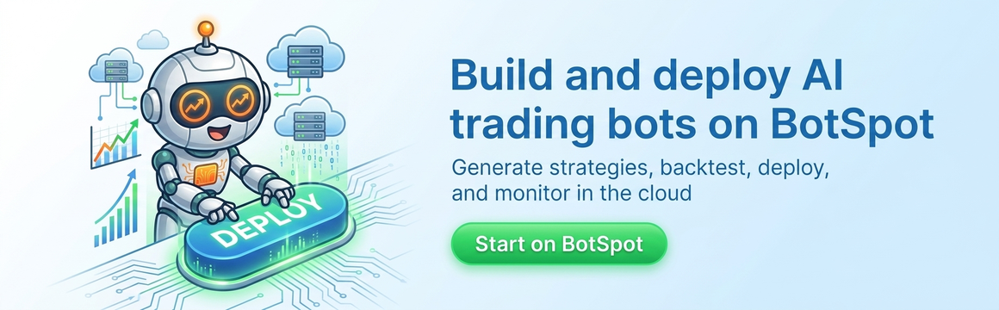
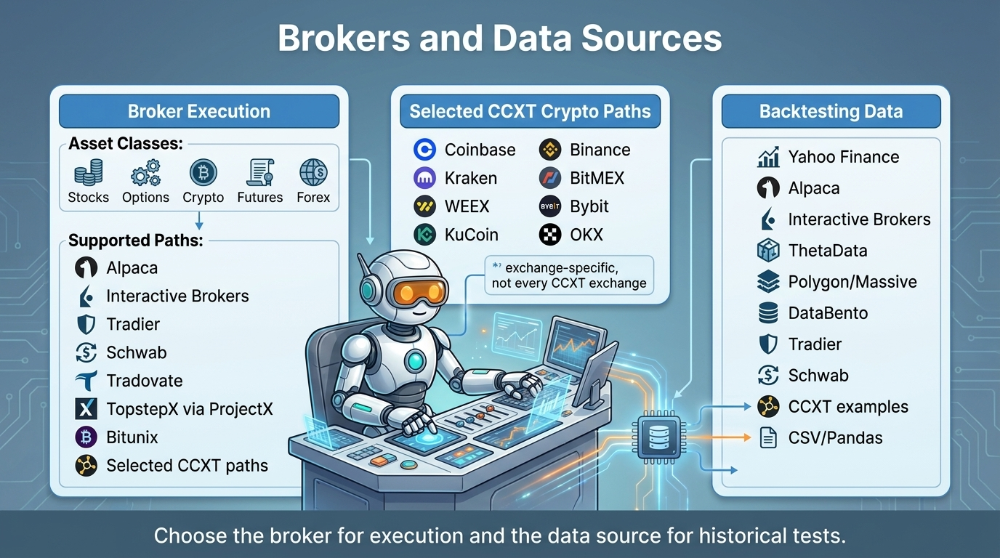
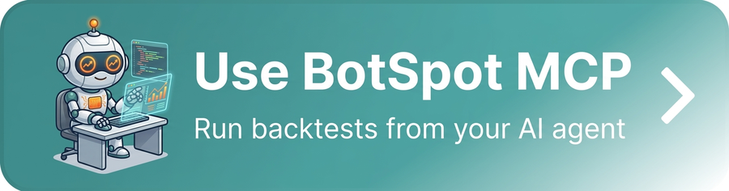
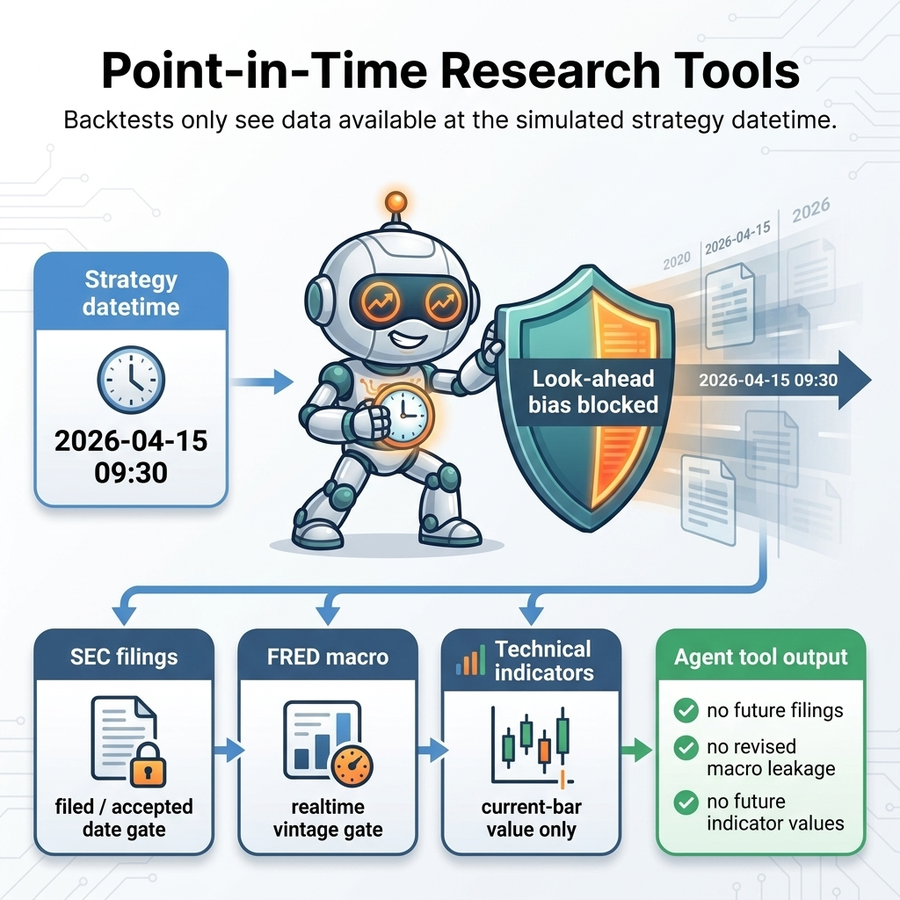
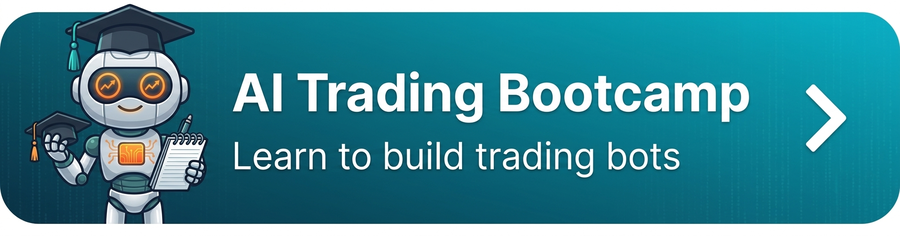

[](https://github.com/Lumiwealth/lumibot/actions/workflows/cicd.yaml)
[](https://github.com/Lumiwealth/lumibot/actions/workflows/cicd.yaml)
[](https://pypi.org/project/lumibot/)
[](https://pypi.org/project/lumibot/)
[](LICENSE)

# Lumibot: Backtestable AI Agents and Python Algorithmic Trading

**Build deterministic trading strategies, AI trading agents, and AI trading teams for stocks, options, crypto, futures, forex, prediction markets, SEC filings, FRED macro data, technical indicators, and real brokers.** Backtest, paper trade, or run live with the same Python code.

**Full docs:** [lumibot.lumiwealth.com](https://lumibot.lumiwealth.com/) · **Managed cloud:** [BotSpot.trade](https://botspot.trade/sales?showLogin=1&utm_source=github&utm_medium=readme&utm_campaign=lumibot&utm_content=top_text_link&sample=lumibot_readme_deploy) · **MCP:** [BotSpot for AI coding agents](https://botspot.trade/agents?utm_source=github&utm_medium=readme&utm_campaign=lumibot&utm_content=top_mcp_link)

<p align="center">
  
</p>

## What You Can Build

- **Deterministic strategies:** normal Python logic, indicators, if statements, scheduled rules, position sizing, and risk controls.
- **AI-agent strategies:** one or more agents that reason through evidence, call tools, write memory, and optionally place orders.
- **Backtests:** replay historical data and simulated orders with artifacts you can inspect.
- **Paper or live trading:** reuse the same strategy code with real broker state and real order routing.

Start with the open-source docs, then deploy when you are ready: [Lumibot documentation](https://lumibot.lumiwealth.com/?utm_source=github&utm_medium=readme&utm_campaign=lumibot&utm_content=what_you_can_build_docs) · [Try a sample Lumibot strategy on BotSpot](https://botspot.trade/sales?showLogin=1&utm_source=github&utm_medium=readme&utm_campaign=lumibot&utm_content=what_you_can_build_botspot&sample=lumibot_readme_deploy)

## Quick Start

### Backtest a strategy

```bash
pip install lumibot
```

Save this as `my_strategy.py`:

```python
from datetime import datetime
from lumibot.strategies import Strategy
from lumibot.backtesting import YahooDataBacktesting

class MyStrategy(Strategy):
    def on_trading_iteration(self):
        if self.first_iteration:
            aapl = self.create_order("AAPL", 10, "buy")
            self.submit_order(aapl)

MyStrategy.backtest(
    YahooDataBacktesting,
    datetime(2023, 1, 1),
    datetime(2024, 1, 1),
)
```

```bash
python my_strategy.py
```

### Run the same strategy with a paper broker

After the backtest works, keep the `MyStrategy` class and replace the final `MyStrategy.backtest(...)` call with a broker runner. This example uses Alpaca paper trading:

```bash
export ALPACA_API_KEY='your-alpaca-key'
export ALPACA_API_SECRET='your-alpaca-secret'
export ALPACA_IS_PAPER=true
python my_strategy.py
```

```python
import os
from lumibot.brokers import Alpaca
from lumibot.traders import Trader

ALPACA_CONFIG = {
    "API_KEY": os.environ["ALPACA_API_KEY"],
    "API_SECRET": os.environ["ALPACA_API_SECRET"],
    "PAPER": os.environ.get("ALPACA_IS_PAPER", "true").lower() != "false",
}

broker = Alpaca(ALPACA_CONFIG)
strategy = MyStrategy(broker=broker)

trader = Trader()
trader.add_strategy(strategy)
trader.run_all()
```

Start with paper trading. When you are ready for live trading, use the same strategy class and switch your broker account/configuration intentionally.

For full setup guides, broker tutorials, AI-agent docs, examples, and deployment notes, use the **[Lumibot documentation](https://lumibot.lumiwealth.com/)**.

## AI Trading Team

Lumibot now includes a built-in AI agent runtime for financial research, reasoning, debate, risk review, and trade execution. Agents can inspect market data, read filings, query indicators, search memory, compare macro context, and submit orders through the same Lumibot strategy loop used by normal backtests and live trading.

Classic Python strategies are still first-class. Lumibot lets you choose the right level of intelligence: fixed rules, AI agents, or a hybrid where Python handles the hard gates and agents reason through evidence.

Built-in AI agent tools include market/account state, order inspection, DuckDB queries, documentation search, Alpaca news when credentials exist, technical indicators, SEC fundamentals and filings, FRED macro data, local memory, and Telegram notifications.

### Design Your AI Trading Team

An AI trading team is just a group of agents with different jobs inside the same Lumibot strategy. You can build a single-agent strategy, a specialist research flow, bull/bear/neutral teams, model-vs-model debates, deterministic execution gates, or agent reviewers layered on top of normal Python logic.

<p align="center">
  
</p>

### Example: Research, Bull, Bear, and Trader Agents

Here is one example pattern: a researcher gathers evidence, bull and bear agents debate the trade, and a trader agent decides what to buy or sell.

<p align="center">
  
</p>

In this pattern, each agent has a job:

1. **Research Agent:** builds the evidence pack from market data, filings, fundamentals, news, macro data, and indicators.
2. **Bull Agent:** turns that evidence into the strongest long thesis.
3. **Bear Agent:** challenges the thesis, looks for risk, and argues for avoiding, delaying, or reducing the trade.
4. **Trader / Portfolio Manager Agent:** checks cash, positions, open orders, and risk limits, then decides whether to trade.

The copy-paste example below implements that exact team. It uses Gemini Flash Lite because it is fast and inexpensive for experiments.

To run it with a broker in paper mode, set your AI and Alpaca credentials and run the file:

```bash
export GEMINI_API_KEY='your-key-here'
export ALPACA_API_KEY='your-alpaca-key'
export ALPACA_API_SECRET='your-alpaca-secret'
export ALPACA_IS_PAPER=true
python ai_trading_team_bull_bear_leveraged_etf.py
```

To backtest the same strategy instead, change `IS_BACKTESTING = False` to `IS_BACKTESTING = True` in the runner:

```bash
export GEMINI_API_KEY='your-key-here'
python ai_trading_team_bull_bear_leveraged_etf.py
```

Save this as `ai_trading_team_bull_bear_leveraged_etf.py`. If an AI key is missing or invalid, Lumibot stops and prints a clear provider key error with a link to create a key.

```python
import os
from datetime import datetime

from lumibot.strategies.strategy import Strategy


class AITradingTeamBullBearLeveragedETFStrategy(Strategy):
    parameters = {
        "universe": ["TQQQ", "SQQQ", "UPRO", "SPXU", "UDOW", "SDOW", "TNA", "TZA", "TECL", "TECS", "SOXL", "SOXS", "WEBL", "WEBS", "FAS", "FAZ", "LABU", "LABD", "ERX", "ERY", "GUSH", "DRIP", "DRN", "DRV", "TMF", "TMV", "NUGT", "DUST"],
    }

    def initialize(self):
        self.sleeptime = "1D"
        model = os.environ.get("AI_TRADING_TEAM_MODEL", "gemini-3.1-flash-lite")
        # The first three agents are read-only. They can reason, but cannot trade.
        self.agents.create(
            name="researcher",
            model=model,
            allow_trading=False,
            system_prompt="Rank the ETFs by upside. Be direct.",
        )
        self.agents.create(
            name="bull",
            model=model,
            allow_trading=False,
            system_prompt="Argue for the strongest money-making trade.",
        )
        self.agents.create(
            name="bear",
            model=model,
            allow_trading=False,
            system_prompt="Point out the biggest risk, briefly.",
        )
        # Only this final agent can submit orders through Lumibot.
        self.agents.create(
            name="trader",
            model=model,
            allow_trading=True,
            system_prompt="Buy one ETF from the universe aggressively. Use nearly all cash.",
        )

    def on_trading_iteration(self):
        # Each trading day, pass the same market context through the team.
        context = {
            "date": self.get_datetime().date().isoformat(),
            "universe": self.parameters["universe"],
        }
        research = self.agents["researcher"].run(
            task_prompt="Pick the strongest ETF.",
            context=context,
        )
        bull = self.agents["bull"].run(
            task_prompt="Make the bull case.",
            context={**context, "research": research.summary},
        )
        bear = self.agents["bear"].run(
            task_prompt="Make the bear case.",
            context={**context, "research": research.summary, "bull": bull.summary},
        )
        self.agents["trader"].run(
            task_prompt="Sell anything that is not the pick, then buy the best ETF with nearly all available cash.",
            context={**context, "research": research.summary, "bull": bull.summary, "bear": bear.summary},
        )


if __name__ == "__main__":
    IS_BACKTESTING = False

    if IS_BACKTESTING:
        from lumibot.backtesting import YahooDataBacktesting

        AITradingTeamBullBearLeveragedETFStrategy.backtest(
            YahooDataBacktesting,
            datetime(2026, 4, 7),
            datetime(2026, 5, 22),
        )
    else:
        from lumibot.brokers import Alpaca
        from lumibot.traders import Trader

        ALPACA_CONFIG = {
            "API_KEY": os.environ["ALPACA_API_KEY"],
            "API_SECRET": os.environ["ALPACA_API_SECRET"],
            "PAPER": os.environ.get("ALPACA_IS_PAPER", "true").lower() != "false",
        }

        broker = Alpaca(ALPACA_CONFIG)
        strategy = AITradingTeamBullBearLeveragedETFStrategy(broker=broker)

        trader = Trader()
        trader.add_strategy(strategy)
        trader.run_all()
```

Example backtest artifact from this sample strategy:

<p align="center">
  
</p>

Backtests are not expected future performance. The point is that the full AI trading team runs inside Lumibot's normal broker and backtest loops, so the decisions, orders, and artifacts are inspectable before you connect real money.

**[See this AI trading team running live on BotSpot](https://botspot.trade/marketplace/strategy/4aa43848-54d6-48bf-b2e4-b266f9fec6ad)**

### More AI Trading Team Examples

These examples show different ways to organize an AI trading team. Each page explains the inspiration, the agent flow, how to run it with a broker in paper mode, and how to backtest it.

1. **[Citadel sector pods AI trading team](https://lumibot.lumiwealth.com/agents_example_citadel_sector_pods.html):** inspired by the pod-style structure associated with Ken Griffin's Citadel: sector specialists pitch their best ideas, a risk manager challenges crowding and drawdown risk, and a portfolio manager rotates into the strongest sector ETF. [Watch it live on BotSpot](https://botspot.trade/marketplace/strategy/0b4576c7-f78b-4477-ba3a-630758fb0168). Source: [`ai_trading_team_citadel_sector_pods.py`](lumibot/example_strategies/ai_trading_team_citadel_sector_pods.py).
2. **[Warren Buffett value AI trading team](https://lumibot.lumiwealth.com/agents_example_warren_buffett_value.html):** uses AI agents like a patient value-investing desk: one agent digs into business quality and annual reports, one demands valuation discipline, and the portfolio manager only buys the best long-term compounder. [Watch it live on BotSpot](https://botspot.trade/marketplace/strategy/bdd324e9-8026-4115-b26e-30cccf6e00e8). Source: [`ai_trading_team_warren_buffett_value.py`](lumibot/example_strategies/ai_trading_team_warren_buffett_value.py).
3. **[Ray Dalio idea meritocracy AI trading team](https://lumibot.lumiwealth.com/agents_example_ray_dalio_idea_meritocracy.html):** turns Bridgewater-style thoughtful disagreement into a macro ETF workflow, with growth, inflation, liquidity, and disagreement agents arguing before the trader acts. [Watch it live on BotSpot](https://botspot.trade/marketplace/strategy/81af73b8-7dec-4941-ba35-d5a06fee6863). Source: [`ai_trading_team_ray_dalio_idea_meritocracy.py`](lumibot/example_strategies/ai_trading_team_ray_dalio_idea_meritocracy.py).
4. **[Bill Ackman concentrated AI trading team](https://lumibot.lumiwealth.com/agents_example_bill_ackman_concentrated.html):** inspired by Pershing Square-style concentrated investing: find one great business, make the activist bull case, attack it like a short seller, then let the portfolio manager take a focused position if the thesis survives. [Watch it live on BotSpot](https://botspot.trade/marketplace/strategy/d56d5bf1-293b-44d8-a18c-bdda969b82f3). Source: [`ai_trading_team_bill_ackman_concentrated.py`](lumibot/example_strategies/ai_trading_team_bill_ackman_concentrated.py).
5. **[Bull/bear leveraged ETF AI trading team](https://lumibot.lumiwealth.com/agents_example_bull_bear_leveraged_etf.html):** a fast, aggressive demo where bull and bear agents debate leveraged long and inverse ETFs before the trader rotates into one high-conviction ETF. [Watch it live on BotSpot](https://botspot.trade/marketplace/strategy/4aa43848-54d6-48bf-b2e4-b266f9fec6ad). Source: [`ai_trading_team_bull_bear_leveraged_etf.py`](lumibot/example_strategies/ai_trading_team_bull_bear_leveraged_etf.py).
6. **[Bull/bear large-cap stocks AI trading team](https://lumibot.lumiwealth.com/agents_example_bull_bear_large_cap_stocks.html):** the same debate structure applied to familiar large-cap stocks, which makes it easier to inspect each agent's reasoning before using more volatile instruments. [Watch it live on BotSpot](https://botspot.trade/marketplace/strategy/932f3661-c552-4723-b247-869518a5d30f). Source: [`ai_trading_team_bull_bear_large_cap_stocks.py`](lumibot/example_strategies/ai_trading_team_bull_bear_large_cap_stocks.py).

## Run Lumibot Without Managing Servers

BotSpot is the managed cloud built around Lumibot. It makes Lumibot easier and cheaper to run because the data, backtesting workers, broker connections, scheduling, monitoring, logs, alerts, and kill switches are already wired together.

BotSpot is not a generic chatbot bolted onto a broker account. Its AI workflows, prompts, MCP tools, backtest setup, broker paths, and deployment flow are built for Lumibot.

- **Backtesting data included.** Use hosted stock, futures, options, FRED macro, SEC filing, and other supported data without wrangling every feed and API key yourself. Some data is included; premium data can be much cheaper than buying direct subscriptions for occasional experiments.
- **Cheaper deployment at scale.** Scheduled and periodic bots should not need a full always-on server per strategy. BotSpot runs Lumibot bots on managed infrastructure built for this workflow, with monitoring and controls included.
- **Lumibot-tuned AI.** Generic coding tools can write Python, but BotSpot is tuned for Lumibot strategy structure, broker setup, backtests, artifacts, and deployment.
- **MCP for coding agents.** Connect BotSpot to Codex, Claude Code, Cursor, and other MCP clients so your coding agent can run backtests, inspect artifacts, compare results, and prepare deployment instead of only generating code.
- **Work from anywhere.** Use the same strategy workspace from the web, your phone, Telegram, Discord, Claude, ChatGPT, and coding tools. Start in one place and continue in another.
- **Marketplace and strategy library.** Browse existing strategy code, clone and adapt strategies, run strategies where available, and publish your own strategies when you are ready.
- **Observability and control.** Inspect why a bot bought or sold, review charts, logs, decisions, orders, notifications, audit history, and kill-switch controls in one place.

<p align="center">
  <a href="https://botspot.trade/sales?showLogin=1&utm_source=github&utm_medium=readme&utm_campaign=lumibot&utm_content=managed_cloud_banner&sample=lumibot_readme_deploy">
    
  </a>
</p>

## Why Lumibot?

AI trading projects have proved that people want agentic trading workflows. Lumibot's edge is that those workflows run inside a real Python trading framework: you can backtest the agent decisions, inspect artifacts, add Python guardrails, paper trade, and connect to brokers without rewriting the strategy.

That matters because an AI trading demo is not the same thing as a trading system. Without backtests and broker-aware strategy code, you are mostly trusting prompts. Lumibot lets you iterate faster: test the agent flow on historical data, see what it would have bought or sold, tighten the Python risk checks, then run the same lifecycle in paper or live trading.

### Compared with AI trading agent projects

| Project | Main angle | AI agents / teams | Backtest agent decisions | Paper/live broker path | Deterministic Python strategies | Hosted data/deploy/monitoring |
|---------|------------|-------------------|--------------------------|------------------------|---------------------------------|-------------------------------|
| **Lumibot + BotSpot** | Python strategies, flexible AI trading teams, hybrid guardrails, backtests, brokers, hosted deployment | **Flexible teams, debates, specialist desks, and deterministic gates** | **Replayable decisions, orders, traces, artifacts, charts, logs** | **Yes: Alpaca, IBKR, Tradier, Schwab, Tradovate, ProjectX, Bitunix, Polymarket, selected CCXT** | **Yes** | **Hosted data, parallel backtests, deployment, monitoring, MCP, alerts, kill switches** |
| TradingAgents | Multi-agent LLM trading research framework | Yes, with a specific research/debate structure | Research/demo oriented | Not the main focus | Limited | No |
| ai-hedge-fund | Educational AI hedge fund with named investor-style agents | Yes, with investor-style personas | Demo/backtest oriented | Not the main focus | Limited | No |
| OpenAlice | One-person Wall Street agent concept | Yes, end-to-end agent concept | Emerging/experimental | Local/self-run focus | Limited | No |
| QuantDinger | Self-hosted AI quant operating system | Yes | Yes | Crypto, IBKR, MT5, Alpaca | Yes | Self-hosted |
| Vibe-Trading | Personal trading agent | Yes | Yes | Agent trading platform focus | Limited | Platform-specific |
| AI-Trader | Agent-native trading platform | Yes | Platform focus | Platform focus | Limited | Platform-specific |
| OpenBB | Financial data platform for analysts, quants, and AI agents | Tooling for agents | Not a strategy backtester | No broker execution framework | No | OpenBB workspace/platform |
| Qlib | AI-oriented quant research platform | Research/ML agents | Quant research backtests | Limited live focus | Research pipelines | No |

See the docs comparison pages for more detail: [Lumibot vs TradingAgents](https://lumibot.lumiwealth.com/lumibot_vs_tradingagents.html), [Lumibot vs ai-hedge-fund](https://lumibot.lumiwealth.com/lumibot_vs_ai_hedge_fund.html), [Lumibot vs OpenAlice](https://lumibot.lumiwealth.com/lumibot_vs_openalice.html), and [Lumibot vs QuantDinger](https://lumibot.lumiwealth.com/lumibot_vs_quantdinger.html).

### Compared with backtesting libraries

| Feature | Lumibot | Backtrader | Freqtrade | Zipline | Backtesting.py | Jesse | vectorbt | NautilusTrader | Hummingbot |
|---------|---------|------------|-----------|---------|----------------|-------|----------|----------------|------------|
| **Same code: backtest + live** | Yes | Yes | Yes (crypto) | No | No | Yes (paid) | No | Yes | Yes (crypto) |
| **Stocks** | Yes | Yes | No | Yes | Yes | No | Yes | Yes | No |
| **Options** | **Yes** | No | No | No | No | No | No | Limited | No |
| **Crypto** | Yes | Limited | Yes | No | Yes | Yes | Yes | Yes | Yes |
| **Prediction markets** | Polymarket trading and backtesting | No | No | No | No | No | No | No | Limited/no |
| **Futures** | Yes | Limited | Crypto only | Partial | Yes | Crypto only | Yes | Yes | Perpetuals/crypto venues |
| **Forex** | Yes | Outdated | No | No | Yes | No | Yes | Yes | No |
| **AI agent runtime** | Built-in | No | FreqAI (ML) | No | No | ML pipeline | No | No | Scripts/controllers |
| **Broker execution** | Alpaca, IBKR, Tradier, Schwab, Tradovate, TopstepX (via ProjectX), Bitunix, Polymarket, selected CCXT | IB only (outdated) | Crypto exchanges | None | None | Crypto exchanges | No | Exchange adapters | Crypto exchanges |
| **Hosted deployment path** | BotSpot | No | No | No | No | Paid cloud | No | No | Hummingbot Foundation/enterprise ecosystem |
| **License** | MIT | GPL-3.0 | GPL-3.0 | Apache-2.0 | AGPL-3.0 | MIT | Apache-2.0 | LGPL-3.0 | Apache-2.0 |

**Switching from Backtrader?** See our [migration guide](docs/MIGRATING_FROM_BACKTRADER.md) for a side-by-side comparison with code examples.

## Deploy Live

### Option A: BotSpot (managed cloud)

[BotSpot](https://botspot.trade/sales?showLogin=1&utm_source=github&utm_medium=readme&utm_campaign=lumibot&utm_content=deploy_live_text_link&sample=lumibot_readme_deploy) is the managed path for taking a Lumibot strategy from idea to backtest to paper or live trading. It handles the expensive and fragile parts around the strategy: hosted data setup for supported backtests, parallel backtest runs, broker connections, scheduling, logs, alerts, monitoring, audit history, and kill-switch controls.

This is especially useful when your strategy only needs to run daily or periodically. You get the same Lumibot code path without paying for always-on infrastructure, maintaining a scheduler, hand-wiring broker secrets, or building your own log and alerting stack.

<p align="center">
  
</p>

<p align="center">
  <a href="https://botspot.trade/sales?showLogin=1&utm_source=github&utm_medium=readme&utm_campaign=lumibot&utm_content=deploy_live_button&sample=lumibot_readme_deploy">
    
  </a>
</p>

### Option B: Self-hosted (full control)

Run Lumibot on your own machine with any supported broker:

```python
from lumibot.brokers import Alpaca
from lumibot.traders import Trader

ALPACA_CONFIG = {
    "API_KEY": "your-key",
    "API_SECRET": "your-secret",
    "PAPER": True,
}

broker = Alpaca(ALPACA_CONFIG)
strategy = MyStrategy(broker=broker)

trader = Trader()
trader.add_strategy(strategy)
trader.run_all()
```

## Supported Brokers

Lumibot supports stocks, options, crypto, futures, forex, indexes, and prediction contracts across several broker integrations:

<p align="center">
  
</p>

- Alpaca
- Interactive Brokers and Interactive Brokers REST
- Tradier
- Schwab
- Tradovate
- TopstepX futures (via ProjectX)
- Bitunix
- Polymarket prediction-contract trading and backtesting
- Selected CCXT crypto paths. Coinbase, Kraken, and WEEX have auto-detected credential paths; KuCoin, Binance, and BitMEX have documented manual CCXT setup paths; Kraken, Binance, KuCoin, BitMEX, Bybit, and OKX have documented backtesting examples. Lumibot does not claim blanket support for every CCXT exchange.

## Select Backtesting Data Sources

Lumibot can backtest from free daily data, broker data, premium market data, and your own files:

- Yahoo Finance
- Alpaca
- Interactive Brokers REST
- ThetaData
- Polygon/Massive
- DataBento
- Tradier
- Schwab
- Polymarket prediction-contract price history
- CCXT backtesting examples: Kraken, Binance, KuCoin, BitMEX, Bybit, and OKX
- Pandas/CSV dataframes

### Recommended Data Provider

For the deepest historical coverage (stocks, options, futures, indexes), we recommend [ThetaData](https://www.thetadata.net/). Use promo code **`BotSpot10`** for 10% off your first order.

## AI Trading Agents

Lumibot includes a built-in AI trading agent runtime. Build agents that run identically in backtests and live trading.

- Create agents with `self.agents.create(...)`
- Use a different model per agent with `model="openai/gpt-5.5"` or any LiteLLM/ADK-supported provider string
- Make research agents read-only with `allow_trading=False`
- Give agents built-in SEC fundamentals, filings, FRED macro data, indicators, memory, and notifications
- Use **DuckDB** for time-series analysis instead of dumping raw bars into prompts
- Mount external **MCP servers** for news, macro data, filings, or any domain-specific tools
- Replay identical agent decisions in **backtests** without paying for another model call

Use **[BotSpot MCP](https://botspot.trade/agents?utm_source=github&utm_medium=readme&utm_campaign=lumibot&utm_content=ai_agents_mcp_link)** when you want an AI coding agent to generate Lumibot strategies, launch backtests, inspect artifacts, and iterate without leaving your editor.

<p align="center">
  <a href="https://botspot.trade/agents?utm_source=github&utm_medium=readme&utm_campaign=lumibot&utm_content=ai_agents_mcp_button">
    
  </a>
</p>

<p align="center">
  
</p>

Start here:
- [Agent Documentation](https://lumibot.lumiwealth.com/agents.html)
- [AI Trading Team Flow Design](https://lumibot.lumiwealth.com/agents_flows.html)
- [AI Trading Team Examples](https://lumibot.lumiwealth.com/agents_examples.html)
- [Leveraged ETF](lumibot/example_strategies/ai_trading_team_bull_bear_leveraged_etf.py), [large-cap stocks](lumibot/example_strategies/ai_trading_team_bull_bear_large_cap_stocks.py), [Ray Dalio idea meritocracy](lumibot/example_strategies/ai_trading_team_ray_dalio_idea_meritocracy.py), [Warren Buffett value](lumibot/example_strategies/ai_trading_team_warren_buffett_value.py), [Bill Ackman concentrated](lumibot/example_strategies/ai_trading_team_bill_ackman_concentrated.py), and [Citadel sector pods](lumibot/example_strategies/ai_trading_team_citadel_sector_pods.py)
- [Standalone AI Committee Demo](https://github.com/Lumiwealth/lumibot-ai-investment-committee)
- [Discretionary Agent Example](lumibot/example_strategies/agent_discretionary.py)
- [News Sentiment Agent Example](lumibot/example_strategies/agent_news_sentiment.py)
- [Full Guide](docs/AI_TRADING_AGENTS.md)

## Memory and Traceability

AI strategies can record proposals, risk notes, actual trading decisions, submitted orders, lessons, open theses, tool calls, and run artifacts as local SQLite and Parquet files. This makes an AI backtest reviewable instead of a black box: you can inspect why the agent traded, which tools it used, what memory it retrieved, and what it remembered for later iterations. Memory events include agent/model-call provenance when they come from agent tools.

<p align="center">
  
</p>

## Community Strategies

Browse and contribute open-source strategies: **[lumibot-strategies](https://github.com/Lumiwealth/lumibot-strategies)**. For hosted strategy discovery with performance, descriptions, visuals, and deploy flows, use the **[BotSpot marketplace](https://botspot.trade/marketplace?utm_source=github&utm_medium=readme&utm_campaign=lumibot&utm_content=community_marketplace_link)**.

<p align="center">
  <a href="https://botspot.trade/marketplace?utm_source=github&utm_medium=readme&utm_campaign=lumibot&utm_content=community_marketplace_button">
    
  </a>
</p>

## Example Strategies

Lumibot includes 25+ example strategies covering stocks, options, crypto, futures, forex, and Polymarket prediction contracts:

```bash
# Run a simple buy-and-hold backtest
python -m lumibot.example_strategies.stock_buy_and_hold

# Or explore all examples
ls lumibot/example_strategies/
```

Browse all examples: [example_strategies/](lumibot/example_strategies/)

Polymarket example: [polymarket_prediction_contract.py](lumibot/example_strategies/polymarket_prediction_contract.py)

**External example repo:** [stock_example_algo](https://github.com/Lumiwealth-Strategies/stock_example_algo) shows a minimal strategy repository you can run yourself or adapt inside BotSpot.

## Backtesting Data Sources

Select a data source via environment variable (overrides code):

```bash
export BACKTESTING_DATA_SOURCE=thetadata   # or yahoo, ibkr, polygon, polymarket
```

Multi-provider routing by asset type:

```bash
export BACKTESTING_DATA_SOURCE='{"default":"thetadata","option":"thetadata","crypto":"ibkr","crypto_future":"ibkr","future":"ibkr","cont_future":"ibkr"}'
```

Crypto futures/perpetual backtests can route `Asset.AssetType.CRYPTO_FUTURE` through spot crypto history. Quote symbols are preserved: `BTCUSDT` uses `BTC/USDT` spot history when that pair is available from the selected crypto data source. LumiBot must not silently replace a requested USDT, USDC, EUR, or other quote with USD; missing pairs should fail honestly or be changed explicitly in strategy code.

### Data source comparison

| Data Source | OHLCV | Split Adjusted | Dividends | Dividend Adjusted Returns |
|-------------|-------|----------------|-----------|---------------------------|
| Yahoo       | Yes   | Yes            | Yes       | Yes                       |
| Alpaca      | Yes   | Yes            | No        | No                        |
| Polygon     | Yes   | Yes            | No        | No                        |
| Tradier     | Yes   | Yes            | No        | No                        |
| Polymarket  | Yes   | N/A            | N/A       | N/A                       |
| Pandas*     | Yes   | Yes            | Yes       | Yes                       |

*Pandas loads CSV files in Yahoo dataframe format, which can contain dividends.

## Learn More

- **Documentation:** [lumibot.lumiwealth.com](https://lumibot.lumiwealth.com/)
- **Blog:** [lumiwealth.com/blog](https://lumiwealth.com/blog/)
- **AI strategy builder and hosted deployment:** [BotSpot.trade](https://botspot.trade/sales?showLogin=1&utm_source=github&utm_medium=readme&utm_campaign=lumibot&utm_content=learn_more_botspot&sample=lumibot_readme_deploy)
- **BotSpot MCP for AI coding agents:** [botspot.trade/agents](https://botspot.trade/agents?utm_source=github&utm_medium=readme&utm_campaign=lumibot&utm_content=learn_more_mcp)
- **Strategy marketplace:** [botspot.trade/marketplace](https://botspot.trade/marketplace?utm_source=github&utm_medium=readme&utm_campaign=lumibot&utm_content=learn_more_marketplace)
- **YouTube strategy builds:** [Lumiwealth on YouTube](https://www.youtube.com/@Lumiwealth?sub_confirmation=1&utm_source=github&utm_medium=readme&utm_campaign=lumibot&utm_content=learn_more_youtube)

<p align="center">
  <a href="https://www.youtube.com/@Lumiwealth?sub_confirmation=1&utm_source=github&utm_medium=readme&utm_campaign=lumibot&utm_content=learn_more_youtube_button">
    
  </a>
</p>

## Project Growth

<a href="https://www.star-history.com/?repos=Lumiwealth%2Flumibot&type=date&legend=top-left">
 <picture>
   <source media="(prefers-color-scheme: dark)" srcset="https://api.star-history.com/chart?repos=Lumiwealth/lumibot&type=date&theme=dark&legend=top-left&sealed_token=wb5P3MSfQ5xSeKh1EePxGtv8jEkEp9wXB8eGvKUX0FzeHHL4kDcz4h_YwqmaI8cn71CDw2wvB-kQzV40SS3YFnWbzT3M-ngxp9lyqkSTFDqEJyvoQAupDYcyymGR0S2SrKAluekzR-xTEAkXUqetWIQTPgEs2en4371f17a5oimerkP2K4lGK-0lSL2K" />
   <source media="(prefers-color-scheme: light)" srcset="https://api.star-history.com/chart?repos=Lumiwealth/lumibot&type=date&legend=top-left&sealed_token=wb5P3MSfQ5xSeKh1EePxGtv8jEkEp9wXB8eGvKUX0FzeHHL4kDcz4h_YwqmaI8cn71CDw2wvB-kQzV40SS3YFnWbzT3M-ngxp9lyqkSTFDqEJyvoQAupDYcyymGR0S2SrKAluekzR-xTEAkXUqetWIQTPgEs2en4371f17a5oimerkP2K4lGK-0lSL2K" />
   
 </picture>
</a>

## AI Bootcamp

Learn to build, backtest, and deploy trading strategies using AI. Join 2,400+ traders.

<p align="center">
  <a href="https://www.botspot.trade/ai-bot-builder-bootcamp?utm_source=github&utm_medium=readme&utm_campaign=lumibot&utm_content=bootcamp_button">
    
  </a>
</p>

## Contributing

We welcome contributions! Here's a video to help you get started: [Watch The Video](https://youtu.be/Huz6VxqafZs)

**Steps:**
1. Clone the repository
2. Create a new branch: `git switch -c my-feature`
3. Install dev dependencies: `pip install -r requirements_dev.txt && pip install -e .`
4. Make your changes
5. Run tests: `pytest`
6. Create a pull request

## Running Tests

```bash
pytest                          # Run all tests
pytest tests/test_asset.py      # Run a specific test file
coverage run; coverage report   # Show code coverage
```

## Remote Cache Configuration

Lumibot can mirror its local parquet caches to AWS S3. See `docs/remote_cache.md` for configuration.

## Architecture Documentation

- [Backtesting Architecture](docs/BACKTESTING_ARCHITECTURE.md) - Data flow diagrams for Yahoo, ThetaData, Polygon
- [Acceptance Backtests](docs/ACCEPTANCE_BACKTESTS.md) - End-to-end acceptance suite
- [Environment Variables](docsrc/environment_variables.rst) - All configurable env vars
- [Changelog](CHANGELOG.md) - Release notes
- [AI Assistant Guide](CLAUDE.md) - Instructions for AI coding assistants
- [Production Safety](AGENTS.md) - ThetaData and production rules

## Disclaimer

This software is provided for educational and informational purposes only. It is not financial advice and does not constitute a recommendation to buy or sell any security. Lumibot and BotSpot are not registered broker-dealers or financial advisors. Algorithmic trading involves substantial risk of loss, including the possibility of losses greater than your initial investment. Software bugs and errors can lead to rapid financial losses. Past backtest performance does not guarantee future results. Use this software at your own risk. You are solely responsible for compliance with all applicable laws and regulations regarding the assets you choose to trade.

Affiliate disclosure: some provider links or promo codes, including ThetaData, may support continued Lumibot development.

## License

MIT License - [View License](https://github.com/Lumiwealth/lumibot/blob/master/LICENSE)
