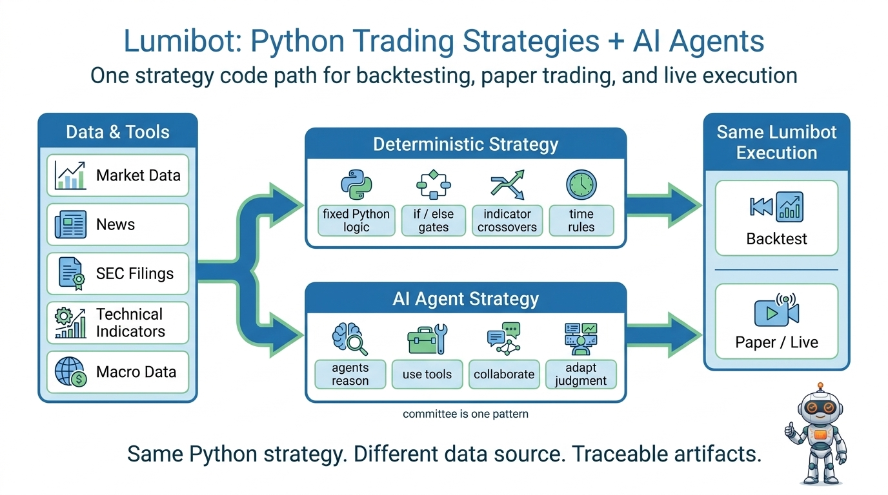
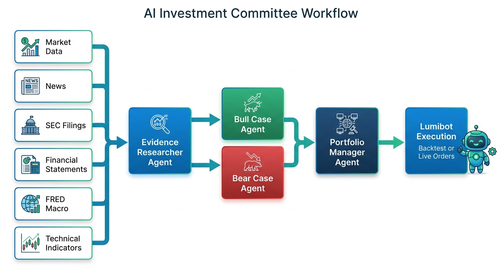
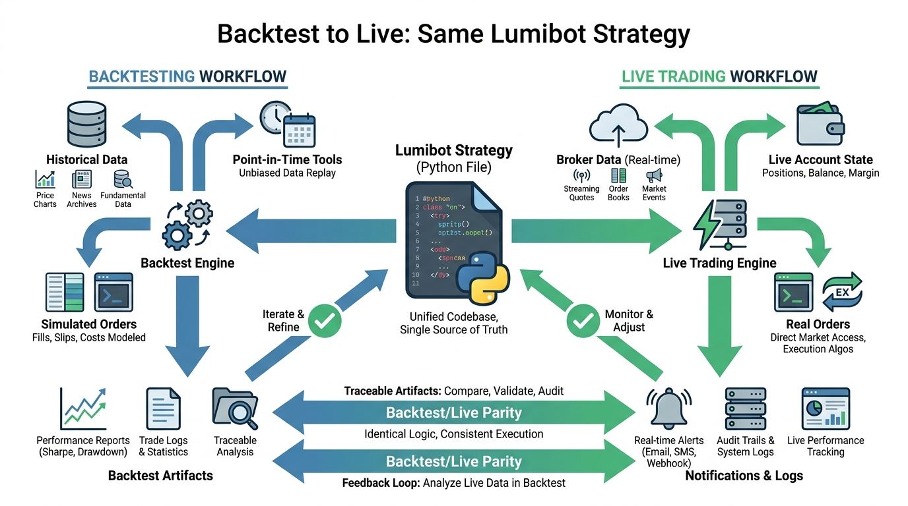
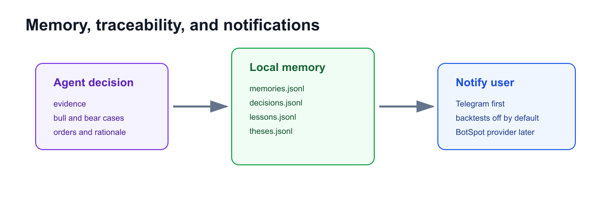

[](https://github.com/Lumiwealth/lumibot/actions/workflows/cicd.yaml)
[](https://github.com/Lumiwealth/lumibot/actions/workflows/cicd.yaml)
[](https://pypi.org/project/lumibot/)
[](https://pypi.org/project/lumibot/)
[](LICENSE)

# Lumibot: Python Trading Strategies + AI Agents

**The same Python strategy can run in a backtest, paper account, or live broker account.** Lumibot is an open-source trading framework for deterministic strategies, AI-agent strategies, stocks, options, crypto, futures, forex, and real broker execution.

**Full docs:** [lumibot.lumiwealth.com](https://lumibot.lumiwealth.com/) · **No-code cloud:** [BotSpot.trade](https://botspot.trade/?utm_source=github&utm_medium=readme&utm_campaign=lumibot)

<p align="center">
  
</p>

## What You Can Build

- **Deterministic strategies:** normal Python logic, indicators, if statements, scheduled rules, position sizing, and risk controls.
- **AI-agent strategies:** one or more agents that reason through evidence, call tools, write memory, and optionally place orders.
- **Backtests:** replay historical data and simulated orders with artifacts you can inspect.
- **Paper or live trading:** reuse the same strategy code with real broker state and real order routing.

## AI Agents Are Optional, Not The Whole Product

Lumibot now includes a built-in AI agent runtime, but you can still write classic Python trading strategies exactly as before. AI agents are useful when the strategy needs reasoning: reading filings, comparing news, checking macro context, debating a thesis, or explaining why a trade should happen.

An investment committee is one example pattern:

<p align="center">
  
</p>

In that pattern, read-only research agents gather evidence and a trading-enabled portfolio manager decides whether to place Lumibot orders. Other agent designs are possible: a single research agent, a pair of specialist agents, a strategy-refinement agent, or a risk-review agent layered on top of deterministic logic.

Built-in AI agent tools include market/account state, order inspection, DuckDB queries, documentation search, Alpaca news when credentials exist, technical indicators, SEC fundamentals and filings, FRED macro data, local memory, and Telegram notifications.

## Build Without Code on BotSpot

**[BotSpot](https://botspot.trade/?utm_source=github&utm_medium=readme&utm_campaign=lumibot)** is the managed cloud product built on Lumibot. Use it when you want to describe a strategy in plain English, have AI generate Lumibot code, backtest it, and deploy it without managing servers.

- **Build** strategies using natural language -- the AI writes production-ready Lumibot code for you
- **Backtest** against years of historical data with a single click
- **Deploy** to live trading with real brokers (Alpaca, Interactive Brokers, and more)
- **Browse** a marketplace of proven, community-built strategies you can run immediately

**Start on BotSpot:** [Build, backtest, and deploy AI trading bots](https://botspot.trade/?utm_source=github&utm_medium=readme&utm_campaign=lumibot)

## Quick Start

```bash
pip install lumibot
```

```python
from datetime import datetime
from lumibot.strategies import Strategy
from lumibot.backtesting import YahooDataBacktesting

class MyStrategy(Strategy):
    def on_trading_iteration(self):
        if self.first_iteration:
            aapl = self.create_order("AAPL", 10, "buy")
            self.submit_order(aapl)

MyStrategy.backtest(
    YahooDataBacktesting,
    datetime(2023, 1, 1),
    datetime(2024, 1, 1),
)
```

```bash
python my_strategy.py
```

That same strategy code works with live brokers. Just swap the broker class.

For full setup guides, broker tutorials, AI-agent docs, examples, and deployment notes, use the **[Lumibot documentation](https://lumibot.lumiwealth.com/)**.

## Why Lumibot?

| Feature | Lumibot | Backtrader | Freqtrade | Zipline | Backtesting.py | Jesse |
|---------|---------|------------|-----------|---------|----------------|-------|
| **Same code: backtest + live** | Yes | Yes | Yes (crypto) | No | No | Yes (paid) |
| **Stocks** | Yes | Yes | No | Yes | Yes | No |
| **Options** | **Yes** | No | No | No | No | No |
| **Crypto** | Yes | Limited | Yes | No | Yes | Yes |
| **Futures** | Yes | Limited | Crypto only | Partial | Yes | Crypto only |
| **Forex** | Yes | Outdated | No | No | Yes | No |
| **AI agent runtime** | Built-in | No | FreqAI (ML) | No | No | ML pipeline |
| **Brokers** | Alpaca, IBKR, Tradier, Schwab, Tradovate, TopstepX (via ProjectX), Bitunix, plus selected CCXT crypto paths | IB only (outdated) | 10+ crypto exchanges | None | None | 8+ crypto (paid) |
| **Actively maintained** | Yes (2026) | No (since 2023) | Yes | Minimal | Moderate | Yes |
| **License** | MIT | GPL-3.0 | GPL-3.0 | Apache-2.0 | AGPL-3.0 | MIT |

**Switching from Backtrader?** See our [migration guide](docs/MIGRATING_FROM_BACKTRADER.md) for a side-by-side comparison with code examples.

## Deploy Live

### Option A: BotSpot (managed cloud)

[BotSpot](https://botspot.trade/?utm_source=github&utm_medium=readme&utm_campaign=lumibot) runs your Lumibot strategies on hosted infrastructure with scheduling, monitoring, and live execution. Build strategies with AI, no coding required.

- Create trading bots using natural language
- Backtest with historical data
- Deploy to trade automatically 24/7
- Join a community of algorithmic traders

**[Open BotSpot.trade](https://botspot.trade/?utm_source=github&utm_medium=readme&utm_campaign=lumibot)**

<p align="center">
  
</p>

### Option B: Self-hosted (full control)

Run Lumibot on your own machine with any supported broker:

```python
from lumibot.brokers import Alpaca
from lumibot.traders import Trader

ALPACA_CONFIG = {
    "API_KEY": "your-key",
    "API_SECRET": "your-secret",
    "PAPER": True,
}

broker = Alpaca(ALPACA_CONFIG)
strategy = MyStrategy(broker=broker)

trader = Trader()
trader.add_strategy(strategy)
trader.run_all()
```

## Supported Brokers

Lumibot supports stocks, options, crypto, futures, forex, and indexes across several broker integrations:

- Alpaca
- Interactive Brokers and Interactive Brokers REST
- Tradier
- Schwab
- Tradovate
- TopstepX futures (via ProjectX)
- Bitunix
- Selected CCXT crypto paths for Coinbase, Kraken, KuCoin, Binance, BitMEX, WEEX, Bybit, and OKX across live, manual, and backtesting examples. Lumibot does not claim blanket support for every CCXT exchange.

## Select Backtesting Data Sources

Lumibot can backtest from free daily data, broker data, premium market data, and your own files:

- Yahoo Finance
- Alpaca
- Interactive Brokers REST
- ThetaData
- Polygon/Massive
- DataBento
- Tradier
- Schwab
- CCXT backtesting examples: Kraken, Binance, KuCoin, BitMEX, Bybit, and OKX
- Pandas/CSV dataframes

### Recommended Data Provider

For the deepest historical coverage (stocks, options, futures, indexes), we recommend [ThetaData](https://www.thetadata.net/). Use promo code **`BotSpot10`** for 10% off your first order.

## AI Trading Agents

Lumibot includes a built-in AI trading agent runtime. Build agents that run identically in backtests and live trading.

- Create agents with `self.agents.create(...)`
- Use a different model per agent with `model="openai/gpt-5.5"` or any LiteLLM/ADK-supported provider string
- Make research agents read-only with `allow_trading=False`
- Give agents built-in SEC fundamentals, filings, FRED macro data, indicators, memory, and notifications
- Use **DuckDB** for time-series analysis instead of dumping raw bars into prompts
- Mount external **MCP servers** for news, macro data, filings, or any domain-specific tools
- Replay identical agent decisions in **backtests** without paying for another model call

Start here:
- [Agent Documentation](https://lumibot.lumiwealth.com/agents.html)
- [Agent Flow Design](https://lumibot.lumiwealth.com/agents_flows.html)
- [AI Investment Committee Example](https://github.com/Lumiwealth/lumibot/blob/version/4.5.11/lumibot/example_strategies/ai_investment_committee.py)
- [Standalone AI Committee Demo](https://github.com/Lumiwealth/lumibot-ai-investment-committee)
- [Stock Agent Example](https://github.com/Lumiwealth/lumibot/blob/version/4.5.11/lumibot/example_strategies/agent_stock_backtest.py)
- [Options Agent Example](https://github.com/Lumiwealth/lumibot/blob/version/4.5.11/lumibot/example_strategies/agent_option_backtest.py)
- [Full Guide](https://github.com/Lumiwealth/lumibot/blob/version/4.5.11/docs/AI_TRADING_AGENTS.md)

## Memory and Traceability

AI strategies can record decisions, lessons, open theses, tool calls, and run artifacts as local files. This makes an AI backtest reviewable instead of a black box: you can inspect why the agent traded, which tools it used, and what it remembered for later iterations.

<p align="center">
  
</p>

## Community Strategies

Browse and contribute trading strategies: **[lumibot-strategies](https://github.com/Lumiwealth/lumibot-strategies)** (fork, backtest, and share your own)

## Example Strategies

Lumibot includes 25+ example strategies covering stocks, options, crypto, futures, and forex:

```bash
# Run a simple buy-and-hold backtest
python -m lumibot.example_strategies.stock_buy_and_hold

# Or explore all examples
ls lumibot/example_strategies/
```

Browse all examples: [example_strategies/](https://github.com/Lumiwealth/lumibot/tree/version/4.5.11/lumibot/example_strategies)

**External example repo:** [stock_example_algo](https://github.com/Lumiwealth-Strategies/stock_example_algo) (deployable to Render or Repl.it)

[](https://render.com/deploy?repo=https://github.com/Lumiwealth-Strategies/stock_example_algo)

## Backtesting Data Sources

Select a data source via environment variable (overrides code):

```bash
export BACKTESTING_DATA_SOURCE=thetadata   # or yahoo, ibkr, polygon
```

Multi-provider routing by asset type:

```bash
export BACKTESTING_DATA_SOURCE='{"default":"thetadata","crypto":"coinbase"}'
```

### Data source comparison

| Data Source | OHLCV | Split Adjusted | Dividends | Dividend Adjusted Returns |
|-------------|-------|----------------|-----------|---------------------------|
| Yahoo       | Yes   | Yes            | Yes       | Yes                       |
| Alpaca      | Yes   | Yes            | No        | No                        |
| Polygon     | Yes   | Yes            | No        | No                        |
| Tradier     | Yes   | Yes            | No        | No                        |
| Pandas*     | Yes   | Yes            | Yes       | Yes                       |

*Pandas loads CSV files in Yahoo dataframe format, which can contain dividends.

## Learn More

- **Documentation:** [lumibot.lumiwealth.com](https://lumibot.lumiwealth.com/)
- **Blog:** [lumiwealth.com/blog](https://lumiwealth.com/blog/)
- **AI Strategy Builder:** [BotSpot.trade](https://botspot.trade/?utm_source=github&utm_medium=readme&utm_campaign=lumibot)

## Project Growth

[](https://www.star-history.com/#Lumiwealth/lumibot&Date)

## AI Bootcamp

Learn to build, backtest, and deploy trading strategies using AI. Join 2,400+ traders.

**[Learn more about the AI Bootcamp](https://www.botspot.trade/ai-bot-builder-bootcamp?utm_source=github&utm_medium=referral&utm_campaign=lumibot_readme)**

## Contributing

We welcome contributions! Here's a video to help you get started: [Watch The Video](https://youtu.be/Huz6VxqafZs)

**Steps:**
1. Clone the repository
2. Create a new branch: `git switch -c my-feature`
3. Install dev dependencies: `pip install -r requirements_dev.txt && pip install -e .`
4. Make your changes
5. Run tests: `pytest`
6. Create a pull request

## Running Tests

```bash
pytest                          # Run all tests
pytest tests/test_asset.py      # Run a specific test file
coverage run; coverage report   # Show code coverage
```

## Remote Cache Configuration

Lumibot can mirror its local parquet caches to AWS S3. See `docs/remote_cache.md` for configuration.

## Architecture Documentation

- [Backtesting Architecture](docs/BACKTESTING_ARCHITECTURE.md) - Data flow diagrams for Yahoo, ThetaData, Polygon
- [Acceptance Backtests](docs/ACCEPTANCE_BACKTESTS.md) - End-to-end acceptance suite
- [Environment Variables](docsrc/environment_variables.rst) - All configurable env vars
- [Changelog](CHANGELOG.md) - Release notes
- [AI Assistant Guide](CLAUDE.md) - Instructions for AI coding assistants
- [Production Safety](AGENTS.md) - ThetaData and production rules

## Disclaimer

This software is provided for educational and informational purposes only. It is not financial advice and does not constitute a recommendation to buy or sell any security. Lumibot and BotSpot are not registered broker-dealers or financial advisors. Algorithmic trading involves substantial risk of loss, including the possibility of losses greater than your initial investment. Software bugs and errors can lead to rapid financial losses. Past backtest performance does not guarantee future results. Use this software at your own risk. You are solely responsible for compliance with all applicable laws and regulations regarding the assets you choose to trade.

Affiliate disclosure: some provider links or promo codes, including ThetaData, may support continued Lumibot development.

## License

MIT License - [View License](https://github.com/Lumiwealth/lumibot/blob/master/LICENSE)
