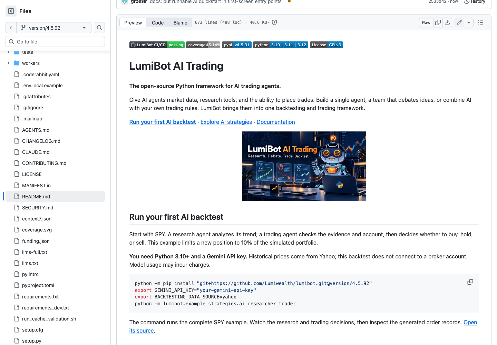
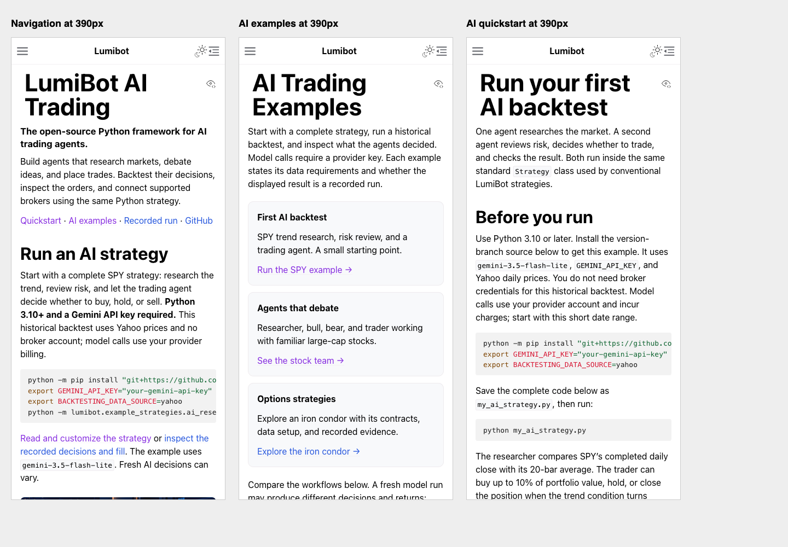
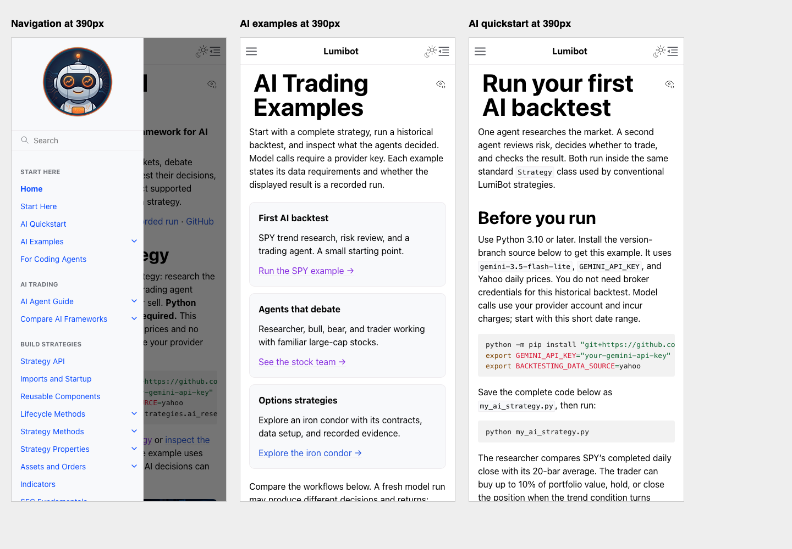

# Revised first screens — September 13, 2026

These screenshots supersede the earlier homepage and README opening captures. The documentation is a local Sphinx build; source publication does not mean the documentation has deployed to Dev.

## What changed and why

- [AI Hedge Fund](https://github.com/virattt/ai-hedge-fund) makes installation and execution easy to find. LumiBot now provides the existing executable AI strategy directly on the homepage and README.
- [OpenBB](https://github.com/OpenBB-finance/OpenBB) combines a clear product description, visual identity, and a short code example. LumiBot keeps compact artwork alongside executable code.
- [TradingAgents](https://github.com/TauricResearch/TradingAgents) has prominent branding, project links, and updates. LumiBot uses its own AI Trading identity and compact discovery links; it does not copy awards, claims, or artwork.
- The navigation logo is 128 pixels wide, exposing more grouped navigation. AI quickstart and examples remain direct links.
- The free challenge invitation follows useful content. Existing Strategy programming interfaces are unchanged.

These are observed patterns, not evidence that copying a layout causes a particular star-growth rate.

## README on GitHub

Captured from the published version branch at source commit 2533d42d.

## Homepage

## Narrow screens

Actual 390-pixel Firefox frames, not a physical iPhone test. Homepage, examples, and quickstart each had document width equal to viewport width.

## Navigation

## Validation

19/19 affected documentation and backtest-example tests passed. Sphinx HTML and text/llms builds completed. The HTML build retained 18 warnings. No new paid model calls were needed for these layout changes; the executable strategy is unchanged.

[Earlier full-page review](README.md) · [Real AI run and exact source](../spy-20260913/README.md)
