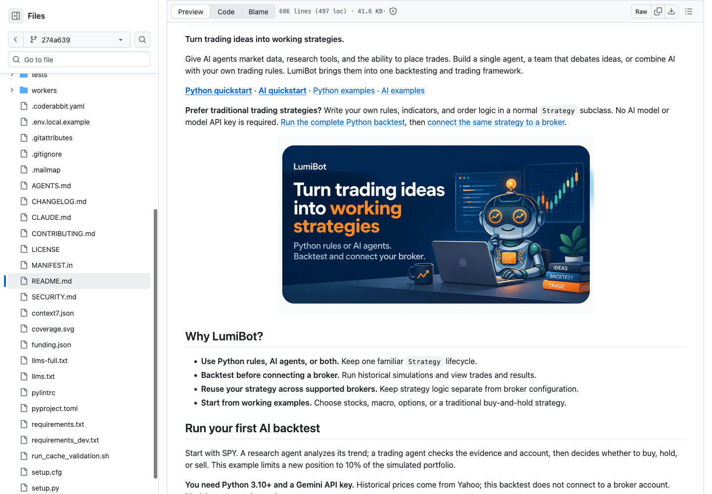
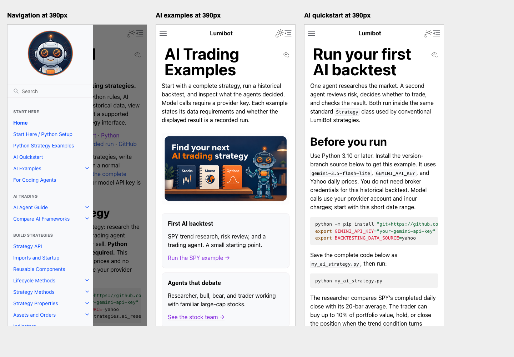
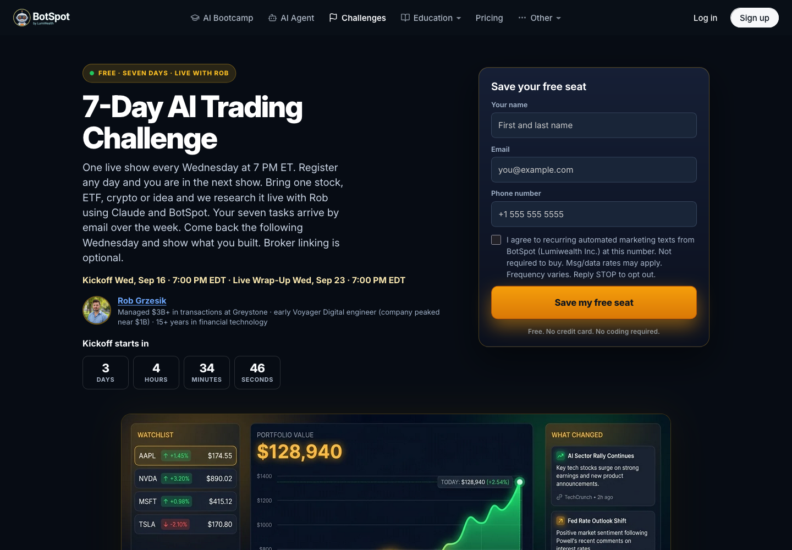

# Complete visual review — September 13, 2026

These are actual Firefox screenshots of the local Sphinx build, not mockups or evidence of a Dev deployment. Open any full-page image and zoom to read every section. The source and screenshot commits are on version/4.5.92.

## Published GitHub README

Captured from source commit `274a6399` on GitHub.

[Full published README screenshot](published-readme-full.png)

## Start with these views

### Homepage, runnable example and navigation

### 390px layouts and expanded mobile menu

### AI examples and free challenge

### Python setup and creator banner

### AI quickstart and bootcamp banner

### Actual free challenge destination

### Actual bootcamp destination

## Every documentation page captured

Each image includes the full page: text, code, menus, images and footer. Some pages only changed their shared navigation, metadata or links; this inventory does not imply every paragraph was rewritten.

- [agent_start_here](full-agent_start_here.png)
- [agents](full-agents.png)
- [agents_example_ai_opening_range_breakout](full-agents_example_ai_opening_range_breakout.png)
- [agents_example_bull_bear_large_cap_stocks](full-agents_example_bull_bear_large_cap_stocks.png)
- [agents_example_citadel_sector_pods](full-agents_example_citadel_sector_pods.png)
- [agents_example_ray_dalio_idea_meritocracy](full-agents_example_ray_dalio_idea_meritocracy.png)
- [agents_examples](full-agents_examples.png)
- [agents_flows](full-agents_flows.png)
- [agents_observability](full-agents_observability.png)
- [agents_quickstart](full-agents_quickstart.png)
- [ai_trading_project_comparison](full-ai_trading_project_comparison.png)
- [backtesting.databento](full-backtesting.databento.png)
- [backtesting.how_to_backtest](full-backtesting.how_to_backtest.png)
- [backtesting](full-backtesting.png)
- [backtesting.polygon](full-backtesting.polygon.png)
- [backtesting.tearsheet_html](full-backtesting.tearsheet_html.png)
- [backtesting.thetadata](full-backtesting.thetadata.png)
- [backtesting.yahoo](full-backtesting.yahoo.png)
- [brokers.alpaca](full-brokers.alpaca.png)
- [brokers.bitunix](full-brokers.bitunix.png)
- [brokers.ccxt](full-brokers.ccxt.png)
- [brokers.interactive_brokers](full-brokers.interactive_brokers.png)
- [brokers](full-brokers.png)
- [brokers.schwab](full-brokers.schwab.png)
- [deployment](full-deployment.png)
- [examples](full-examples.png)
- [faq](full-faq.png)
- [fundamentals](full-fundamentals.png)
- [getting_started](full-getting_started.png)
- [index](full-index.png)
- [indicators](full-indicators.png)
- [lumibot.strategies](full-lumibot.strategies.png)
- [lumibot_vs_ai_hedge_fund](full-lumibot_vs_ai_hedge_fund.png)
- [lumibot_vs_openalice](full-lumibot_vs_openalice.png)
- [lumibot_vs_tradingagents](full-lumibot_vs_tradingagents.png)
- [macro_data](full-macro_data.png)
- [reference](full-reference.png)
- [standalone_components](full-standalone_components.png)
- [strategy_api_overview](full-strategy_api_overview.png)
- [strategy_methods](full-strategy_methods.png)

## Changes that are not pictures

See [implementation and growth review](../../../../GROWTH_REVIEW_2026-09-13.md) for source paths, tests, remaining work and competitor research. Runtime code, CI and repository triage must be reviewed as source and test evidence, not as screenshots of a page.
