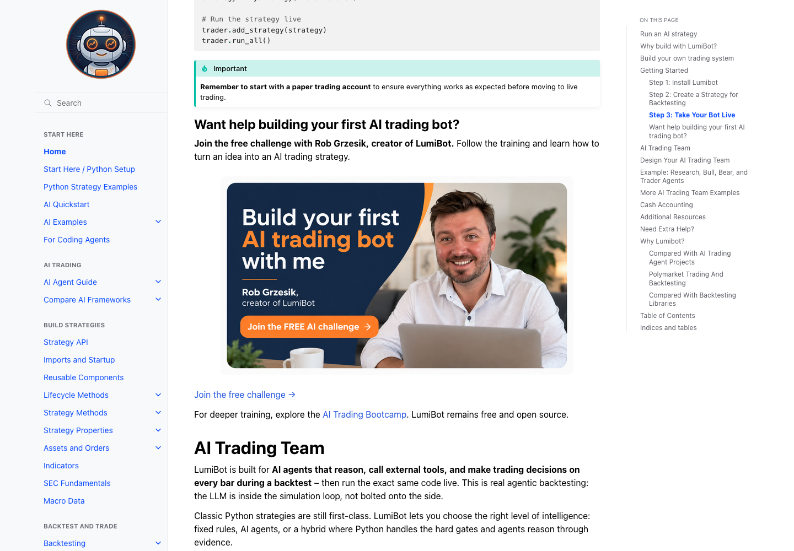
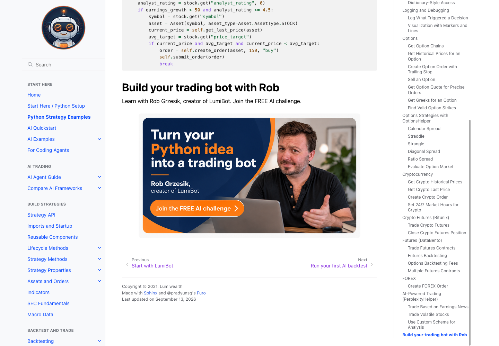
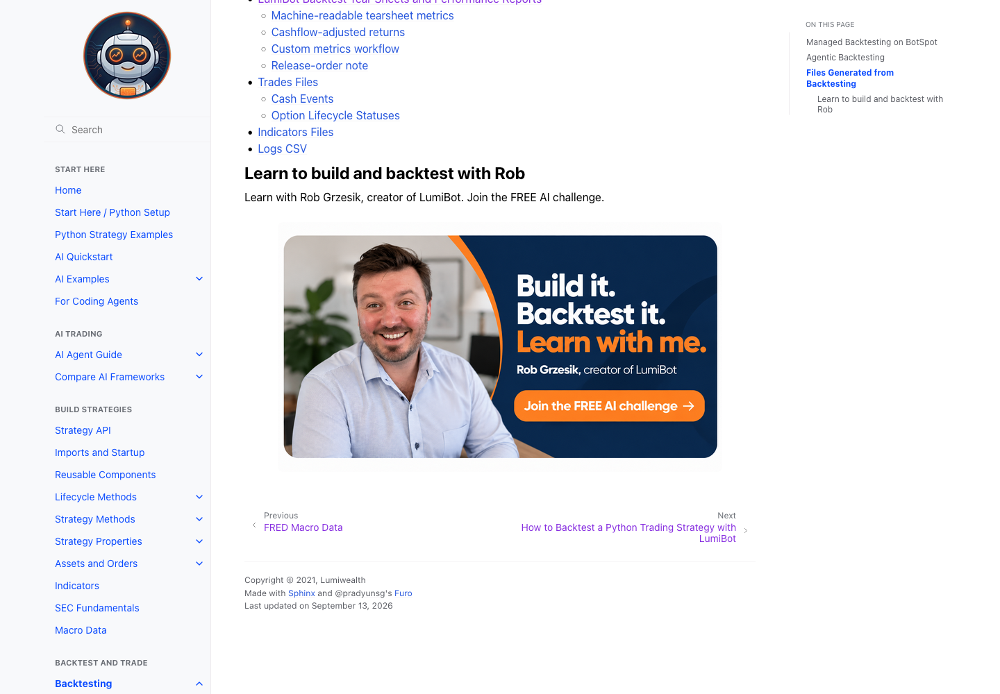
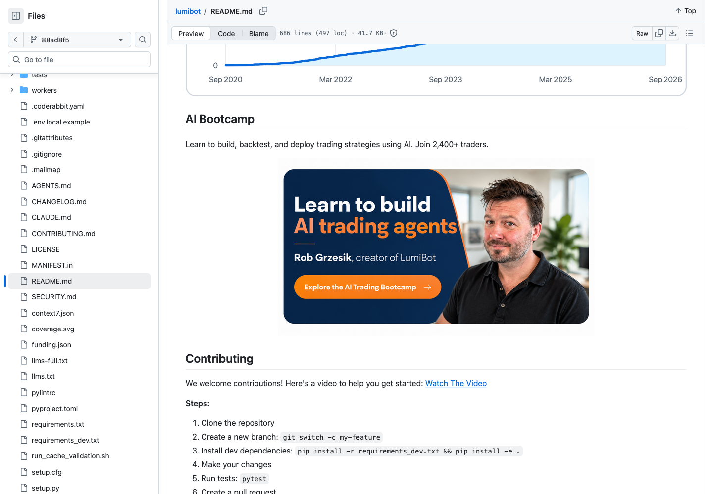

# Creator campaign screenshot review

Six challenge portraits and three bootcamp portraits, across ten tracked placements. These are raw Firefox page screenshots. Documentation is a local build; source is pushed on the version branch.

## index

[Full page](creator-full-index.png)

## getting_started

[Full page](creator-full-getting_started.png)

## agents_examples

[Full page](creator-full-agents_examples.png)

## examples

[Full page](creator-full-examples.png)

## backtesting

[Full page](creator-full-backtesting.png)

## agents_quickstart

[Full page](creator-full-agents_quickstart.png)

## standalone_components

[Full page](creator-full-standalone_components.png)

## agents_flows

[Full page](creator-full-agents_flows.png)

## New AI gallery

## Homepage

## Published README challenge

## Published README bootcamp

