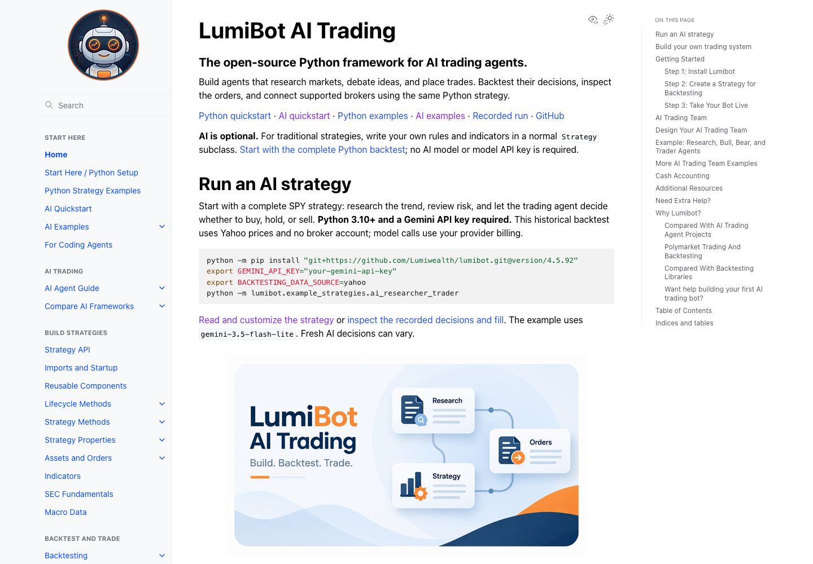
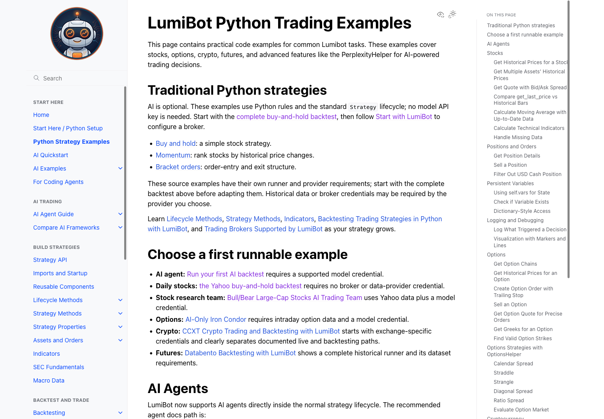

# Traditional strategy entry points

The homepage and README opening now offer a Python quickstart alongside AI.
Python setup and examples are in the first navigation group. The examples page
starts with traditional buy-and-hold, momentum and bracket-order strategies.

21/21 affected tests passed. Sphinx builds completed. Firefox verified the
homepage anchor reaches the conventional backtest and examples navigation
opens the traditional examples page. Screenshots are local build evidence;
source publication does not mean Dev deployment.

