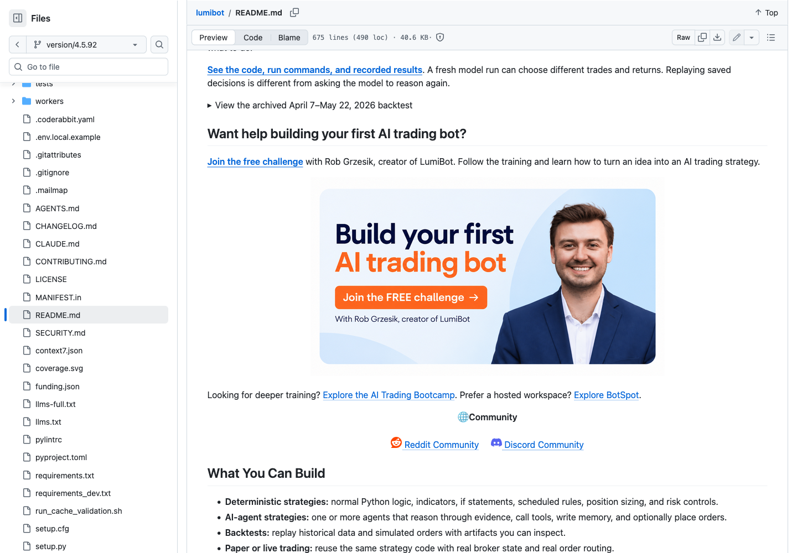
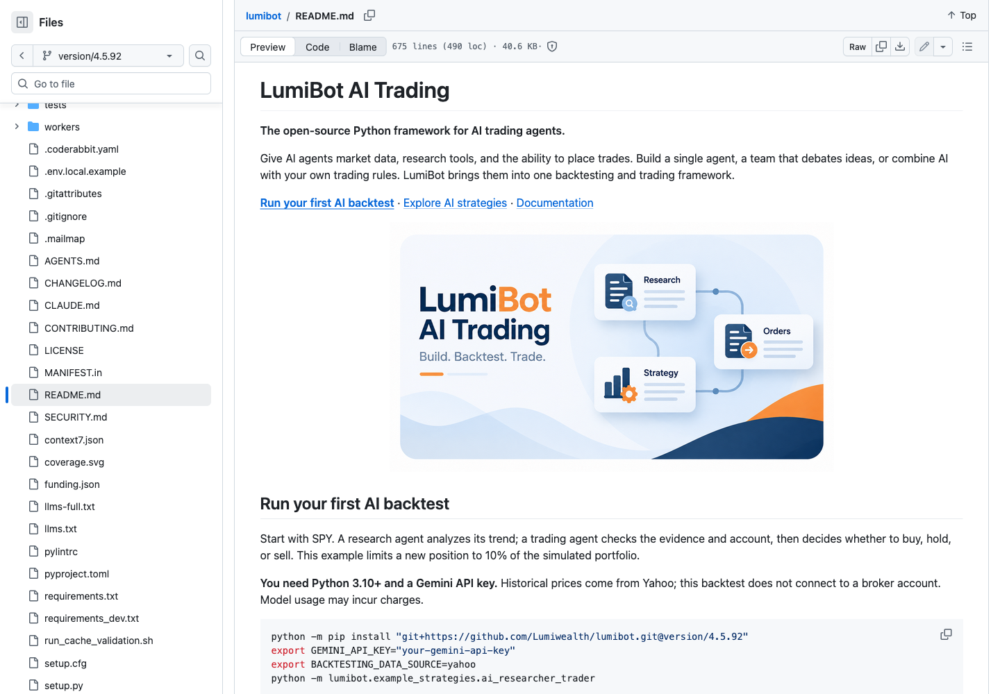
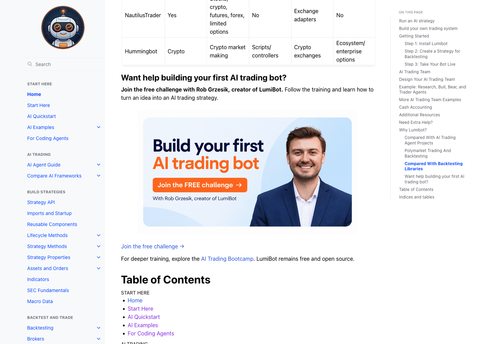
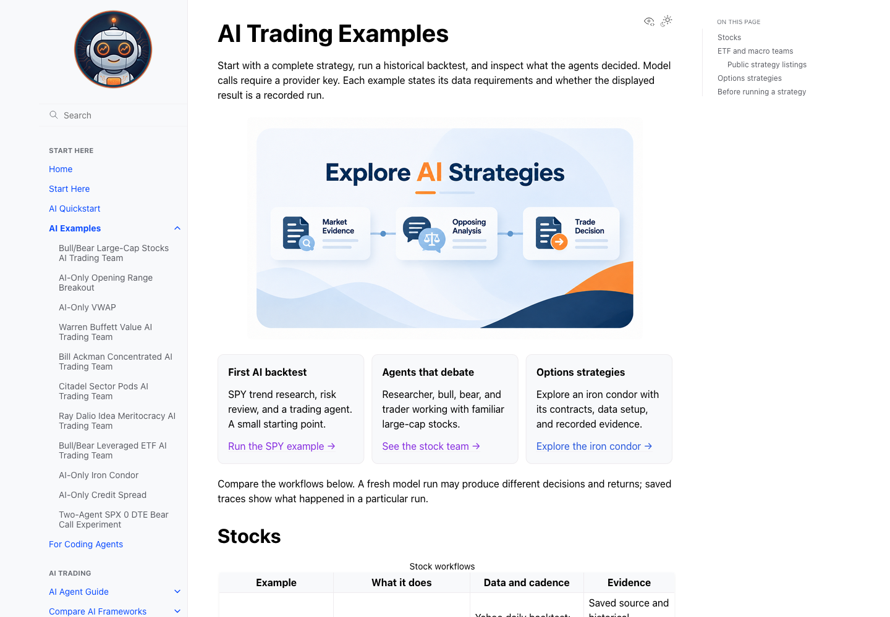
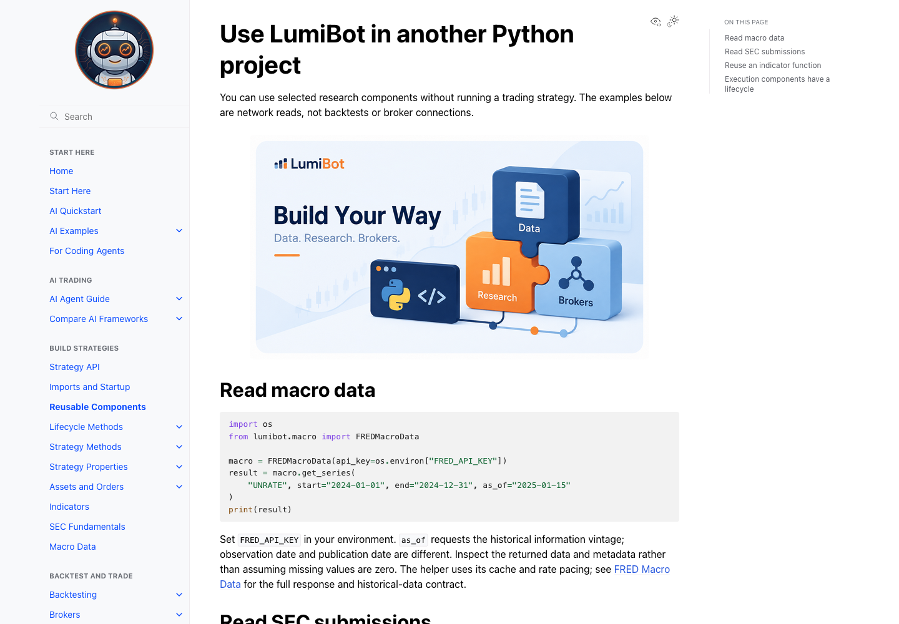
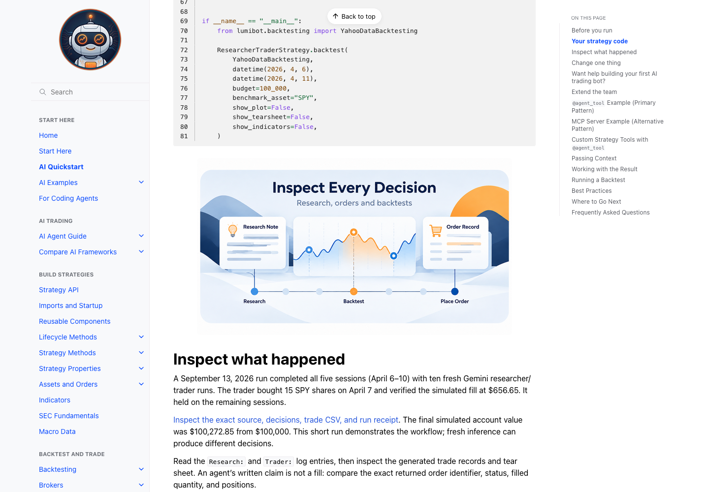
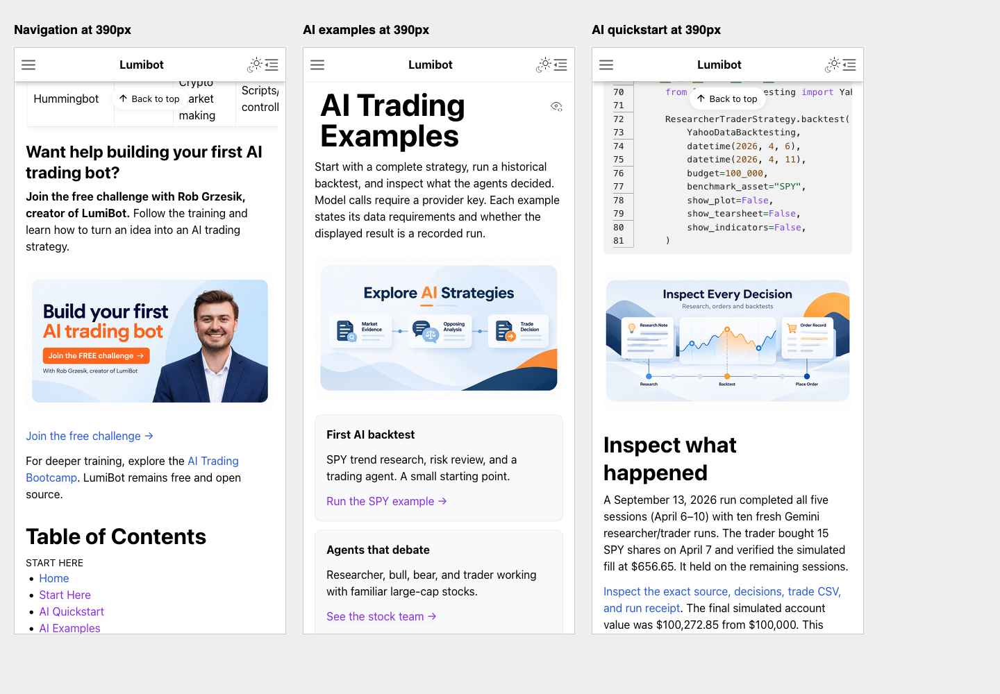

# Five-image visual refresh

**Correction:** the backtest illustration below was subsequently regenerated to replace the shopping cart with a financial trade ticket. [View the corrected asset](../inspect-decisions.png). Historical screenshots below predate that icon correction.

Replaces the robot hero and awkward left-aligned challenge image; adds three workflow illustrations. These are locally built documentation screenshots. Source publication is separate from Dev deployment.

20/20 affected tests passed. Sphinx builds completed. Firefox verified desktop image centering (zero offset), 640 × 360 proportions, and 390px responsive pages without overflow. Narrow-screen images rendered at 358 × 201.38. This is browser-frame evidence, not an iPhone device test.

## Published GitHub README

Captured from version/4.5.92 after commit 4e125e44. Challenge image is 640 × 360, centered with zero offset.

## Homepage

## Free challenge

## AI examples

## Reusable components

## Backtest inspection

## Narrow screens

[All five original images and prompts](../README.md)
