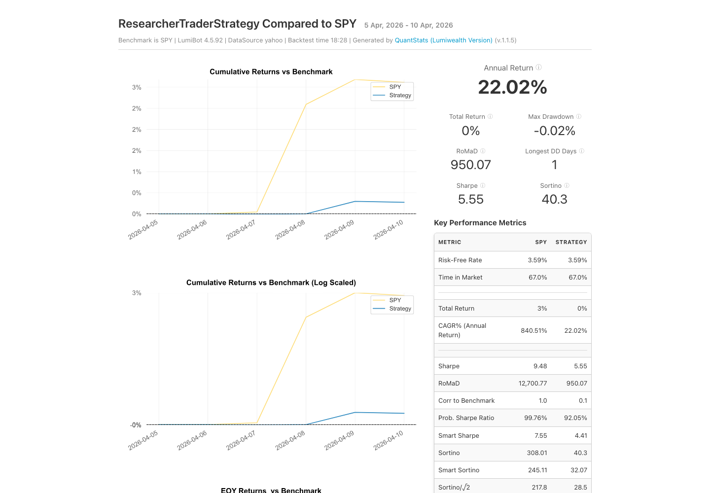

# SPY AI backtest: recorded September 13, 2026

This is the actual small example linked from the README, using fresh Gemini
inference and the real Yahoo backtest engine. It is separate from the archived
large-cap strategy report.

## Run it yourself

Use Python 3.10 or later:

```bash
python -m pip install "git+https://github.com/Lumiwealth/lumibot.git@ea55faef38eea8bfcfc022962e1a457f2d4a8476"
export GEMINI_API_KEY="your-gemini-api-key"
export BACKTESTING_DATA_SOURCE=yahoo
```

Save [strategy.py](strategy.py) as `my_ai_strategy.py`, then run
`python my_ai_strategy.py`. This source is an exact snapshot of
`lumibot/example_strategies/ai_researcher_trader.py`; its SHA-256 is in the receipt.

The validation harness selected native Gemini credentials, isolated cache and
memory directories, disabled automatic browser opening, and attached a shared
model-call budget. It did not replace the agents or change their trading rules.
Your terminal run uses your provider billing; the recorded model estimate was
$0.1664 for this backtest, excluding separate evaluation calls. It took 18m31s
while sharing an input-token pacer with concurrent evaluations. This is a
measurement of that run, not a price or latency guarantee.

## What happened

| Session | Trading decision |
| --- | --- |
| April 6 | Hold: completed close below the 20-bar average; no existing position. |
| April 7 | Buy 15 SPY shares, then verify order `bt_1` filled at $656.6500244. |
| April 8–10 | Hold the existing 15-share position; do not add another entry. |

The final account value was **$100,272.85** from **$100,000**, a direct account
change of **0.27285%**. One order filled. No broker account was connected.
All ten agent runs were fresh application-level inference runs, with no replay
hits or runtime warnings. Provider prompt caching was used and included in cost.

- [Machine-readable receipt](receipt.json): source identity, dates, model, cost and account values.
- [Actual decisions and order-tool observations](decisions.json).
- [Trade events](trades.csv): includes submission and fill as separate rows.
- [Account time series](stats.csv).

Fresh model inference can choose different trades even with the same source.
The saved decisions show what this run did; they are not a complete portable
replay bundle. Replaying requires matching input data and runtime cache context.

## Report interpretation

The engine's summary `total_return` is 0.284734%, while direct final-account
change is 0.272850%. Both original values are retained in the receipt; they are
not represented as identical. The screenshot is the unedited generated report.
Its annualized metrics extrapolate a very short period and are not observed
annual performance. Use the trade and account records to inspect this workflow,
not the annualized headline as an investment claim. Historical model knowledge
can include later events even when market tools respect the strategy clock.

The report currently rounds its total-return display to **0%** despite the
nonzero account change above. It also includes a pre-session seed date (April 5)
in the chart. These presentation limitations are retained visibly here; this
image is not the README hero or a promoted performance claim.


