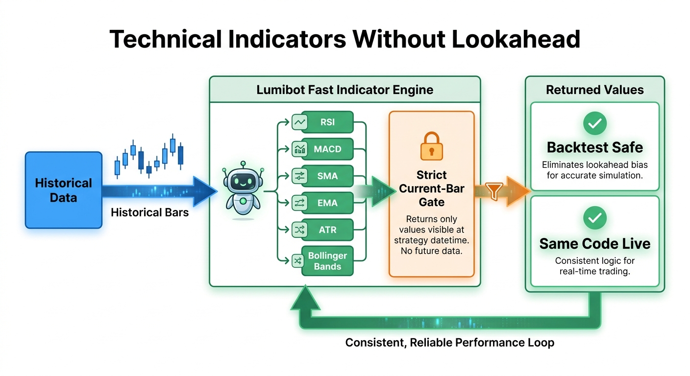
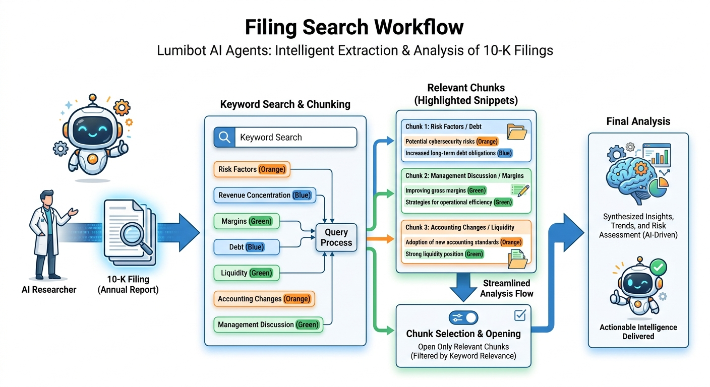

Agent Built-In Tools
====================

LumiBot agents include built-in tools for market state, account state, orders,
DuckDB queries, documentation search, news, indicators, SEC fundamentals,
filings, memory, and notifications.

Trading Permissions
-------------------

.. image:: ../docs/assets/ai_committee/docs_tool_permissions.png
   :alt: Lumibot agent tool permissions

Use ``allow_trading=False`` for research agents:

.. code-block:: python

   self.agents.create(
       name="researcher",
       model="openai/gpt-5.4-mini",
       allow_trading=False,
   )

This removes tools that submit, cancel, or modify orders. Read-only tools remain
available, including open orders and positions.

Technical Indicator Tools
-------------------------

- ``list_indicators``
- ``get_indicator``
- ``get_indicators``

Indicator tools call ``self.indicators`` under the hood. In backtests, LumiBot
computes the full visible series but returns only the value at or before the
current strategy datetime.

SEC Filing Tools
----------------

Use ``get_filings`` to find point-in-time filings, ``search_filing`` to search
large filings before opening them, and ``get_filing_document`` when the agent
needs the full filing text.

Notification Tools
------------------

``notify_user`` sends through configured notification providers. Backtests keep
notifications disabled by default unless you explicitly enable them.

.. image:: ../docs/assets/ai_committee/docs_notification_configuration.png
   :alt: Lumibot notification configuration

Memory Tools
------------

.. image:: ../docs/assets/ai_committee/docs_memory_lifecycle.png
   :alt: Lumibot agent memory lifecycle

- ``remember``
- ``search_memory``
- ``remember_decision``
- ``remember_lesson``
- ``open_thesis``
- ``update_thesis``
- ``close_thesis``

These write local JSONL files so agent decisions and lessons are inspectable.
