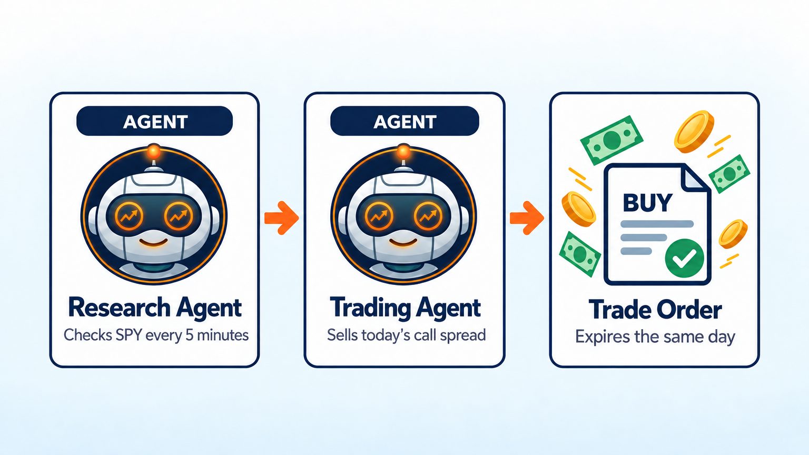
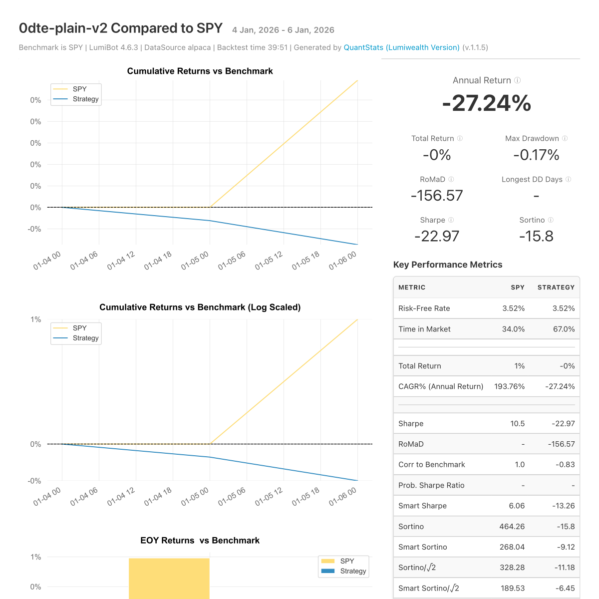

0DTE Options AI Trading Bot
===========================

.. meta::
   :description: Two AI agents team up to trade SPY 0DTE options with bear call spreads that expire the same day. Free Python code you can backtest in LumiBot.

This bot trades 0DTE options: options that expire the same day. It sells a bear call spread on SPY, the S&P 500 ETF, and keeps the premium if SPY stays below the short strike by the close. 0DTE is now the biggest part of the index options market: in August 2025 it was a record 62.4% of all SPX options trading (`Cboe <https://www.cboe.com/insights/posts/spx-0-dte-options-jump-to-record-62-share-in-august>`__).

How it works
------------

1. **Research agent** checks SPY and the calls that expire today every 15 minutes. It finds the call near 0.20 delta and the call 5 points higher, with their prices.
2. **Trading agent** sells that spread once a day, risking about 1% of the account.
3. The trading agent keeps watching and closes the spread early when you have kept half the credit, when closing costs twice the credit, or when SPY rises above the short strike. It never opens a new spread in the last 30 minutes of the day.

Change ``symbol`` to ``"SPX"`` to trade S&P 500 index options, if your broker offers them.

Run it on BotSpot
-----------------

Run this bot on `BotSpot <https://botspot.trade/marketplace?utm_source=documentation&utm_medium=docs&utm_campaign=lumibot_ai_examples&utm_content=agents_example_0dte_options_ai_trading_bot>`_ without installing anything. BotSpot runs LumiBot in the cloud, backtests it, and connects it to your broker.

Backtest tear sheet
-------------------

GPT-6 Luna, January 5 to 6, 2026, Alpaca option prices, $100,000 start. Each morning the bot sold a 2-contract SPY bear call spread that expired that day, for about $0.27 a share. Both days SPY rallied into the short strike, and the bot closed the spread early at its loss limit, near 2 to 3 times the credit because it checks every 15 minutes. It ended at $99,826 (-0.2%). A losing window, shown as it happened.

`Open the full tear sheet <tearsheets/0dte-options-ai-trading-bot.html>`__. A short backtest shows the bot works as written. It is not a promise of future returns.

The code
--------

The whole bot is one short file. The prompts are plain English, and they are the strategy.

.. literalinclude:: ../lumibot/example_strategies/ai_0dte_options_trading_bot.py
   :language: python

Run it yourself
---------------

.. code-block:: bash

   pip install lumibot
   python -m lumibot.example_strategies.ai_0dte_options_trading_bot

Put these in your ``.env`` file: ``OPENAI_API_KEY``, and your broker keys (for example ``ALPACA_API_KEY``, ``ALPACA_API_SECRET``, and ``ALPACA_IS_PAPER=true`` for paper trading). With ``IS_BACKTESTING=false`` the bot trades. With ``IS_BACKTESTING=true`` it backtests instead; set ``BACKTESTING_START`` and ``BACKTESTING_END`` to pick the dates, and start with a week or two, because every AI call costs a little. Option and minute-bar backtests use Alpaca's free history, so paper Alpaca keys are enough.

Good to know
------------

* 0DTE options move very fast. Paper trade first.
* The bot checks every 15 minutes, so it makes a lot of AI calls per day.

See :doc:`agents_examples` for more AI trading bots and :doc:`strategy_run_modes` for backtest and live runs.
