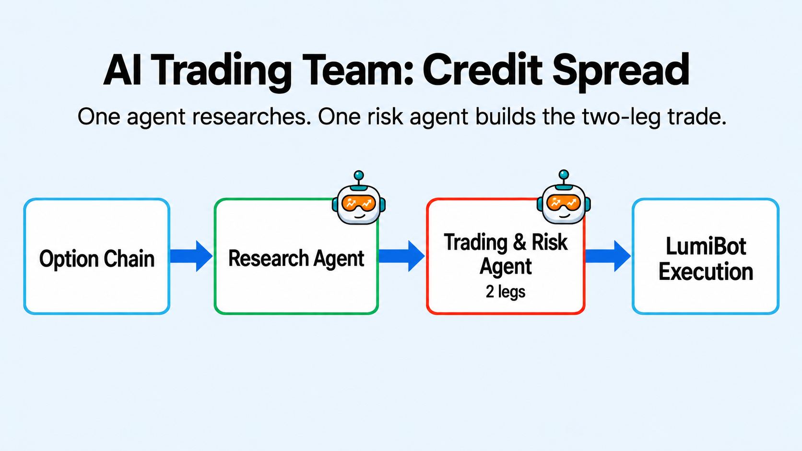

AI Credit Spread
================

.. meta::
   :description: ai_credit_spread.py is a two-agent options strategy. A research-only agent finds and documents an exact listed spread candidate.

``ai_credit_spread.py`` is a two-agent options strategy. A research-only agent
finds and documents an exact listed spread candidate. A dedicated
trading-and-risk agent independently rechecks the contracts, prices and sizes
the package, and is the only agent allowed to place a broker order. LumiBot's
built-in options skill provides reusable contract, pricing, atomic-order,
signed-position, and close-verification mechanics.

How it works
------------

* The research agent selects a listed put or call vertical from current evidence.
* The trading-and-risk agent verifies both exact contracts and package credit.
* Only that final agent submits both legs atomically to the broker.
* Active rules prevent duplicate structures and repeated closing orders.

Verified backtest evidence
--------------------------

The preserved pre-fix run demonstrated the original failure clearly: reversed
closing sides, repeated close attempts, and quantities that escalated to 480
contracts. That artifact is retained as the red baseline.

The repaired real-model eval now passes three consecutive repetitions. Each run
reconstructs the signed spread, maps long legs to ``sell_to_close`` and short
legs to ``buy_to_close``, submits one correctly sized atomic close, and verifies
the final state. The current historical downloader returned no option chain for
the canonical local window, so that backtest correctly remained flat. These
results validate mechanics without claiming strategy profitability.

.. code-block:: bash

   export OPENAI_API_KEY="your-key"
   export BACKTESTING_DATA_SOURCE="alpaca"
   export DATADOWNLOADER_BASE_URL="https://<your-downloader-host>:8080"
   export DATADOWNLOADER_API_KEY="your-downloader-key"
   python -m lumibot.example_strategies.ai_credit_spread

Set ``BACKTESTING_START`` and ``BACKTESTING_END`` to choose an exact window.

The latest run used ``openai/gpt-6-luna`` on high reasoning with Alpaca option
history from January 5 to 15, 2026. On January 5 it sold 33 SPY February 13
655/650 put credit spreads at real Alpaca prices through
``orders_submit_multileg``, sized to the risk budget. The account ended at
$100,627. This is one short simulation, not a performance claim.

.. literalinclude:: ../lumibot/example_strategies/ai_credit_spread.py
   :language: python
   :linenos:
