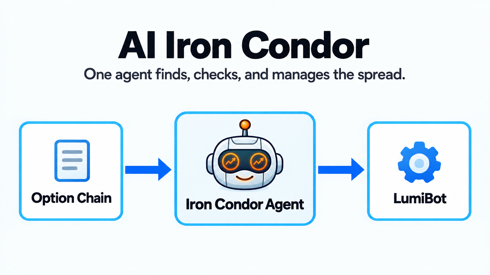

AI Iron Condor
==============

``ai_iron_condor.py`` is a two-agent options strategy. A research-only agent
finds and documents an exact four-contract candidate. A dedicated
trading-and-risk agent independently rechecks the chain, prices and sizes the
package, and is the only agent allowed to place a broker order.

The system prompt contains only the strategy policy: underlying, delta, DTE,
wing width, exits, and risk limits. Reusable options mechanics are supplied by
LumiBot's built-in ``options-trading`` skill. Active ``rules.json`` entries are
loaded again before every agent call and appended to the runtime instructions.

The example uses ``openai/gpt-6-luna`` on high reasoning explicitly. Existing saved
strategies keep the model identifier already stored in their code.

How it works
------------

* The research agent reads the underlying, chain, contracts, Greeks, and quotes.
* The trading-and-risk agent independently verifies the exact four legs and account risk.
* Only that final agent prices and submits the atomic broker order.
* It verifies the returned order and current signed positions before reporting state.

Verified backtest evidence
--------------------------

The preserved ``2026-08-05_00-33_9dcawc`` seven-day backtest opened one atomic
SPY iron condor with the 685/690 put spread and 771/776 call spread, all using a
single 2026-09-04 expiration. The backtest ended near flat with a -0.00% rounded
total return and a -0.08% maximum drawdown. This short window proves mechanics,
not expected performance.

The refactored strategy was also rerun over two current seven-day windows. The
active downloader reported no historical option chain, so the agent correctly
made no trade instead of inventing contracts. The release-gated real-model eval
provides a chain fixture and separately verifies chain retrieval, four valid
legs, explicit package pricing, one atomic submission, and post-submit state
verification.

Run a seven-day backtest ending today with an options-capable backtest data
source:

.. code-block:: bash

   export OPENAI_API_KEY="your-key"
   export BACKTESTING_DATA_SOURCE="alpaca"
   export DATADOWNLOADER_BASE_URL="https://<your-downloader-host>:8080"
   export DATADOWNLOADER_API_KEY="your-downloader-key"
   python -m lumibot.example_strategies.ai_iron_condor

Set ``BACKTESTING_START`` and ``BACKTESTING_END`` in ``YYYY-MM-DD`` format to
choose an exact historical window.

The January 2026 Alpaca proof opened one SPY iron condor with
``orders_submit_multileg`` on January 5 and closed it on January 12. The tear
sheet is a real QuantStats file and the account was not wrecked.

.. literalinclude:: ../lumibot/example_strategies/ai_iron_condor.py
   :language: python
   :linenos:
