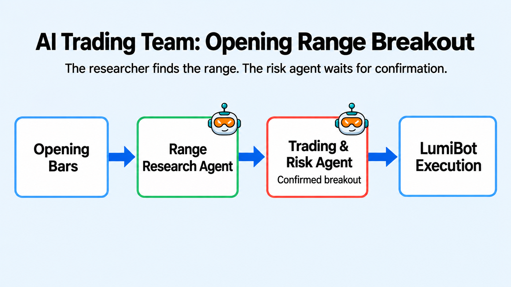

AI Opening Range Breakout
=========================

.. meta::
   :description: ai_opening_range_breakout.py is a two-agent equity strategy. A research-only agent scans completed opening ranges and ranks valid breakouts.

``ai_opening_range_breakout.py`` is a two-agent equity strategy. A research-only
agent scans completed opening ranges and ranks valid breakouts. A dedicated
trading-and-risk agent independently verifies that evidence, sizes the position,
and is the only agent allowed to place a broker order. The built-in
``stock-trading`` skill provides reusable market-evidence, stock-order, and
verification mechanics.

How it works
------------

* The research agent scans the configured universe with batch prices and history.
* It builds ranges only from completed regular-session bars beginning at 09:30 ET.
* The trading-and-risk agent rechecks the strongest completed breakout and account state.
* Only that final agent can size, submit, reconcile, and manage a broker order.

Verified backtest evidence
--------------------------

The earlier five-day mechanical run completed with four fills across NVIDIA and
AMD and a 0.44% total return, but required 104 agent calls. The refactor moved
reusable stock mechanics into the runtime skill and changed the default decision
cadence to hourly while retaining minute evidence. The production-gated ORB eval
passes three consecutive real-model repetitions and verifies completed 09:30 ET
opening bars, a completed breakout close, current price evidence, one submission,
and post-order state.

A fresh one-day run from source commit
``cfa017cfd11c937cd1b87d5119fff067972e6b04`` completed from the April 6,
2026 open through the 16:00 ET close. It used IBKR intraday history through the
configured Data Downloader, ``openai/gpt-6-luna`` on high reasoning, and the SPY, NVDA, and AMD
universe below. Seven hourly agent decisions completed without a runtime or data
fetch failure. The agent submitted no order, the backtesting broker recorded no
fill, and simulated portfolio value remained $100,000. This is a completed
no-trade result, not a timeout or a substituted trade.

The uncached run made 58 provider calls and cost $0.1759 at the recorded input,
cached-input, and output-token rates. It saved ``stats.csv``, ``trades.csv``,
``lumibot.log``, ``tearsheet.html``, and ``tearsheet_metrics.json``. Because the
run contained no trade and no return variation, the tear sheet is a placeholder.

The example is therefore qualified for mechanics and bounded model behavior, not
for expected returns. If minute bars for the true opening window are unavailable,
the agent must skip the symbol instead of inventing a range.

The latest run used ``openai/gpt-6-luna`` on high reasoning with Alpaca minute
bars on January 5 and 6, 2026. It traded confirmed breakouts in DIS and DE at
about 10% of the account, plus an SPGI buy and sell inside the same bar, and
ended at $99,915. The earlier IBKR and ThetaData notes stay as history from
those attempts.

Run a bounded historical example
--------------------------------

Use Python 3.10 or later. From a current LumiBot source checkout, install the
package in your virtual environment so the runner and documentation match:

.. code-block:: bash

   python -m pip install -e .
   export OPENAI_API_KEY="your-openai-key"
   export DATADOWNLOADER_BASE_URL="https://your-downloader-host"
   export DATADOWNLOADER_API_KEY="your-downloader-key"
   export BACKTESTING_DATA_SOURCE="alpaca"
   export BACKTESTING_START="2026-04-06"
   export BACKTESTING_END="2026-04-11"
   export AI_ORB_UNIVERSE="SPY,NVDA,AMD"
   export AI_ORB_SLEEPTIME="1H"
   export LUMIBOT_AGENT_MAX_MODEL_CALLS="60"
   python -m lumibot.example_strategies.ai_opening_range_breakout

The current source selects ``openai/gpt-6-luna`` on medium reasoning. Check that your provider
account supports it. The command above spans April 6 through April 10, 2026,
with an April 11 end boundary. Start with three symbols before expanding to the
default universe. The passing minute proof uses Alpaca, the same source as the
command above. An earlier one-day mechanics run ended April 7 and did not
trade. Yahoo daily bars cannot supply a 09:30-09:45 opening range. Missing
intraday evidence should result in a skip with an explanation.

The call limit bounds agent invocations, not necessarily every provider
continuation or dollar of spend. In the verified one-day run, seven agent
decisions resulted in 58 provider calls. Model and data charges depend on your
accounts; use a separately enforced budget for paid verification. Reaching the
limit is an incomplete run, not a passing demonstration.

Inspect the output
------------------

Record the source commit, package version, model, date range, symbol universe,
and data source together with the generated backtest logs and artifacts. Inspect
completed opening bars, decision timestamps, any submitted orders and fills,
exit decisions, and the terminal backtest status. Check that the strategy uses
minute evidence even though it makes hourly decisions.

A completed no-trade run is possible; do not add a trade merely to make a demo
look successful. A timeout, budget limit, or missing-chain/history failure is
not a completed full-window result. Save the terminal logs before showing a
tearsheet or making a performance statement.

Use ``AI_ORB_*`` parameters for opening-range length, sizing, position limits,
and profit exits; the source below lists their exact names and defaults.

.. literalinclude:: ../lumibot/example_strategies/ai_opening_range_breakout.py
   :language: python
   :linenos:
