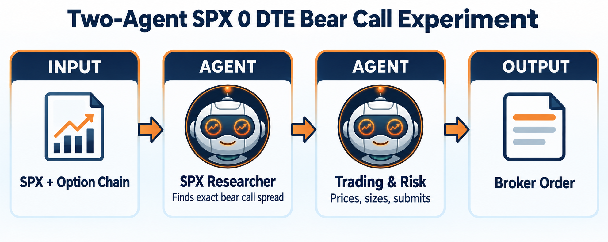

Two-Agent SPX 0 DTE Bear Call Experiment
========================================

.. meta::
   :description: ai_spx_zero_dte_bear_call_team.py tests a strict two-agent architecture: LumiBot documentation.

``ai_spx_zero_dte_bear_call_team.py`` tests a strict two-agent architecture:

* The researcher has ``allow_trading=False`` and gathers current SPX, account,
  chain, contract, Greek, quote, and package-price evidence.
* The trader has ``allow_trading=True``. It independently refreshes the
  evidence, validates every active Rule, decides whether to trade, submits any
  spread through ``orders_submit_multileg``, and verifies the order and
  resulting positions.

Python schedules the two calls and passes the research summary forward. It does
not select contracts or submit orders. The active Rules require SPX 0 DTE calls,
a short call near 0.20 delta, a long call exactly five points higher, one new
package per trading day, and atomic entry and exit.

The active broker must support atomic packages. Otherwise LumiBot rejects the
request before submitting any child leg.

The January 5, 2026 Alpaca proof used SPXW, the listed zero-day symbol, at
strikes 6900 and 6910. It submitted one ``orders_submit_multileg`` to open and
one to close. Both filled. The account ended near $99,925. The monthly SPX
symbol returned no bars for that day, so the proof uses SPXW.

.. code-block:: bash

   export OPENAI_API_KEY="your-key"
   export BACKTESTING_DATA_SOURCE="alpaca"
   export DATADOWNLOADER_BASE_URL="https://<your-downloader-host>:8080"
   export DATADOWNLOADER_API_KEY="your-downloader-key"
   python -m lumibot.example_strategies.ai_spx_zero_dte_bear_call_team

Use a paper broker and a short historical window before considering any live
workflow. The example proves architecture and mechanics, not profitability.

.. literalinclude:: ../lumibot/example_strategies/ai_spx_zero_dte_bear_call_team.py
   :language: python
   :linenos:
