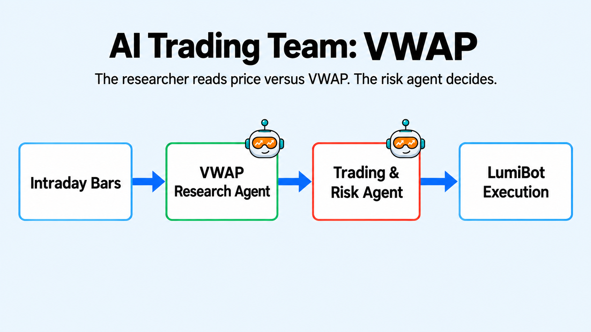

AI VWAP Strategy
================

``ai_vwap.py`` is a two-agent equity strategy. A research-only agent computes and
explains the point-in-time VWAP setup. A dedicated trading-and-risk agent
independently verifies the signal and is the only agent allowed to place a
broker order. The built-in ``stock-trading`` skill supplies reusable evidence,
sizing, order, and verification mechanics. Active rules limit it to one position
and one entry per day.

How it works
------------

* The research agent computes VWAP only from bars visible at the simulated time.
* It evaluates the configured dip and reclaim evidence without trading.
* The trading-and-risk agent rechecks the evidence, account, positions, and open orders.
* Only that final agent sizes and reconciles the exact broker order.
  In backtests, a short bounded terminal wait lets the simulator process the
  agent's own market order without creating an open-ended polling loop.

Verified backtest evidence
--------------------------

The final refactored strategy completed a bounded local backtest from 2026-08-04
through 2026-08-07 with hourly decisions over minute evidence. It bought 12 SPY
shares at $771.23 and sold those same 12 shares at $769.37. There were no
duplicate exit submissions and no residual position. The portfolio ended near
$99,978 from a $100,000 start. The tear sheet rounded total return to -0.00%,
annualized return to -2.02%, and maximum drawdown to -0.02%. This short result
is mechanical evidence, not a performance claim.

A later Alpaca minute proof, January 5, 2026, bought 1 SPY at 686.54 and sold
that share at 687.29. The tear sheet for that run is a real QuantStats file.
That is the source this page now names. The earlier August prices stay as
history from the prior data source.

.. code-block:: bash

   export OPENAI_API_KEY="your-key"
   export DATADOWNLOADER_BASE_URL="https://data.example.test"
   export DATADOWNLOADER_API_KEY="your-data-key"
   export BACKTESTING_DATA_SOURCE="alpaca"
   python -m lumibot.example_strategies.ai_vwap

Set ``BACKTESTING_START``, ``BACKTESTING_END``, and optional ``AI_VWAP_*``
variables to reproduce a specific policy and window.

.. literalinclude:: ../lumibot/example_strategies/ai_vwap.py
   :language: python
   :linenos:
