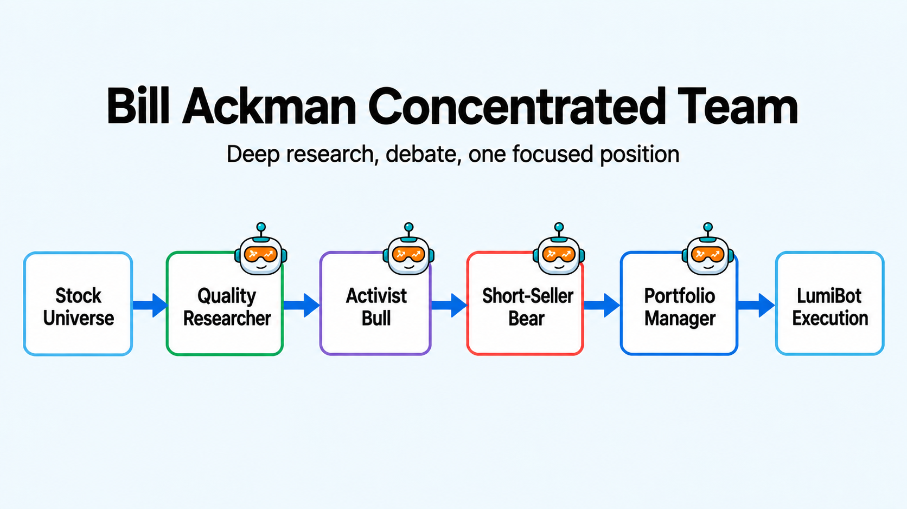

Bill Ackman Concentrated AI Trading Team
========================================

This strategy is inspired by Bill Ackman and Pershing Square-style concentrated
investing: do deep work on a small number of understandable, high-quality
businesses, make a strong bull case, invite a brutal bear case, and then act
with conviction if the thesis survives.

The team is intentionally adversarial. The quality researcher finds the best
candidate, the activist bull looks for catalysts and value creation, the
short-seller bear attacks the thesis, and the portfolio manager decides whether
one concentrated position is still justified.

How the team works
------------------

* ``quality_researcher`` finds the best high-quality large-cap candidate.
* ``activist_bull`` argues for catalysts, pricing power, and value creation.
* ``short_seller_bear`` attacks leverage, governance, accounting, competition, and valuation risk.
* ``portfolio_manager`` builds one concentrated position and is the only agent allowed to trade.

Run it with a broker
--------------------

The file defaults to broker-connected execution. With Alpaca, it runs in paper
mode unless you set ``ALPACA_IS_PAPER=false``.

.. code-block:: bash

   export GEMINI_API_KEY='your-key-here'
   export ALPACA_API_KEY='your-alpaca-key'
   export ALPACA_API_SECRET='your-alpaca-secret'
   export ALPACA_IS_PAPER=true
   python lumibot/example_strategies/ai_trading_team_bill_ackman_concentrated.py

Backtest it
-----------

Use the same strategy class and change ``IS_BACKTESTING = False`` to ``IS_BACKTESTING = True`` in the runner:

.. code-block:: bash

   export GEMINI_API_KEY='your-key-here'
   python lumibot/example_strategies/ai_trading_team_bill_ackman_concentrated.py

Example code
------------

.. literalinclude:: ../lumibot/example_strategies/ai_trading_team_bill_ackman_concentrated.py
   :language: python
