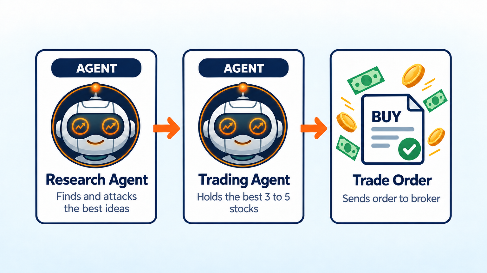
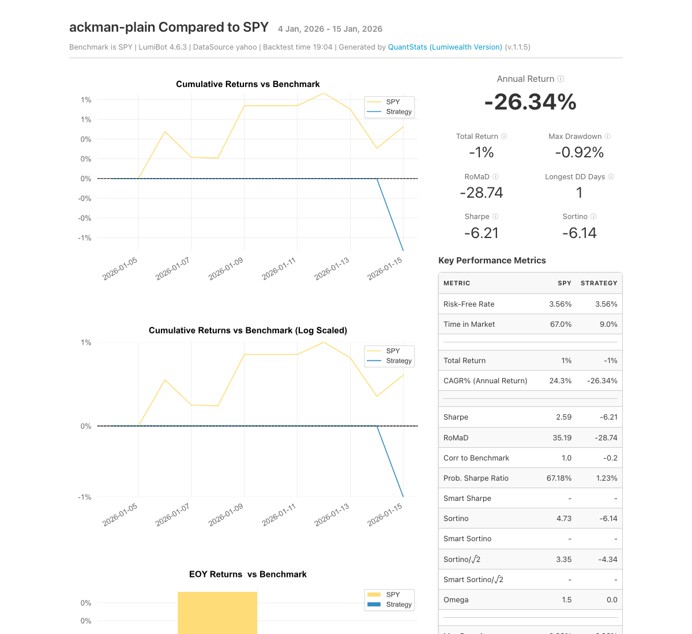

Bill Ackman Portfolio AI Trading Bot
====================================

.. meta::
   :description: An AI bot that invests like Bill Ackman. It holds a few big, high-conviction stocks and drops ideas that stop making the cut. Free Python code for LumiBot.

This bot invests the way Bill Ackman describes his style at Pershing Square: own a small number of simple, high-quality companies and put real money behind each one. Pershing Square usually keeps most of its money in just 8 to 12 core holdings (`Pershing Square Holdings <https://pershingsquareholdings.com/about-us/>`__), and its value rose 70.2% in 2020, its best year (`2020 annual report <https://assets.pershingsquareholdings.com/2021/04/12201719/Pershing-Square-Holdings-Ltd.-2020-Annual-Report-1.pdf-Letter-Only.pdf>`__).

How it works
------------

1. **Research agent** studies each company for simple, predictable businesses that make lots of cash and are priced well, and ranks its top 5 ideas.
2. **Short seller agent** attacks each idea the way a short seller would: too much debt, weak management, strong rivals, accounting that looks off, or a price that is too high. It says which ideas survive.
3. **Trading agent** holds the 3 to 5 ideas that survived, with bigger weights on the best ones. It sells a stock when it no longer survives the attack.

Change ``universe`` to pick from different companies.

Run it on BotSpot
-----------------

Run this bot on `BotSpot <https://botspot.trade/marketplace?utm_source=documentation&utm_medium=docs&utm_campaign=lumibot_ai_examples&utm_content=agents_example_bill_ackman_portfolio_ai_trading_bot>`_ without installing anything. BotSpot runs LumiBot in the cloud, backtests it, and connects it to your broker.

Backtest tear sheet
-------------------

GPT-6 Luna, January 5 to 16, 2026, Yahoo daily prices, $100,000 start. After the short seller's attack the bot held four survivors, CMG, GOOGL, MSFT, and UBER, and ended at $99,083 (-0.9%) while SPY rose 1%. Two weeks is far too short to judge a concentrated long-term portfolio. Cash never went below $2,453.

`Open the full tear sheet <tearsheets/bill-ackman-portfolio-ai-trading-bot.html>`__. A short backtest shows the bot works as written. It is not a promise of future returns.

The code
--------

The whole bot is one short file. The prompts are plain English, and they are the strategy.

.. literalinclude:: ../lumibot/example_strategies/ai_trading_team_bill_ackman_concentrated.py
   :language: python

Run it yourself
---------------

.. code-block:: bash

   pip install lumibot
   python -m lumibot.example_strategies.ai_trading_team_bill_ackman_concentrated

Put these in your ``.env`` file: ``OPENAI_API_KEY``, and your broker keys (for example ``ALPACA_API_KEY``, ``ALPACA_API_SECRET``, and ``ALPACA_IS_PAPER=true`` for paper trading). With ``IS_BACKTESTING=false`` the bot trades. With ``IS_BACKTESTING=true`` it backtests instead; set ``BACKTESTING_START`` and ``BACKTESTING_END`` to pick the dates, and start with a week or two, because every AI call costs a little.

Good to know
------------

* Inspired by Bill Ackman's public comments on concentrated investing. Not affiliated with or endorsed by Bill Ackman or Pershing Square.

See :doc:`agents_examples` for more AI trading bots and :doc:`strategy_run_modes` for backtest and live runs.
