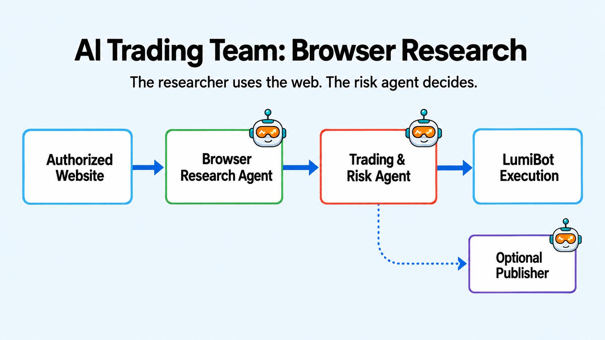

Authenticated Browser Research Showcase
=======================================

This example demonstrates the full handoff: an authenticated browser
researcher reads a JavaScript application, a dedicated trading/risk agent
decides whether to trade, and a separate publisher can post a truthful trade
receipt to an explicitly authorized account.

Install the optional browser runtime first::

   pip install "lumibot[browser]"
   patchright install chromium

Set ``research_url`` and a named host-scoped credential profile in the hosting
application. Never commit passwords or pass them in an agent prompt.

Publishing is off by default: ``publish_enabled=False``. Enable it only for an
owned test account or an account you are authorized to automate, provide ``publish_url``
and its separate credential profile, and validate the site terms. The publisher
must report observed order status truthfully, use a stable idempotency key, and
capture a screenshot/action receipt. A submitted order is not a filled order.

.. literalinclude:: ../lumibot/example_strategies/ai_browser_research_showcase.py
   :language: python
   :linenos:
