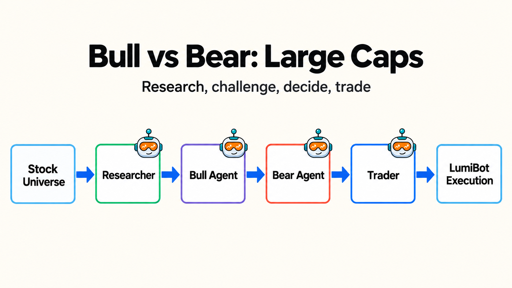
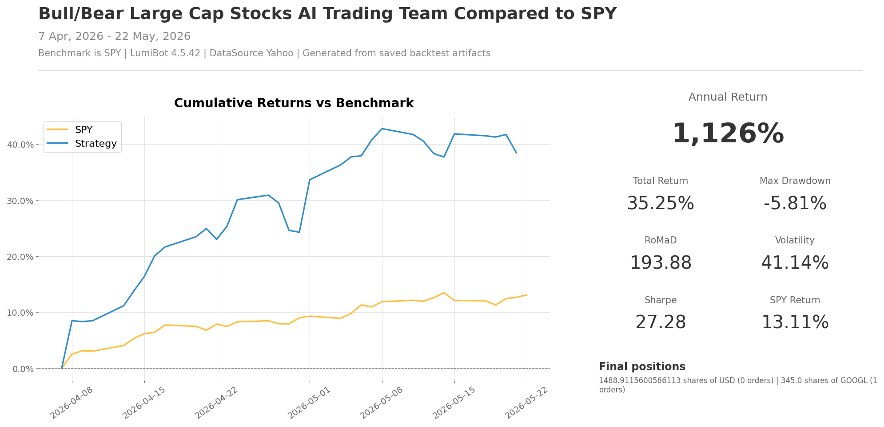

Bull/Bear Large-Cap Stocks AI Trading Team
==========================================

This strategy uses the same simple bull/bear pattern as the leveraged ETF demo,
but applies it to familiar large-cap stocks. It is a cleaner starting point for
people who want to understand the AI agent behavior before using more volatile
leveraged instruments.

The researcher picks the strongest stock, the bull agent argues the upside
case, the bear agent forces a risk check, and the trader decides whether to
rotate into the pick. Because the symbols are recognizable, it is easier to
read the trace and decide whether the agents are making sensible arguments.

`See this strategy running live on BotSpot <https://botspot.trade/marketplace/strategy/932f3661-c552-4723-b247-869518a5d30f>`__

How the team works
------------------

* ``researcher`` ranks the large-cap stock universe.
* ``bull`` argues for the strongest upside case.
* ``bear`` flags the biggest risk.
* ``trader`` sells non-picks, buys the chosen stock, and is the only agent allowed to trade.

Backtest snapshot
-----------------

Run it with a broker
--------------------

The file defaults to broker-connected execution. With Alpaca, it runs in paper
mode unless you set ``ALPACA_IS_PAPER=false``.

.. code-block:: bash

   export GEMINI_API_KEY='your-key-here'
   export ALPACA_API_KEY='your-alpaca-key'
   export ALPACA_API_SECRET='your-alpaca-secret'
   export ALPACA_IS_PAPER=true
   python lumibot/example_strategies/ai_trading_team_bull_bear_large_cap_stocks.py

Backtest it
-----------

Use the same strategy class and change ``IS_BACKTESTING = False`` to ``IS_BACKTESTING = True`` in the runner:

.. code-block:: bash

   export GEMINI_API_KEY='your-key-here'
   python lumibot/example_strategies/ai_trading_team_bull_bear_large_cap_stocks.py

Example code
------------

.. literalinclude:: ../lumibot/example_strategies/ai_trading_team_bull_bear_large_cap_stocks.py
   :language: python
