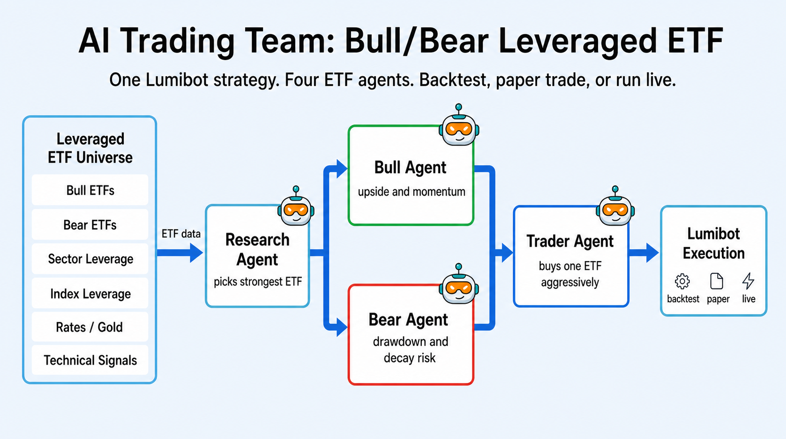

Bull/Bear Leveraged ETF Trading Team
====================================

This example rotates across leveraged and inverse ETFs. A researcher picks the
strongest ETF, a bull agent makes the upside case, a bear agent challenges the
risk, and the trader agent is the only agent allowed to submit orders.

Agent flow
----------

* ``researcher`` ranks the leveraged ETF universe.
* ``bull`` argues for the strongest money-making trade.
* ``bear`` points out the biggest risk.
* ``trader`` sells non-picks and buys the chosen ETF with trading permission.

Example code
------------

.. literalinclude:: ../lumibot/example_strategies/ai_trading_team_bull_bear_leveraged_etf.py
   :language: python
