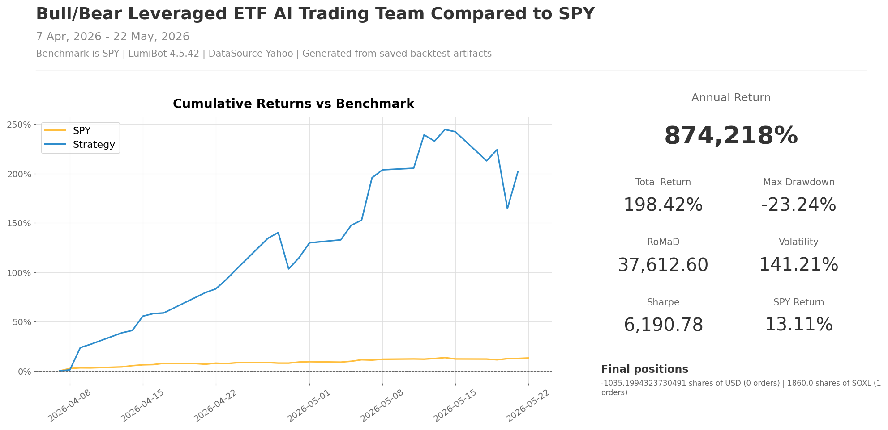

Bull/Bear Leveraged ETF AI Trading Team
=======================================

.. image:: ../docs/assets/ai-trading-team-workflows/bull-bear-leveraged-etf.png
   :alt: AI trading team workflow for bull/bear leveraged ETFs
   :width: 100%

This is a fast, dramatic AI trading team demo. It gives the agents a universe
of leveraged long and inverse ETFs, then asks a dedicated trading-and-risk
agent to decide whether one ETF deserves a tightly capped position. The
purpose is to show the full loop clearly: research, upside case, risk
challenge, risk-controlled execution.

Because the universe includes both bull and bear instruments, the team can
choose risk-on or risk-off exposure. That makes the decision trail easy to
audit: you can inspect why the agents liked a sector, why the bear agent
objected, and why the final trader still bought or sold.

`See this strategy running live on BotSpot <https://botspot.trade/marketplace/strategy/4aa43848-54d6-48bf-b2e4-b266f9fec6ad>`__

How the team works
------------------

* ``researcher`` ranks the leveraged ETF universe.
* ``bull`` argues for the strongest money-making trade.
* ``bear`` points out the biggest risk.
* ``trader`` is the dedicated trading-and-risk agent. It verifies account, leverage, and order state, then holds or sizes one ETF to at most 10% of portfolio value.
* The January 2026 price proof used Yahoo daily bars and bought 1 share of TQQQ. The universe pairs leveraged funds that move more than the index, such as TQQQ against SQQQ and UPRO against SPXU.

Backtest snapshot
-----------------

Run it with a broker
--------------------

The file defaults to broker-connected execution. With Alpaca, it runs in paper
mode unless you set ``ALPACA_IS_PAPER=false``.

.. code-block:: bash

   export OPENAI_API_KEY='your-key-here'
   export ALPACA_API_KEY='your-alpaca-key'
   export ALPACA_API_SECRET='your-alpaca-secret'
   export ALPACA_IS_PAPER=true
   python lumibot/example_strategies/ai_trading_team_bull_bear_leveraged_etf.py

Backtest it
-----------

Use the same strategy class and change ``IS_BACKTESTING = False`` to ``IS_BACKTESTING = True`` in the runner:

.. code-block:: bash

   export OPENAI_API_KEY='your-key-here'
   python lumibot/example_strategies/ai_trading_team_bull_bear_leveraged_etf.py

Example code
------------

.. literalinclude:: ../lumibot/example_strategies/ai_trading_team_bull_bear_leveraged_etf.py
   :language: python
