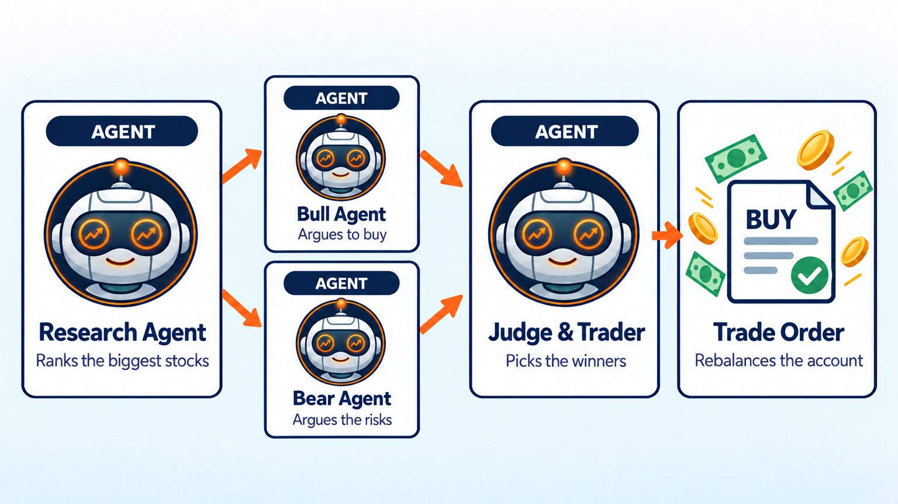
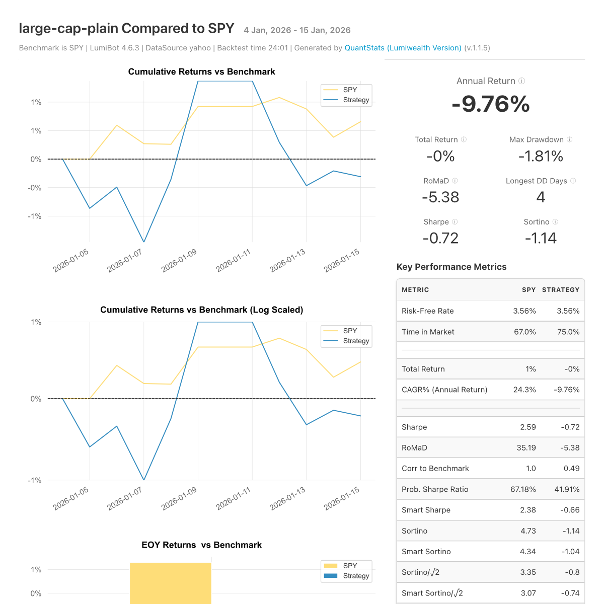

Bull vs Bear AI Stock Trading Bot
=================================

.. meta::
   :description: A bull AI and a bear AI argue about each big stock, then a judge AI makes the trade. Free Python code you can backtest in LumiBot.

Before this bot puts money into a stock, two AI agents argue about it. A bull agent makes the case for buying and a bear agent makes the case against. A judge agent weighs both sides and trades. Why debate? In the TradingAgents research paper, AI agents that argued bull and bear cases before trading beat simpler baselines on returns, Sharpe ratio, and drawdown (`Xiao et al., 2024 <https://arxiv.org/abs/2412.20138>`__).

How it works
------------

1. **Research agent** ranks 13 of the biggest US stocks, like Apple, Microsoft, and Nvidia, from recent prices, trends, and news.
2. **Bull agent** and **bear agent** read the same research and argue at the same time: one for buying, one about the risks.
3. **Judge and trading agent** weighs both sides, picks the stocks that win the debate, and splits the account across them. It sells stocks that lost the debate. The bot repeats this once a day.

Run it on BotSpot
-----------------

Run this bot on `BotSpot <https://botspot.trade/marketplace?utm_source=documentation&utm_medium=docs&utm_campaign=lumibot_ai_examples&utm_content=agents_example_bull_vs_bear_ai_stock_trading_bot>`_ without installing anything. BotSpot runs LumiBot in the cloud, backtests it, and connects it to your broker.

Backtest tear sheet
-------------------

GPT-6 Luna, January 5 to 16, 2026, Yahoo daily prices, $100,000 start. The debate rotated between AMZN, GOOGL, JPM, LLY, NVDA, V, and XOM, and the bot ended at $99,691 (-0.3%) while SPY rose 1%. Cash never went below $539.

`Open the full tear sheet <tearsheets/bull-vs-bear-ai-stock-trading-bot.html>`__. A short backtest shows the bot works as written. It is not a promise of future returns.

The code
--------

The whole bot is one short file. The prompts are plain English, and they are the strategy.

.. literalinclude:: ../lumibot/example_strategies/ai_trading_team_bull_bear_large_cap_stocks.py
   :language: python

Run it yourself
---------------

.. code-block:: bash

   pip install lumibot
   python -m lumibot.example_strategies.ai_trading_team_bull_bear_large_cap_stocks

Put these in your ``.env`` file: ``OPENAI_API_KEY``, and your broker keys (for example ``ALPACA_API_KEY``, ``ALPACA_API_SECRET``, and ``ALPACA_IS_PAPER=true`` for paper trading). With ``IS_BACKTESTING=false`` the bot trades. With ``IS_BACKTESTING=true`` it backtests instead; set ``BACKTESTING_START`` and ``BACKTESTING_END`` to pick the dates, and start with a week or two, because every AI call costs a little.

See :doc:`agents_examples` for more AI trading bots and :doc:`strategy_run_modes` for backtest and live runs.
