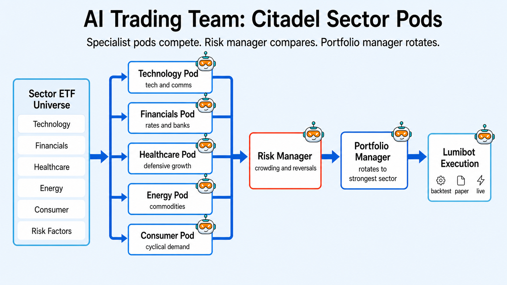

Citadel Sector-Pods Trading Team
================================

This example shows a specialist-desk pattern. Several sector pods independently
pitch a sector ETF, a risk manager compares the tradeoffs, and the portfolio
manager rotates into the strongest sector.

Agent flow
----------

* ``technology_pod`` ranks technology and communications.
* ``financials_pod`` ranks financial and rate-sensitive sectors.
* ``healthcare_pod`` ranks healthcare and defensive growth.
* ``energy_pod`` ranks energy and commodity-sensitive sectors.
* ``consumer_pod`` ranks consumer and housing-sensitive sectors.
* ``risk_manager`` challenges crowding, drawdown, macro, and reversal risks.
* ``portfolio_manager`` rotates into the strongest sector ETF with trading permission.

Example code
------------

.. literalinclude:: ../lumibot/example_strategies/ai_trading_team_citadel_sector_pods.py
   :language: python
