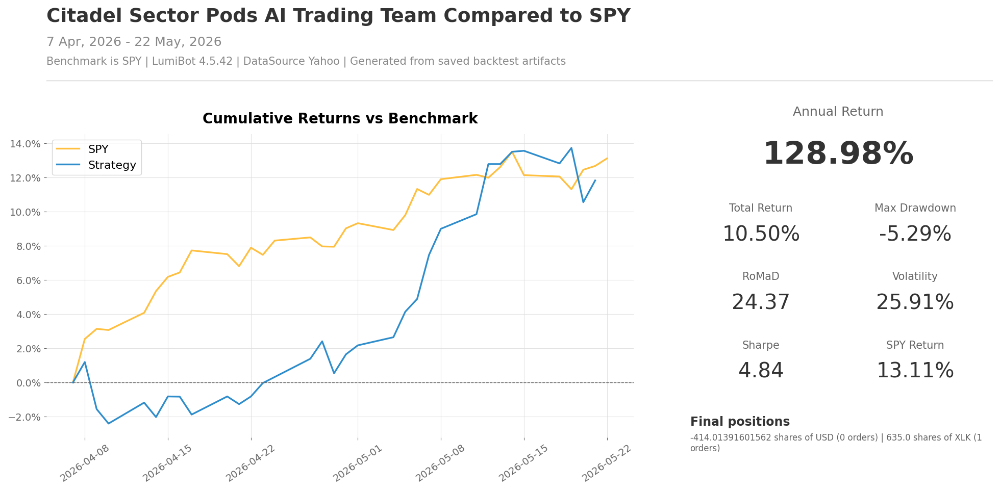

Citadel Sector Pods AI Trading Team
===================================

.. image:: ../docs/assets/ai-trading-team-workflows/citadel-sector-pods.png
   :alt: AI trading team workflow for Citadel-style sector pods
   :width: 100%

This strategy is inspired by the pod-style structure associated with Ken
Griffin's Citadel and other multi-manager platforms. The idea is simple: do not
ask one generalist to understand every market at once. Give each specialist a
clear lane, let them pitch their strongest idea, then put a risk manager and
portfolio manager above the debate.

In Lumibot, that becomes an AI trading team. Sector pods study different parts
of the market, a risk manager challenges the strongest pitches, and only the
portfolio manager has permission to submit orders. It is a good example when
you want to test whether specialist agents can create better decisions than one
single broad prompt.

Hosted examples on BotSpot
---------------------------

Open the Data-On marketplace variants: `regular sector ETFs <https://botspot.trade/marketplace/strategy/4fb6cf2f-272c-4a73-96e7-edd7383b1a33?utm_source=documentation&utm_medium=example&utm_campaign=lumibot_ai_examples&utm_content=citadel_regular>`_
or `leveraged sector ETFs <https://botspot.trade/marketplace/strategy/da83818b-f994-4163-8ef3-99ea346325b4?utm_source=documentation&utm_medium=example&utm_campaign=lumibot_ai_examples&utm_content=citadel_leveraged>`_.
These variants add macro and news evidence and request diversified allocations;
their saved code differs from the original example below. Start with the regular
version. The listings have no strategy subscription fee; BotSpot plans, model
usage, broker access, and data requirements still apply.

These are educational examples with no affiliation or endorsement from Citadel
or its personnel, and are not replicas of a proprietary strategy.

How the team works
------------------

* ``technology_pod`` looks at technology and communications exposure.
* ``financials_pod`` looks at financials and rate-sensitive exposure.
* ``healthcare_pod`` looks at healthcare and defensive growth.
* ``energy_pod`` looks at energy and commodity-sensitive exposure.
* ``consumer_pod`` looks at consumer and housing-sensitive exposure.
* ``risk_manager`` challenges crowding, drawdown, macro, and reversal risk.
* ``portfolio_manager`` rotates into the strongest sector ETF and is the only agent allowed to trade.

Backtest snapshot
-----------------

Run it with a broker
--------------------

The file defaults to broker-connected execution. With Alpaca, it runs in paper
mode unless you set ``ALPACA_IS_PAPER=false``.

.. code-block:: bash

   export GEMINI_API_KEY='your-key-here'
   export ALPACA_API_KEY='your-alpaca-key'
   export ALPACA_API_SECRET='your-alpaca-secret'
   export ALPACA_IS_PAPER=true
   python lumibot/example_strategies/ai_trading_team_citadel_sector_pods.py

Backtest it
-----------

Use the same strategy class and change ``IS_BACKTESTING = False`` to ``IS_BACKTESTING = True`` in the runner:

.. code-block:: bash

   export GEMINI_API_KEY='your-key-here'
   python lumibot/example_strategies/ai_trading_team_citadel_sector_pods.py

Example code
------------

.. literalinclude:: ../lumibot/example_strategies/ai_trading_team_citadel_sector_pods.py
   :language: python
