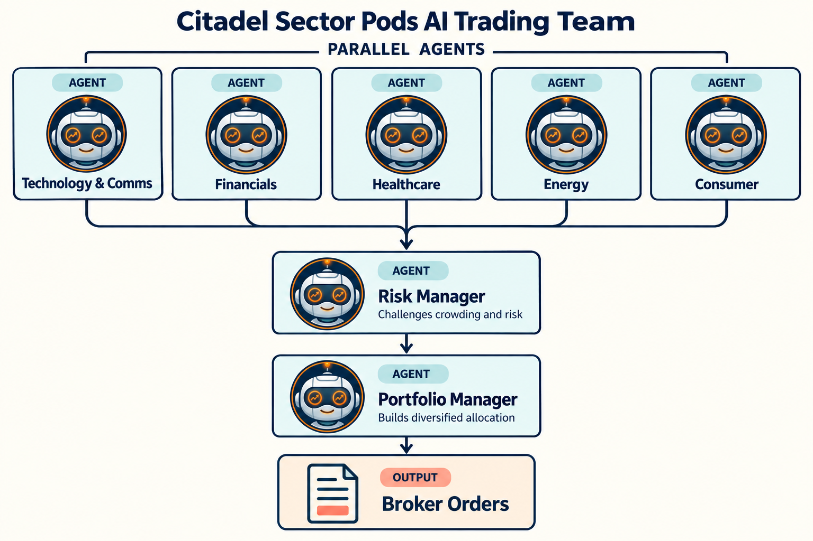
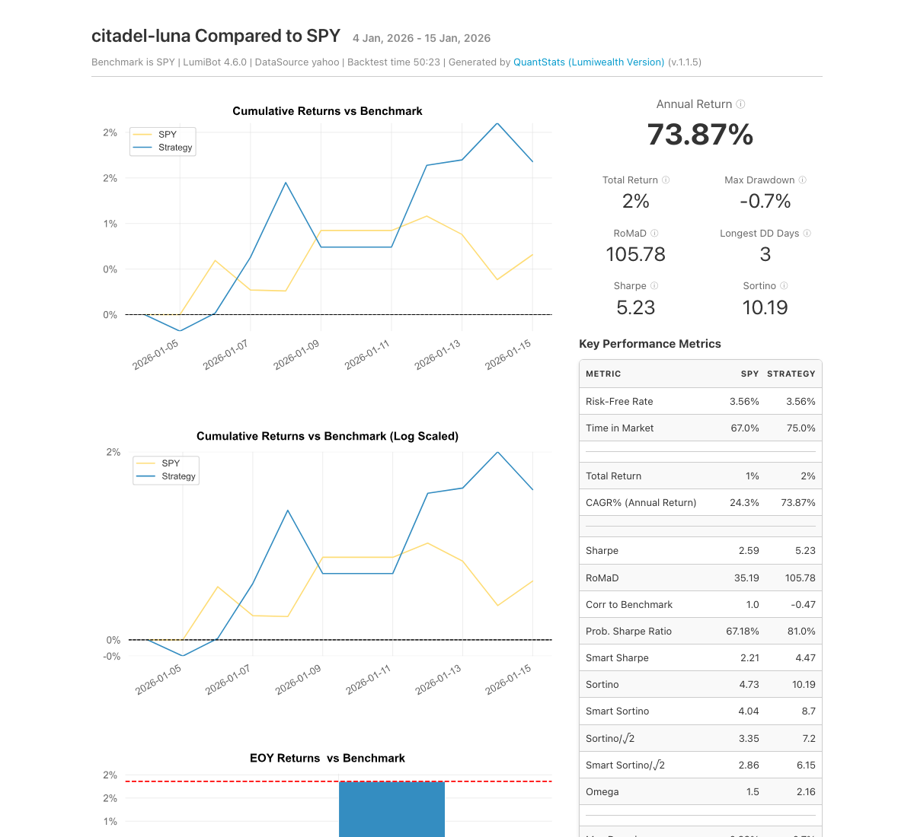

Citadel Sector Pods AI Trading Team
===================================

.. meta::
   :description: An AI hedge fund team inspired by Citadel's sector pods: five sector agents pitch ideas, a risk manager pushes back, and a portfolio manager trades. Free Python code.

This AI team is inspired by the "pod" setup used by big multi-manager hedge funds like Ken Griffin's Citadel. Instead of asking one AI to understand the whole market, five specialist agents each cover one part of it and pitch their best sector ETF. A risk manager pushes back, and only the portfolio manager places trades. It shows how specialist agents can check each other before money moves.

How it works
------------

1. **Five sector agents** each study one area: technology and communications, financials, healthcare, energy, and consumer. Each pitches its strongest idea from the ETF universe.
2. **Risk manager agent** reads all five pitches and challenges them: crowded trades, big drops, macro risk, and sudden reversals.
3. **Portfolio manager agent** builds a portfolio across at least three sectors and is the only agent allowed to place orders. The team repeats this once a day.

This file is the exact code running on BotSpot with a live paper track record, including its model, Gemini 3.1 Flash Lite. A leveraged version holds leveraged sector ETFs instead.

Run it on BotSpot
-----------------

Run this team on `BotSpot <https://botspot.trade/marketplace?utm_source=documentation&utm_medium=docs&utm_campaign=lumibot_ai_examples&utm_content=agents_example_citadel_sector_pods>`_ without installing anything. BotSpot runs LumiBot in the cloud, backtests it, and connects it to your broker.

Backtest tear sheet
-------------------

GPT-6 Luna (set with ``AI_TRADING_TEAM_MODEL``), January 5 to 16, 2026, Yahoo daily prices, $100,000 start. The team rotated across sector ETFs such as XLC, XLE, XLF, XLI, XLV, and XLB and ended at $101,680 (+2%) while SPY rose 1%. Cash stayed near zero, lowest $33 in the daily stats. The live paper track record on BotSpot runs the Gemini model shown in the code.

`Open the full tear sheet <tearsheets/citadel-sector-pods.html>`__. A short backtest shows the team works as written. It is not a promise of future returns.

The code
--------

Regular sector ETFs:

.. literalinclude:: ../lumibot/example_strategies/ai_trading_team_citadel_sector_pods.py
   :language: python

Leveraged sector ETFs:

.. literalinclude:: ../lumibot/example_strategies/ai_trading_team_citadel_sector_pods_leveraged.py
   :language: python

Run it yourself
---------------

.. code-block:: bash

   pip install lumibot
   python -m lumibot.example_strategies.ai_trading_team_citadel_sector_pods

Add ``GEMINI_API_KEY`` and your broker keys (for example ``ALPACA_API_KEY``, ``ALPACA_API_SECRET``, and ``ALPACA_IS_PAPER=true``) to your ``.env`` file. This file trades by default. Set ``IS_BACKTESTING=true`` in your environment to backtest it instead. To use another model, set ``AI_TRADING_TEAM_MODEL``, for example ``openai/gpt-6-luna`` with ``OPENAI_API_KEY``.

Good to know
------------

* Inspired by public descriptions of multi-manager hedge funds. Not affiliated with or endorsed by Citadel or its people, and not a copy of any real strategy.
* The picture shows the five sector agents side by side because none of them depends on another. The code calls them one after another.

See :doc:`agents_examples` for more AI trading bots and :doc:`strategy_run_modes` for backtest and live runs.
