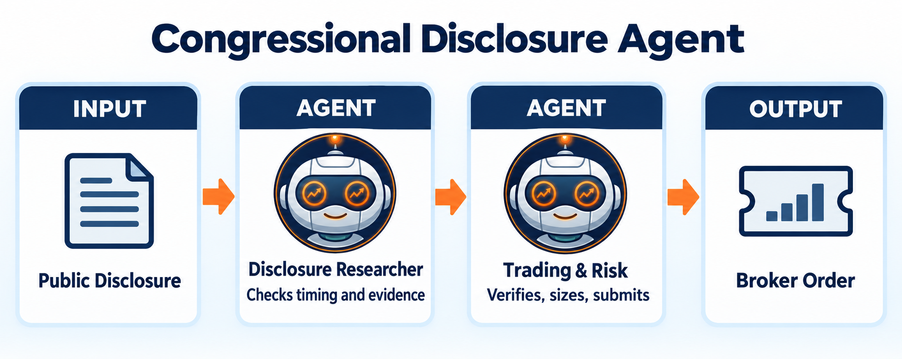

Congressional Disclosure Agent
===============================

.. meta::
   :description: This example reads the public House Clerk periodic transaction report. It downloads the yearly index at the House financial-pdfs ZIP, then the member PDF.

This example reads the public House Clerk periodic transaction report. It
downloads the yearly index at the House financial-pdfs ZIP, then the member
PDF. The bot trades only after that filing is public. It is a
disclosure-following example, not a claim that the member traded on the
publication date or that copying the trade is profitable. Amounts on the
report are ranges, and the report can be up to 45 days late.

Availability
------------

The source ``TransactionDate`` describes when the reported transaction
occurred. ``ReportDate`` (normalized as ``published_at``) is when the example
first makes the record visible. Federal disclosure rules may permit a report
as late as **45 days** after the transaction, so this is not a low-latency
signal and the example must never backdate availability to ``TransactionDate``.

House and Senate periodic transaction reports are public filings. The House
source is the Clerk's yearly index ZIP and the PTR PDF named in that index.
Official instructions say an option row should name the underlying security,
put or call, strike, and expiration. Real filings are PDFs, and some rows
leave the contract fields incomplete. Stock mode needs the ticker and the
buy or sell. Option mode also needs call or put, strike, and expiration. A
row without strike and expiration is skipped. Gifts, spinoffs, private
companies, and money-market funds are skipped.

This example does not ship sample trades. Pass parsed official filings in
``disclosures`` or a JSON file of those filings in ``disclosures_path``.
Running the module with neither argument stops instead of inventing a
portfolio. A backtest on this page is real only after those filings and
market prices are supplied. Amounts on the filings are ranges, not exact
share counts.

Architecture
------------

``disclosure_researcher`` cannot trade. ``trading_risk_manager`` is the only
agent with trading tools and caps a new position at the configured percentage.
The researcher is the only agent created with ``allow_network=True``, so it is
the only one that can fetch filings with ``http_request``.
Already processed disclosure IDs are ignored and old records are rejected by
the configured age limit. Records stay hidden until ``ReportDate``.

.. literalinclude:: ../lumibot/example_strategies/ai_congress_disclosures.py
   :language: python
   :linenos:
