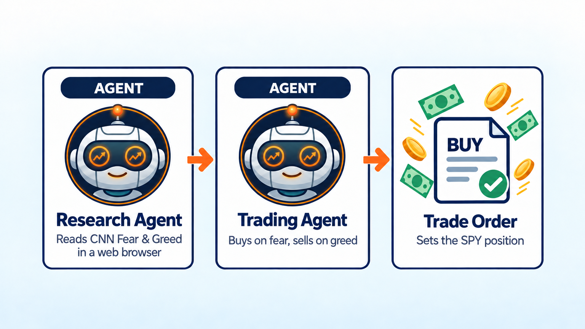
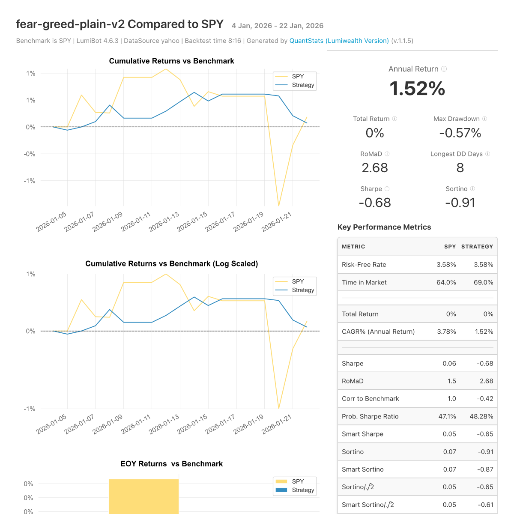

Fear and Greed Index Trading Bot
================================

.. meta::
   :description: This AI bot opens a real web browser, reads the CNN Fear and Greed Index, and buys SPY on fear, sells on greed. Free Python code for LumiBot.

This bot buys the S&P 500 when investors are scared and sells when they get greedy. Each day an AI agent opens a real web browser, goes to CNN's Fear & Greed Index page, and reads the score. The score blends seven market signals, like momentum, volatility, and demand for safe assets, into one number from 0 to 100. Buying when others are scared is an old idea: Warren Buffett wrote that he tries "to be fearful when others are greedy and to be greedy only when others are fearful" (`1986 Berkshire letter <https://www.berkshirehathaway.com/letters/1986.html>`__). It is also the simplest example of an AI agent using a browser to read a live website and trade on it.

How it works
------------

1. **Research agent** opens a real Chrome browser and finds the Fear & Greed score (0 is extreme fear, 100 is extreme greed) for the most recent day before today, on CNN's page or CNN's list of past scores.
2. **Trading agent** sets how much of your account is in SPY: 100% below 25, 75% from 25 to 44, 50% from 45 to 55, 25% from 56 to 75, and 0% above 75. The rest stays in cash.
3. If there is no score from the last few days, the trading agent does nothing. The bot repeats this once a day.

Run it on BotSpot
-----------------

Run this bot on `BotSpot <https://botspot.trade/marketplace?utm_source=documentation&utm_medium=docs&utm_campaign=lumibot_ai_examples&utm_content=agents_example_fear_and_greed_index_trading_bot>`_ without installing anything. BotSpot runs LumiBot in the cloud, backtests it, and connects it to your broker.

Backtest tear sheet
-------------------

GPT-6 Luna, January 5 to 23, 2026, Yahoo daily prices, $100,000 start. Each day the research agent opened CNN's score history in a real browser and used the score from the day before. Neutral scores put 50% in SPY; when greed pushed the score above 55, the bot cut SPY to 25%. It ended at $100,074, about even with SPY. Cash never went below $50,460.

`Open the full tear sheet <tearsheets/fear-and-greed-index-trading-bot.html>`__. A short backtest shows the bot works as written. It is not a promise of future returns.

The code
--------

The whole bot is one short file. The prompts are plain English, and they are the strategy.

.. literalinclude:: ../lumibot/example_strategies/ai_fear_and_greed_trading_bot.py
   :language: python

Run it yourself
---------------

.. code-block:: bash

   pip install "lumibot[browser]"
   patchright install chromium
   python -m lumibot.example_strategies.ai_fear_and_greed_trading_bot

Put these in your ``.env`` file: ``OPENAI_API_KEY``, and your broker keys (for example ``ALPACA_API_KEY``, ``ALPACA_API_SECRET``, and ``ALPACA_IS_PAPER=true`` for paper trading). With ``IS_BACKTESTING=false`` the bot trades. With ``IS_BACKTESTING=true`` it backtests instead; set ``BACKTESTING_START`` and ``BACKTESTING_END`` to pick the dates, and start with a week or two, because every AI call costs a little.

Good to know
------------

* CNN's page only shows today's score, so in a backtest the research agent uses CNN's list of past scores and takes the day before each test day. The list also shows later days, so this rule lives in the prompt.
* Change the percentages in the trading agent's prompt to make the bot more or less aggressive.

See :doc:`agents_examples` for more AI trading bots and :doc:`strategy_run_modes` for backtest and live runs.
