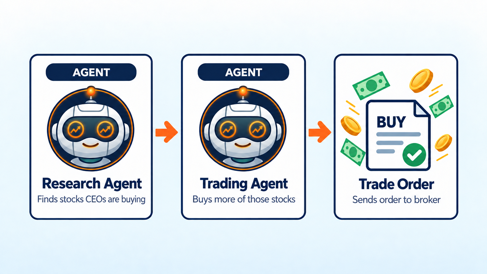
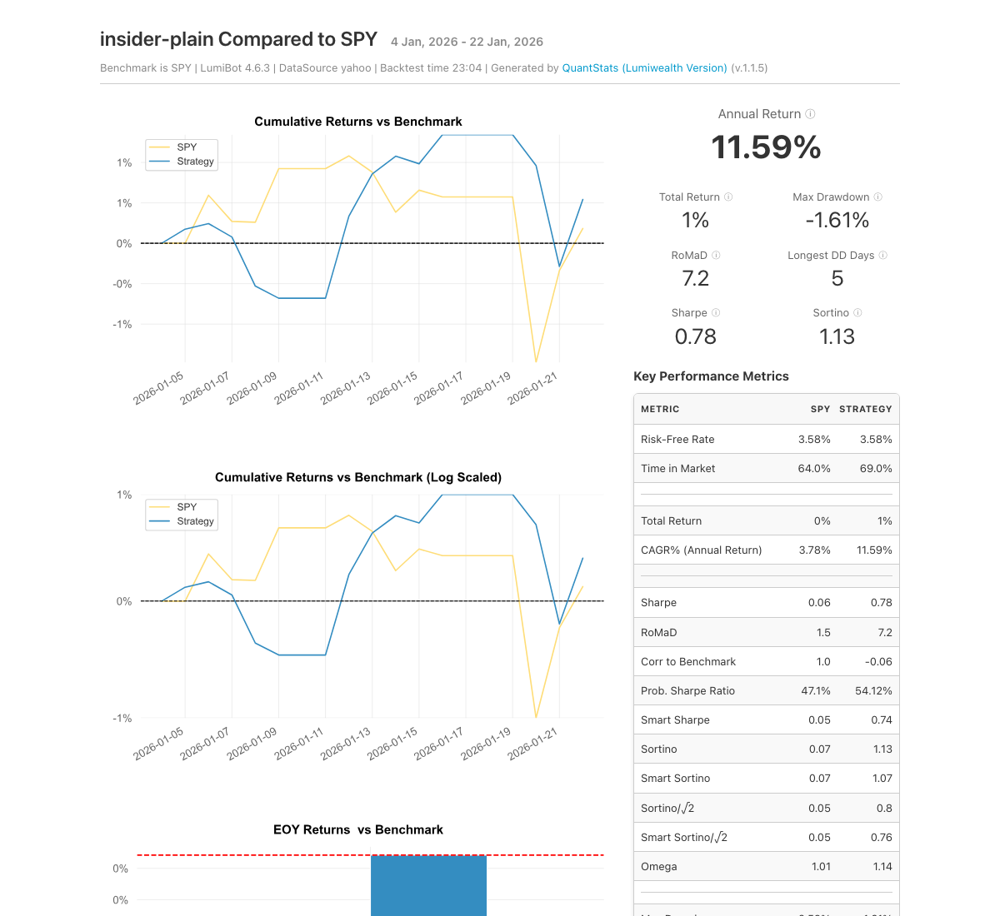

Insider Trading Bot
===================

.. meta::
   :description: This AI bot buys stocks that CEOs and directors are buying with their own money, using SEC insider filings. Free Python code for LumiBot.

This bot follows the people who know a company best: its own CEOs, CFOs, and directors. When they buy their company's stock with their own money, the bot puts more of your account into that stock. When they sell a lot, it puts in less. This is legal insider trading: executives must report every trade to the SEC within two business days, and anyone can read those reports. Why follow them? In a study in the Journal of Finance, copying insiders' unusual, non-routine trades earned about 0.82% a month more than the market (`Cohen, Malloy and Pomorski, 2012 <https://papers.ssrn.com/sol3/papers.cfm?abstract_id=1692517>`__).

How it works
------------

1. **Research agent** reads the insider trade reports that executives file with the SEC for each stock on your watchlist, going back 30 days.
2. It keeps real open-market buys and sells and skips stock awards, gifts, option exercises, and planned sales. It reports how many dollars insiders bought and sold, and who traded.
3. **Trading agent** starts with the same amount in every watchlist stock. It adds more to stocks insiders are buying and less to stocks they are dumping.
4. The trading agent places the orders and checks that they filled. The bot repeats this once a day.

Change ``watchlist`` to follow any stocks you like.

Run it on BotSpot
-----------------

Run this bot on `BotSpot <https://botspot.trade/marketplace?utm_source=documentation&utm_medium=docs&utm_campaign=lumibot_ai_examples&utm_content=agents_example_insider_trading_bot>`_ without installing anything. BotSpot runs LumiBot in the cloud, backtests it, and connects it to your broker.

Backtest tear sheet
-------------------

GPT-6 Luna, January 5 to 23, 2026, Yahoo daily prices, $100,000 start. The bot bought all ten watchlist stocks and ended at $100,542 (+0.5%) while SPY was about flat. It found no open-market insider buys in that window, so it held the watchlist evenly. Cash never went below $2,168.

`Open the full tear sheet <tearsheets/insider-trading-bot.html>`__. A short backtest shows the bot works as written. It is not a promise of future returns.

The code
--------

The whole bot is one short file. The prompts are plain English, and they are the strategy.

.. literalinclude:: ../lumibot/example_strategies/ai_insider_trading_bot.py
   :language: python

Run it yourself
---------------

.. code-block:: bash

   pip install lumibot
   python -m lumibot.example_strategies.ai_insider_trading_bot

Put these in your ``.env`` file: ``OPENAI_API_KEY``, and your broker keys (for example ``ALPACA_API_KEY``, ``ALPACA_API_SECRET``, and ``ALPACA_IS_PAPER=true`` for paper trading). With ``IS_BACKTESTING=false`` the bot trades. With ``IS_BACKTESTING=true`` it backtests instead; set ``BACKTESTING_START`` and ``BACKTESTING_END`` to pick the dates, and start with a week or two, because every AI call costs a little.

Good to know
------------

* The SEC blocks automated web browsers, so the research agent reads the reports straight from the SEC's data feed through LumiBot. In a backtest it only sees reports filed before each test day.
* Big companies often go weeks with no insider buys on the open market. Then the bot simply holds the watchlist evenly.

See :doc:`agents_examples` for more AI trading bots and :doc:`strategy_run_modes` for backtest and live runs.
