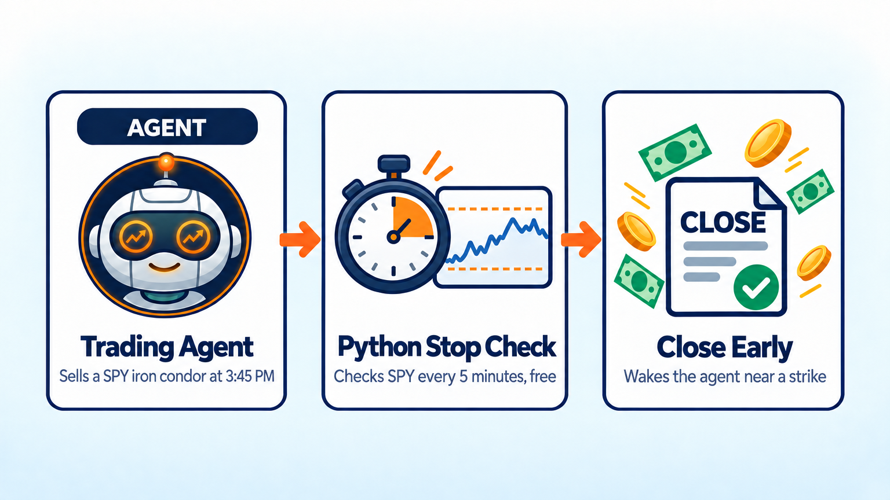

AI Iron Condor Trading Bot
==========================

.. meta::
   :description: Build an AI iron condor bot for SPY with LumiBot. Sell next-day spreads at 3:45 PM, skip high-VIX days, and check a Python early exit. Free strategy code and backtest results.

This bot sells an iron condor on SPY every afternoon. An iron condor is a bet that SPY stays inside a price range until the next day's close. You collect cash up front, and the protective options cap how much you can lose. It copies the core of our older Iron Condor bot, which sold a one-day condor at 3:45 PM and did best when it closed early once SPY ran toward a strike. Why this trade? Over about 35 years, Cboe's iron condor index had a worst drop of 19%, compared with 51% for the S&P 500 (`Cboe <https://www.cboe.com/insights/posts/benchmark-indices-series-volatility-management-with-cboes-bfly-and-cndr-indices/>`__).

How it works
------------

1. At 3:45 PM each trading day, the **trading agent** checks yesterday's VIX close. If the VIX is above 25, it skips the day.
2. Otherwise it sells a SPY iron condor that expires the next trading day: a put and a call near 0.14 delta, each with a protective option $1 farther out. It sizes the trade so the most it can lose is about 3% of the account.
3. Every 5 minutes, a few lines of plain Python check SPY for free. If SPY moves 40% of the way from the middle of the condor toward a short strike, they wake the trading agent, which closes the whole condor.
4. Otherwise the condor expires the next afternoon, and the agent sells a new one at 3:45 PM.

Run it on BotSpot
-----------------

Run this bot on `BotSpot <https://botspot.trade/marketplace?utm_source=documentation&utm_medium=docs&utm_campaign=lumibot_ai_examples&utm_content=agents_example_iron_condor_ai_trading_bot>`_ without installing anything. BotSpot runs LumiBot in the cloud, backtests it, and connects it to your broker.

The code
--------

The whole bot is one short file. The prompt is the strategy; the stop is four lines of Python.

.. literalinclude:: ../lumibot/example_strategies/ai_iron_condor.py
   :language: python

Run it yourself
---------------

.. code-block:: bash

   pip install lumibot
   python -m lumibot.example_strategies.ai_iron_condor

Put these in your ``.env`` file: ``OPENAI_API_KEY``, a free ``FRED_API_KEY`` for the VIX, and your broker keys (for example ``ALPACA_API_KEY``, ``ALPACA_API_SECRET``, and ``ALPACA_IS_PAPER=true`` for paper trading). With ``IS_BACKTESTING=false`` the bot trades. With ``IS_BACKTESTING=true`` it backtests instead; set ``BACKTESTING_START`` and ``BACKTESTING_END`` to pick the dates. The AI runs about once a day, so a month of backtest costs little. Option backtests use Alpaca's free history (from February 2024), so paper Alpaca keys are enough.

Good to know
------------

* Options can lose money fast, and a one-day condor can lose its full width on a sharp move. Paper trade first.
* SPY options can be exercised at expiry. If that ever leaves you holding SPY shares, the agent sells them at 3:45 PM.

See :doc:`agents_examples` for more AI trading bots and :doc:`strategy_run_modes` for backtest and live runs.
