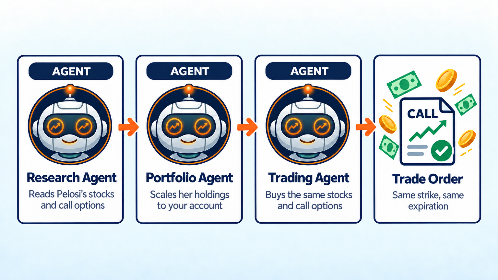

Nancy Pelosi Copy Trading Bot
=============================

.. meta::
   :description: This AI bot copies Nancy Pelosi's whole portfolio, call options included: same stocks, same strike, same expiration, scaled to your account. Free Python code for LumiBot.

Most Pelosi copy bots only buy her stocks. But much of her trading is call options: in her January 23, 2026 report alone she bought call options on Alphabet, Amazon, Apple and Nvidia that expire in January 2027 (`House Clerk report <https://disclosures-clerk.house.gov/public_disc/ptr-pdfs/2026/20033725.pdf>`__). This bot copies those too. It holds the same stocks and the same call options, with the same strike price and the same expiration date, scaled to the size of your account.

Only want her stocks? Use the :doc:`agents_example_nancy_pelosi_trading_bot`.

How it works
------------

1. **Research agent** goes to the House Clerk website (disclosures-clerk.house.gov) and opens the yearly list of filings. It finds Pelosi's newest yearly report, which lists every stock and call option she owned on December 31, and every trade report filed since.
2. The research agent works out what she owns today: every stock, and every call option with its number of contracts, strike price and expiration date. It skips options that have already expired and only uses reports filed before today.
3. **Portfolio agent** scales her holdings to your account. If a call option is 5% of her portfolio, the bot puts 5% of your account into the same call.
4. **Trading agent** buys and sells the same stocks and call options, and checks that every order filled. If one contract costs more than its share of your account, it skips that option.
5. The bot checks once a day, but it only trades when she files a new report, so it does not trade every day.

Want a different member of Congress? Change ``last_name`` from ``"Pelosi"`` to any House member's last name.

Run it on BotSpot
-----------------

Run this bot on `BotSpot <https://botspot.trade/marketplace?utm_source=documentation&utm_medium=docs&utm_campaign=lumibot_ai_examples&utm_content=agents_example_nancy_pelosi_copy_trading_bot>`_ without installing anything. BotSpot runs LumiBot in the cloud, backtests it, and connects it to your broker.

The code
--------

The whole bot is one short file. The three prompts are the strategy. The research agent uses LumiBot's built-in web tools, which read ZIP files, PDFs, spreadsheets and web pages from any website.

.. literalinclude:: ../lumibot/example_strategies/ai_nancy_pelosi_copy_trading_bot.py
   :language: python

Run it yourself
---------------

.. code-block:: bash

   pip install lumibot
   python -m lumibot.example_strategies.ai_nancy_pelosi_copy_trading_bot

Put these in your ``.env`` file: ``OPENAI_API_KEY``, and your broker keys (for example ``ALPACA_API_KEY``, ``ALPACA_API_SECRET``, and ``ALPACA_IS_PAPER=true`` for paper trading). Your broker account needs options trading turned on. With ``IS_BACKTESTING=false`` the bot trades. With ``IS_BACKTESTING=true`` it backtests on Alpaca's price history instead, which has options from February 2024; set ``BACKTESTING_START`` and ``BACKTESTING_END`` to pick the dates, and start with a week or two, because every AI call costs a little.

Good to know
------------

* Call options can lose all their value by the expiration date. The bot copies her options exactly, so it takes the same risk she does.
* Members of Congress can take up to 45 days to report a trade, so the bot always buys late, often at a different price than she paid.
* Reports show dollar ranges, such as $1,000,001 to $5,000,000. The bot uses the middle of each range.
* The yearly report comes out in May and shows what she owned on December 31. Until the new one is filed, the bot starts from the year before and adds every trade since.
* In a backtest the website also shows reports from after the test date. The research agent reads the date on each report and skips any report filed after the test day.
* Pelosi said on November 6, 2025 that she will not run for re-election in 2026 (`NBC News <https://www.nbcnews.com/politics/congress/nancy-pelosi-first-female-speaker-house-wont-seek-re-election-congress-rcna239324>`__). Her reports stop after she leaves office, so change ``last_name`` to keep the bot trading.
* The House website says its reports may not be used for most commercial purposes (5 U.S.C. 13107). Check that your use is allowed.

See :doc:`agents_examples` for more AI trading bots and :doc:`strategy_run_modes` for backtest and live runs.
