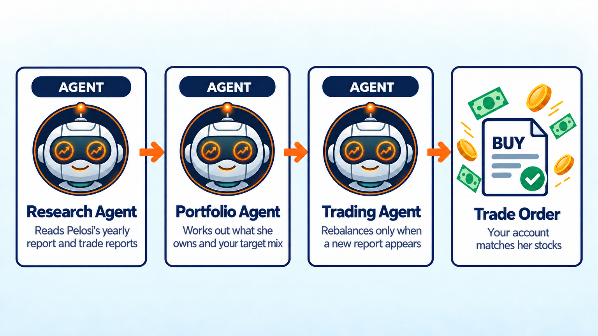

Nancy Pelosi Stock Trading Bot
==============================

.. meta::
   :description: This AI bot owns the same stocks as Nancy Pelosi, rebuilt from her House reports. Free Python code you can backtest and run with LumiBot.

This bot owns the same stocks Nancy Pelosi owns, in the same mix, sized to your account. It reads her own reports on the U.S. House website, so it copies her whole stock portfolio, not just her latest trade. Why copy her? Her reported portfolio was up an estimated 70.9% in 2024, while the S&P 500 rose 24.9%, according to the Unusual Whales report covered by `Fortune <https://fortune.com/2025/01/08/congress-stock-trading-pelosi-2024>`__.

Want her call options too? The :doc:`agents_example_nancy_pelosi_copy_trading_bot` copies those as well.

How it works
------------

1. **Research agent** goes to the `House Clerk website <https://disclosures-clerk.house.gov/>`__ and opens the yearly list of filings. It finds Pelosi's newest yearly report, which lists every stock she owned on December 31, and every trade report filed since.
2. The research agent reads those reports and works out what she owns today: the yearly report, plus every stock she bought or sold after it. It only uses reports filed before today.
3. **Portfolio agent** turns her holdings into your target mix. A stock she holds $5 million to $25 million of gets a bigger share of your account than one she holds $1 million to $5 million of.
4. **Trading agent** buys and sells to match that mix, and checks that every order filled.
5. The bot checks once a day, but it only trades when she files a new report. On other days the research agent answers "nothing new" and the bot does nothing, so it does not trade every day.

Want a different member of Congress? Change ``last_name`` from ``"Pelosi"`` to any House member's last name.

Run it on BotSpot
-----------------

Run this bot on `BotSpot <https://botspot.trade/marketplace?utm_source=documentation&utm_medium=docs&utm_campaign=lumibot_ai_examples&utm_content=agents_example_nancy_pelosi_trading_bot>`_ without installing anything. BotSpot runs LumiBot in the cloud, backtests it, and connects it to your broker.

The code
--------

The whole bot is one short file. The three prompts are the strategy. The research agent uses LumiBot's built-in web tools, which read ZIP files, PDFs, spreadsheets and web pages from any website.

.. literalinclude:: ../lumibot/example_strategies/ai_nancy_pelosi_trading_bot.py
   :language: python

Run it yourself
---------------

.. code-block:: bash

   pip install lumibot
   python -m lumibot.example_strategies.ai_nancy_pelosi_trading_bot

Put these in your ``.env`` file: ``OPENAI_API_KEY``, and your broker keys (for example ``ALPACA_API_KEY``, ``ALPACA_API_SECRET``, and ``ALPACA_IS_PAPER=true`` for paper trading). With ``IS_BACKTESTING=false`` the bot trades. With ``IS_BACKTESTING=true`` it backtests instead; set ``BACKTESTING_START`` and ``BACKTESTING_END`` to pick the dates, and start with a week or two, because every AI call costs a little.

Good to know
------------

* Members of Congress can take up to 45 days to report a trade, so the bot always sees trades late.
* Reports show dollar ranges, such as $1,000,001 to $5,000,000. The bot uses the middle of each range.
* The yearly report comes out in May and shows what she owned on December 31. Until the new one is filed, the bot starts from the year before and adds every trade since.
* In a backtest the website also shows reports from after the test date. The research agent reads the date on each report and skips any report filed after the test day.
* Pelosi said on November 6, 2025 that she will not run for re-election in 2026 (`NBC News <https://www.nbcnews.com/politics/congress/nancy-pelosi-first-female-speaker-house-wont-seek-re-election-congress-rcna239324>`__). Her reports stop after she leaves office, so change ``last_name`` to keep the bot trading.
* The House website says its reports may not be used for most commercial purposes (5 U.S.C. 13107). Check that your use is allowed.

See :doc:`agents_examples` for more AI trading bots and :doc:`strategy_run_modes` for backtest and live runs.
