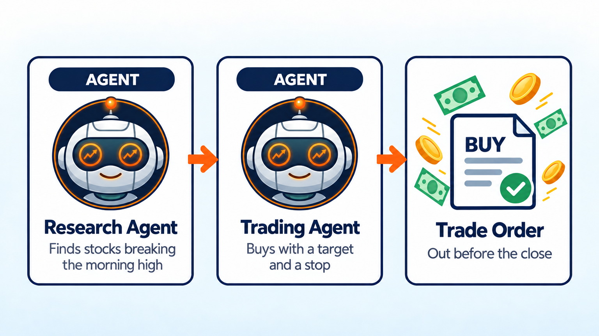
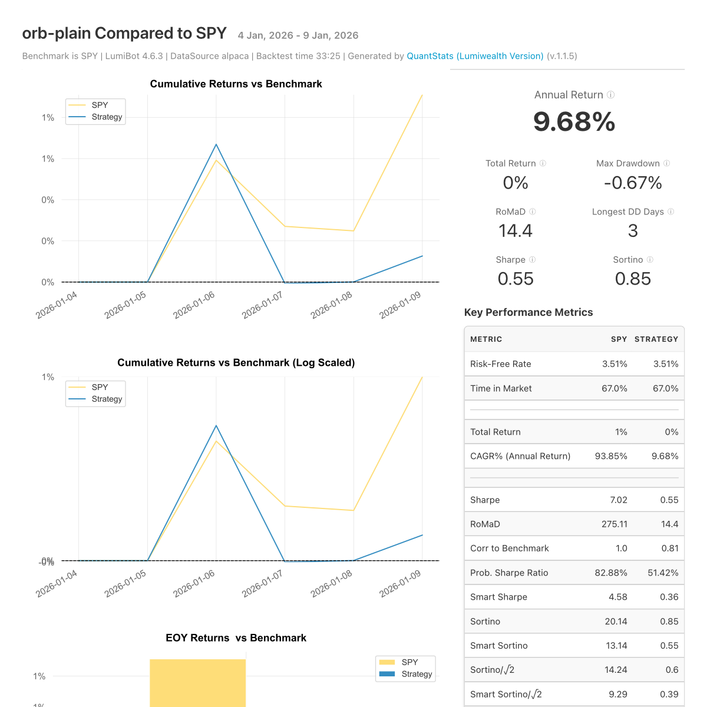

Opening Range Breakout AI Trading Bot
=====================================

.. meta::
   :description: An AI bot that trades the opening range breakout. It waits for the first move of the day, then buys the breakout. Free Python code for LumiBot.

This day trading bot trades the opening range breakout (ORB). It marks each stock's high and low from the first 15 minutes of the day, then buys the stock that breaks out above that high. Why this setup? A study of a 5-minute opening range breakout on QQQ found 33% a year of return beyond the index after commissions from 2016 to 2023 (`Zarattini and Aziz, 2023 <https://static1.squarespace.com/static/5983d931579fb366729580d8/t/643ed6765176b45506e41a01/1681839734183/SSRN-id4416622.pdf>`__). Most day trading setups do not hold up that well, so test it yourself.

How it works
------------

1. **Research agent** checks 10 big, liquid stocks and ETFs once an hour, starting at 10:00 ET. It finds each stock's opening range (the high and low from 9:30 to 9:45) and lists the stocks that closed above their range high, best first.
2. **Trading agent** buys the best breakout if the bot holds nothing. The stop is the range low, sized so hitting it loses at most 1% of the account.
3. The trading agent also places a profit target at 1.5 times the risk. It sells if the price falls back into the range, and always before the close.

Change ``universe`` to scan different stocks.

Run it on BotSpot
-----------------

Run this bot on `BotSpot <https://botspot.trade/marketplace?utm_source=documentation&utm_medium=docs&utm_campaign=lumibot_ai_examples&utm_content=agents_example_opening_range_breakout_ai_trading_bot>`_ without installing anything. BotSpot runs LumiBot in the cloud, backtests it, and connects it to your broker.

Backtest tear sheet
-------------------

GPT-6 Luna, January 5 to 9, 2026, Alpaca minute prices checked hourly, $100,000 start. The bot traded breakouts in TSLA, AMZN, MSFT, and NVDA, one stock at a time with a target and a stop, and ended at $100,127 (+0.1%) while SPY rose 1%.

`Open the full tear sheet <tearsheets/opening-range-breakout-ai-trading-bot.html>`__. A short backtest shows the bot works as written. It is not a promise of future returns.

The code
--------

The whole bot is one short file. The prompts are plain English, and they are the strategy.

.. literalinclude:: ../lumibot/example_strategies/ai_opening_range_breakout.py
   :language: python

Run it yourself
---------------

.. code-block:: bash

   pip install lumibot
   python -m lumibot.example_strategies.ai_opening_range_breakout

Put these in your ``.env`` file: ``OPENAI_API_KEY``, and your broker keys (for example ``ALPACA_API_KEY``, ``ALPACA_API_SECRET``, and ``ALPACA_IS_PAPER=true`` for paper trading). With ``IS_BACKTESTING=false`` the bot trades. With ``IS_BACKTESTING=true`` it backtests instead; set ``BACKTESTING_START`` and ``BACKTESTING_END`` to pick the dates, and start with a week or two, because every AI call costs a little. Option and minute-bar backtests use Alpaca's free history, so paper Alpaca keys are enough.

See :doc:`agents_examples` for more AI trading bots and :doc:`strategy_run_modes` for backtest and live runs.
