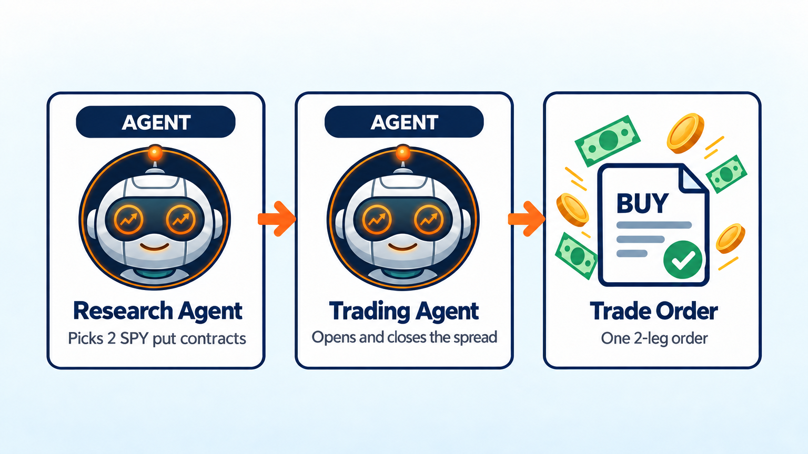
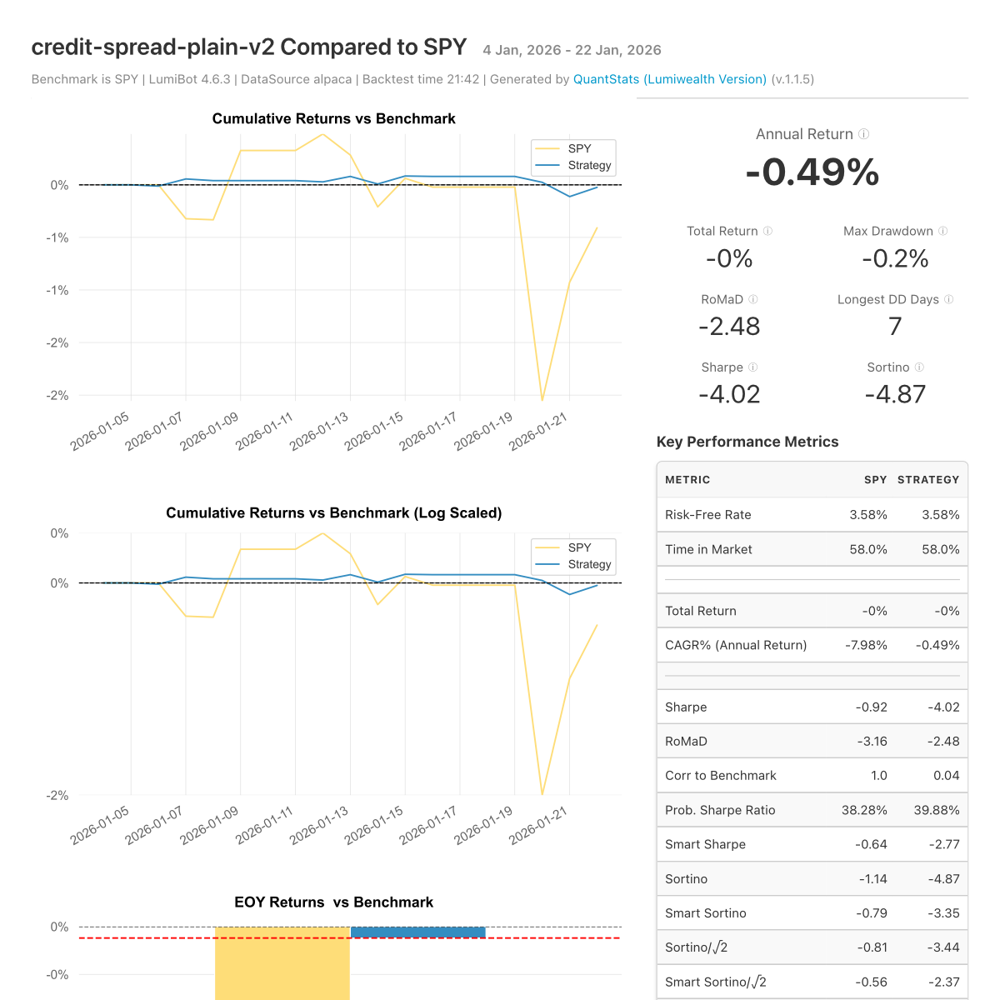

Put Credit Spread AI Trading Bot
================================

.. meta::
   :description: An AI bot that sells put credit spreads on SPY, picks the strikes, and closes losers early. Free Python code you can backtest in LumiBot.

This bot sells a put credit spread on SPY about a month out. You get paid up front and keep the money if SPY stays above the short strike, and the second put caps how much you can lose. Why sell puts? Over more than 32 years, Cboe's index of selling S&P 500 puts earned almost the same yearly return as the S&P 500 (9.54% vs 9.80%) with much smaller swings (`Bondarenko for Cboe, 2019 <https://cdn.cboe.com/resources/education/research_publications/PutWriteCBOE19_v14_by_Prof_Oleg_Bondarenko_as_of_June_14.pdf>`__).

How it works
------------

1. **Research agent** checks SPY's price, trend, and the live option chain. It picks an expiration 30 to 45 days out, a short put near 0.16 delta, and a long put 5 points lower.
2. **Trading agent** first manages any spread you hold. It closes it when you have kept half the premium, when closing costs twice the premium, or when 21 days are left.
3. If you hold no spread, the trading agent sells the new one, risking about 2% of the account. The bot checks once a day.

Run it on BotSpot
-----------------

Run this bot on `BotSpot <https://botspot.trade/marketplace?utm_source=documentation&utm_medium=docs&utm_campaign=lumibot_ai_examples&utm_content=agents_example_put_credit_spread_ai_trading_bot>`_ without installing anything. BotSpot runs LumiBot in the cloud, backtests it, and connects it to your broker.

Backtest tear sheet
-------------------

GPT-6 Luna, January 5 to 23, 2026, Alpaca option prices, $100,000 start. The bot sold a 4-contract SPY put spread for $0.44, closed it for $0.24 (about half the credit kept), sold a new one, closed that at its 2x loss limit, and sold a third. Each spread went in as one order and risked about 2% of the account. It ended at $99,976, about flat, while SPY was flat too.

`Open the full tear sheet <tearsheets/put-credit-spread-ai-trading-bot.html>`__. A short backtest shows the bot works as written. It is not a promise of future returns.

The code
--------

The whole bot is one short file. The prompts are plain English, and they are the strategy.

.. literalinclude:: ../lumibot/example_strategies/ai_credit_spread.py
   :language: python

Run it yourself
---------------

.. code-block:: bash

   pip install lumibot
   python -m lumibot.example_strategies.ai_credit_spread

Put these in your ``.env`` file: ``OPENAI_API_KEY``, and your broker keys (for example ``ALPACA_API_KEY``, ``ALPACA_API_SECRET``, and ``ALPACA_IS_PAPER=true`` for paper trading). With ``IS_BACKTESTING=false`` the bot trades. With ``IS_BACKTESTING=true`` it backtests instead; set ``BACKTESTING_START`` and ``BACKTESTING_END`` to pick the dates, and start with a week or two, because every AI call costs a little. Option and minute-bar backtests use Alpaca's free history, so paper Alpaca keys are enough.

Good to know
------------

* A sharp market drop can turn a credit spread into a full loss. Paper trade first.

See :doc:`agents_examples` for more AI trading bots and :doc:`strategy_run_modes` for backtest and live runs.
