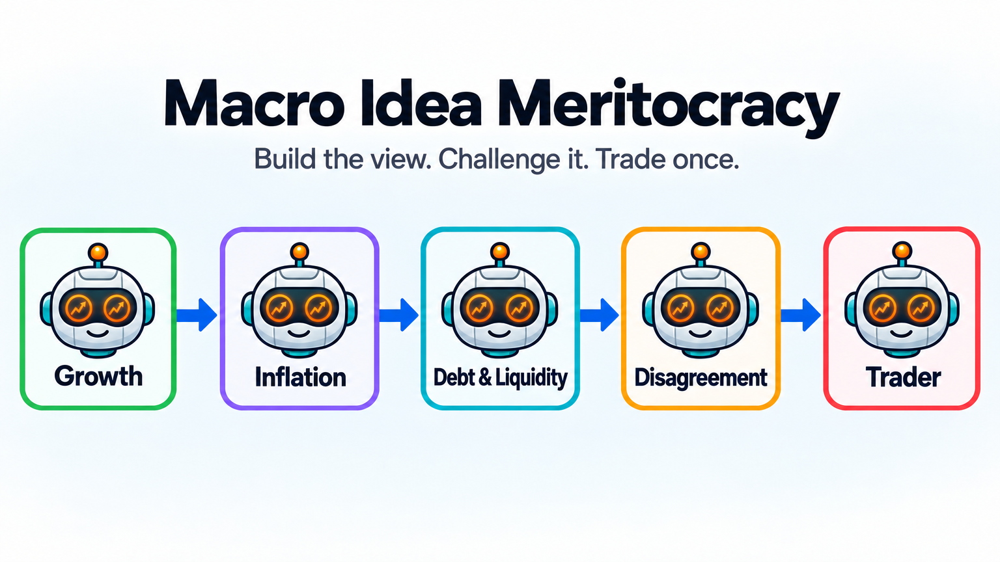
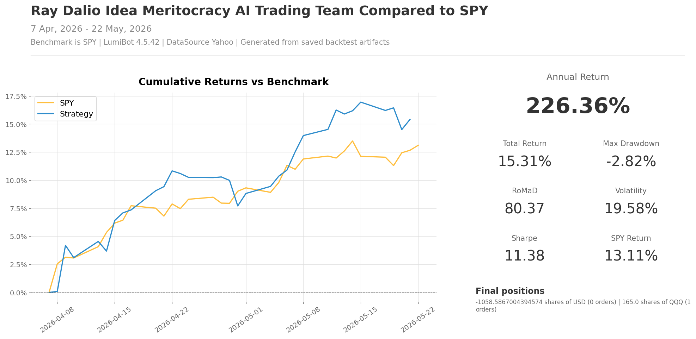

Ray Dalio Idea Meritocracy AI Trading Team
==========================================

This strategy is inspired by Ray Dalio's public writing about idea meritocracy
and thoughtful disagreement. It is not an "All Weather" clone. The important
idea is the operating system: independent thinkers argue from different models
of the world, the disagreement is explicit, and the final decision should be
stronger because weak assumptions were challenged.

In Lumibot, that turns into a macro trading team. One agent argues from growth,
one argues from inflation and rates, one argues from debt, liquidity, currency,
and policy pressure, then a disagreement agent stress-tests all three before
the trader picks one ETF.

`See this strategy running live on BotSpot <https://botspot.trade/marketplace/strategy/81af73b8-7dec-4941-ba35-d5a06fee6863>`__

How the team works
------------------

* ``growth_agent`` asks what wins if growth improves.
* ``inflation_agent`` asks what wins or loses if inflation and rates surprise.
* ``debt_liquidity_agent`` argues from debt, liquidity, currency, and policy pressure.
* ``thoughtful_disagreement`` challenges the other agents and names the strongest idea.
* ``trader`` buys the best macro ETF idea and is the only agent allowed to trade.

Backtest snapshot
-----------------

Run it with a broker
--------------------

The file defaults to broker-connected execution. With Alpaca, it runs in paper
mode unless you set ``ALPACA_IS_PAPER=false``.

.. code-block:: bash

   export GEMINI_API_KEY='your-key-here'
   export ALPACA_API_KEY='your-alpaca-key'
   export ALPACA_API_SECRET='your-alpaca-secret'
   export ALPACA_IS_PAPER=true
   python lumibot/example_strategies/ai_trading_team_ray_dalio_idea_meritocracy.py

Backtest it
-----------

Use the same strategy class and change ``IS_BACKTESTING = False`` to ``IS_BACKTESTING = True`` in the runner:

.. code-block:: bash

   export GEMINI_API_KEY='your-key-here'
   python lumibot/example_strategies/ai_trading_team_ray_dalio_idea_meritocracy.py

Example code
------------

.. literalinclude:: ../lumibot/example_strategies/ai_trading_team_ray_dalio_idea_meritocracy.py
   :language: python
