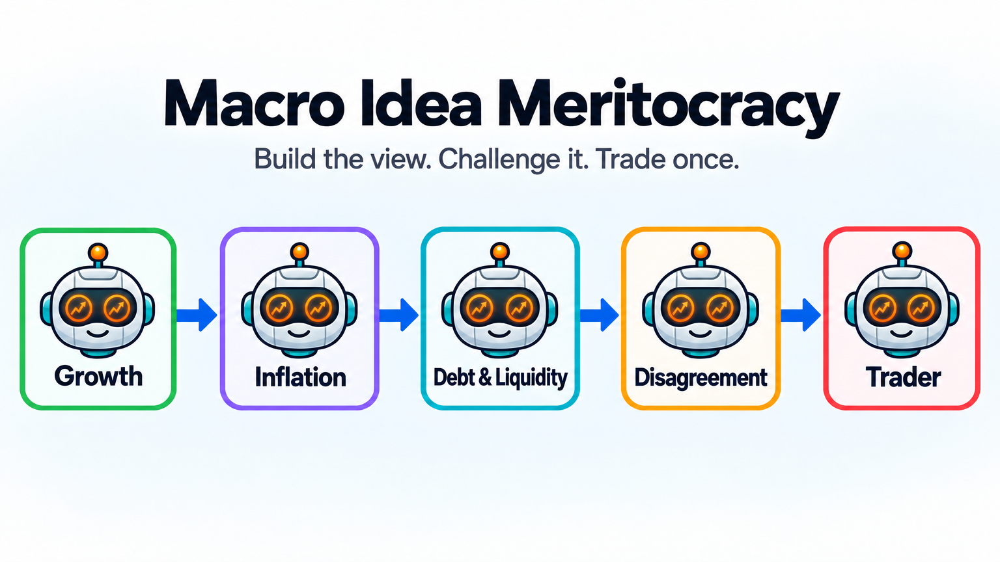
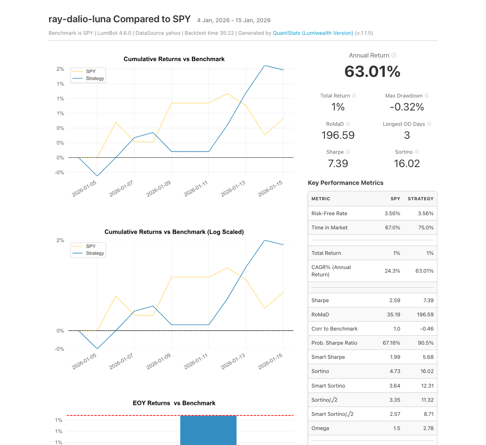

Ray Dalio Idea Meritocracy AI Trading Team
==========================================

.. meta::
   :description: An AI macro trading team inspired by Ray Dalio's idea meritocracy: growth, inflation, and debt agents argue before a trader builds an ETF portfolio. Free Python code.

This AI team is inspired by Ray Dalio's public writing about "idea meritocracy": smart people with different views argue openly, and the best idea wins. Three agents each look at the economy through a different lens, a fourth agent makes them argue, and a trader builds a diversified ETF portfolio from the winning ideas. It is not a copy of Bridgewater's All Weather portfolio.

How it works
------------

1. **Growth agent** asks what wins if the economy speeds up or slows down.
2. **Inflation agent** asks what wins or loses if inflation and interest rates surprise.
3. **Debt and liquidity agent** argues from debt, money supply, currency, and central bank policy.
4. **Disagreement agent** challenges all three and names the strongest idea.
5. **Trading agent** builds a diversified macro ETF portfolio and is the only agent allowed to place orders. The team repeats this once a day.

This file is the exact code running on BotSpot with a live paper track record, including its model, Gemini 3.1 Flash Lite. A leveraged version holds leveraged ETFs instead.

Run it on BotSpot
-----------------

Run this team on `BotSpot <https://botspot.trade/marketplace?utm_source=documentation&utm_medium=docs&utm_campaign=lumibot_ai_examples&utm_content=agents_example_ray_dalio_idea_meritocracy>`_ without installing anything. BotSpot runs LumiBot in the cloud, backtests it, and connects it to your broker.

Backtest tear sheet
-------------------

GPT-6 Luna, January 5 to 16, 2026, Yahoo daily prices, $100,000 start. The team built a macro mix of SPY, EEM, GLD, IEF, and SHV and ended at $101,483 (+1%), about even with SPY. Cash never went below $262. The live paper track record on BotSpot runs the Gemini model shown in the code.

`Open the full tear sheet <tearsheets/ray-dalio-idea-meritocracy.html>`__. A short backtest shows the team works as written. It is not a promise of future returns.

The code
--------

Regular ETFs:

.. literalinclude:: ../lumibot/example_strategies/ai_trading_team_ray_dalio_idea_meritocracy.py
   :language: python

Leveraged ETFs:

.. literalinclude:: ../lumibot/example_strategies/ai_trading_team_ray_dalio_idea_meritocracy_leveraged.py
   :language: python

Run it yourself
---------------

.. code-block:: bash

   pip install lumibot
   python -m lumibot.example_strategies.ai_trading_team_ray_dalio_idea_meritocracy

Add ``GEMINI_API_KEY`` and your broker keys (for example ``ALPACA_API_KEY``, ``ALPACA_API_SECRET``, and ``ALPACA_IS_PAPER=true``) to your ``.env`` file. This file trades by default. Set ``IS_BACKTESTING=true`` in your environment to backtest it instead. For macro data, add a free ``FRED_API_KEY`` (see :doc:`macro_data`).

Good to know
------------

* Inspired by Ray Dalio's public writing. Not affiliated with or endorsed by Ray Dalio or Bridgewater, and not a copy of any real strategy.
* The picture shows the three research agents side by side because none of them depends on another. The code calls them one after another.

See :doc:`agents_examples` for more AI trading bots and :doc:`strategy_run_modes` for backtest and live runs.
