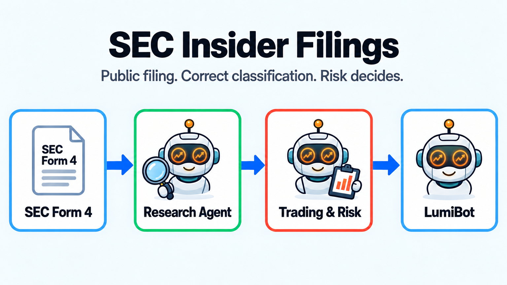

SEC Form 4 Insider-Filing Agent
===============================

This example analyzes public SEC **Form 4** filings. It does not use material
non-public information. Records first become visible at the SEC
``acceptance``/publication time (normalized as ``published_at``), never merely
on their earlier transaction date.

The parser preserves transaction codes, direct versus indirect ownership,
derivative status, amendments, quantities, prices, and computed values. The
default strategy considers only open-market transactions; grants, gifts,
option exercises, derivatives, and amendments must not be treated as ordinary
open-market buying or selling.

``form4_researcher`` builds the evidence packet without trading permission.
``trading_risk_manager`` independently verifies account state and price and is
the only agent allowed to submit an order.

The live source is the SEC Form 4 Atom feed at
``https://www.sec.gov/cgi-bin/browse-edgar?action=getcurrent&type=4&output=atom``.
The strategy may act only on entries whose published time is already visible
at the backtest clock. A January 23, 2026 clock fetched 40 current entries
and hid all 40 as future. A live feed item such as Mark W. Webb, accession
0001193125-26-397981, is the kind of row live mode can see when it is still
in the latest feed.

This example does not ship sample trades. Pass official EDGAR filings in
``transactions`` or a JSON file of those filings in ``transactions_path``.
Running the module with neither argument stops instead of inventing trades.
A backtest on this page is real only after those filings and market prices
are supplied.

.. literalinclude:: ../lumibot/example_strategies/ai_sec_insider_filings.py
   :language: python
   :linenos:
