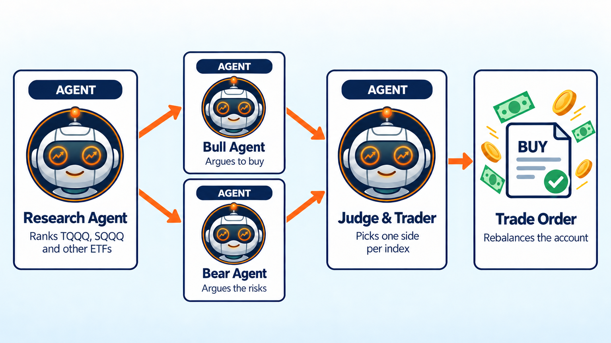
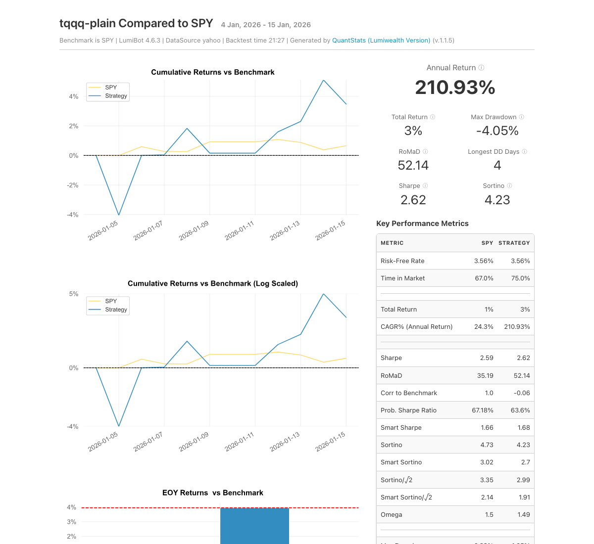

TQQQ Strategy AI Trading Bot
============================

.. meta::
   :description: A bull AI and a bear AI debate the Nasdaq, then the bot picks TQQQ or SQQQ and other leveraged ETFs. A TQQQ strategy you can backtest free in LumiBot.

This bot trades leveraged ETFs like TQQQ, which moves about 3 times the Nasdaq-100 each day, and SQQQ, which moves 3 times the opposite way. A bull agent and a bear agent debate the market, and a judge agent picks one side per index. Leveraged ETFs reset every day. ProShares warns that over any period longer than a day, your return "may be higher or lower" than 3 times the index (`ProShares <https://www.proshares.com/our-etfs/leveraged-and-inverse/tqqq>`__). That is why this bot rechecks the debate every day.

How it works
------------

1. **Research agent** ranks 12 leveraged ETFs, like TQQQ, SQQQ, UPRO, and SOXL, from recent prices and trends.
2. **Bull agent** and **bear agent** read the same research and argue at the same time.
3. **Judge and trading agent** weighs both sides and splits the account across the winners. It never holds an ETF and its opposite on the same index, like TQQQ with SQQQ, and sells the old side before it switches. The bot repeats this once a day.

Run it on BotSpot
-----------------

Run this bot on `BotSpot <https://botspot.trade/marketplace?utm_source=documentation&utm_medium=docs&utm_campaign=lumibot_ai_examples&utm_content=agents_example_tqqq_strategy_ai_trading_bot>`_ without installing anything. BotSpot runs LumiBot in the cloud, backtests it, and connects it to your broker.

Backtest tear sheet
-------------------

GPT-6 Luna, January 5 to 16, 2026, Yahoo daily prices, $100,000 start. The debate picked leveraged long ETFs (UPRO, UDOW, TNA, SOXL), never holding an ETF and its opposite together, and the bot ended at $103,475 (+3.5%) while SPY rose 1%. Cash never went below $22,809.

`Open the full tear sheet <tearsheets/tqqq-strategy-ai-trading-bot.html>`__. A short backtest shows the bot works as written. It is not a promise of future returns.

The code
--------

The whole bot is one short file. The prompts are plain English, and they are the strategy.

.. literalinclude:: ../lumibot/example_strategies/ai_trading_team_bull_bear_leveraged_etf.py
   :language: python

Run it yourself
---------------

.. code-block:: bash

   pip install lumibot
   python -m lumibot.example_strategies.ai_trading_team_bull_bear_leveraged_etf

Put these in your ``.env`` file: ``OPENAI_API_KEY``, and your broker keys (for example ``ALPACA_API_KEY``, ``ALPACA_API_SECRET``, and ``ALPACA_IS_PAPER=true`` for paper trading). With ``IS_BACKTESTING=false`` the bot trades. With ``IS_BACKTESTING=true`` it backtests instead; set ``BACKTESTING_START`` and ``BACKTESTING_END`` to pick the dates, and start with a week or two, because every AI call costs a little.

Good to know
------------

* Leveraged ETFs can drop very fast and lose value when held through choppy markets. Paper trade first.

See :doc:`agents_examples` for more AI trading bots and :doc:`strategy_run_modes` for backtest and live runs.
