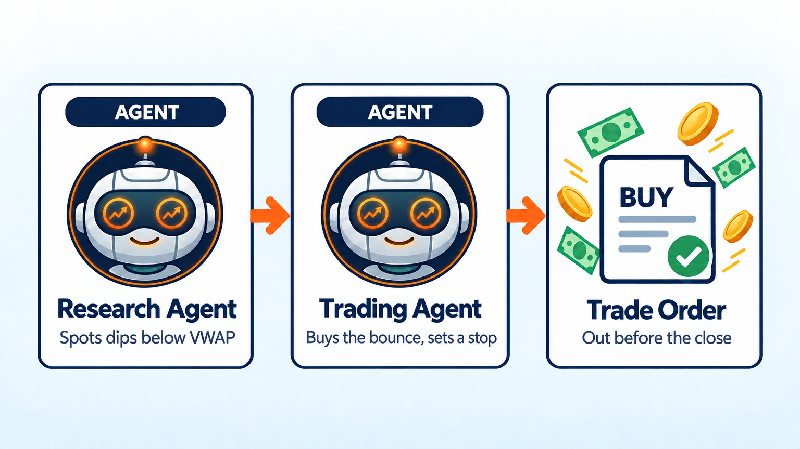
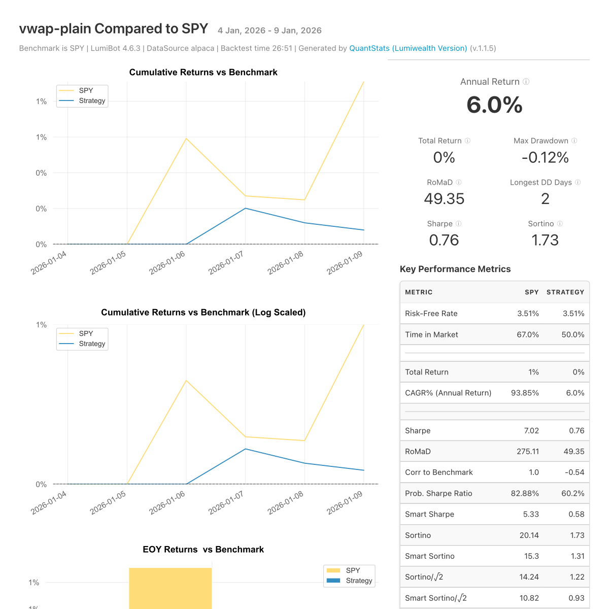

VWAP Strategy AI Trading Bot
============================

.. meta::
   :description: An AI day trading bot that buys SPY when it bounces back above VWAP, the price big funds watch all day. Free Python code you can backtest in LumiBot.

This day trading bot uses VWAP, the volume-weighted average price. Big funds grade their own trades against VWAP, so it is a price level the whole market watches (`Berkowitz, Logue and Noser, 1988 <https://onlinelibrary.wiley.com/doi/abs/10.1111/j.1540-6261.1988.tb02591.x>`__). When SPY dips below VWAP and then climbs back above it, the bot buys the bounce with a tight stop and is out by the close.

How it works
------------

1. **Research agent** checks SPY's minute bars once an hour, starting at 10:00 ET. It reports VWAP, the last price, and whether SPY dipped at least 0.15% below VWAP and then closed back above it since the last check.
2. **Trading agent** buys when that bounce happens and the bot is not already in a trade. It puts the stop just under the dip's low and sizes the trade so hitting the stop loses at most 1% of the account.
3. The trading agent sells at the next hourly check, and always before the close. It makes at most one new trade a day.

Run it on BotSpot
-----------------

Run this bot on `BotSpot <https://botspot.trade/marketplace?utm_source=documentation&utm_medium=docs&utm_campaign=lumibot_ai_examples&utm_content=agents_example_vwap_strategy_ai_trading_bot>`_ without installing anything. BotSpot runs LumiBot in the cloud, backtests it, and connects it to your broker.

Backtest tear sheet
-------------------

GPT-6 Luna, January 5 to 9, 2026, Alpaca minute prices checked hourly, $100,000 start. The bot made three SPY round trips on VWAP bounces and ended at $100,080 (+0.1%) while SPY rose 1%. When no bounce formed it stayed in cash.

`Open the full tear sheet <tearsheets/vwap-strategy-ai-trading-bot.html>`__. A short backtest shows the bot works as written. It is not a promise of future returns.

The code
--------

The whole bot is one short file. The prompts are plain English, and they are the strategy.

.. literalinclude:: ../lumibot/example_strategies/ai_vwap.py
   :language: python

Run it yourself
---------------

.. code-block:: bash

   pip install lumibot
   python -m lumibot.example_strategies.ai_vwap

Put these in your ``.env`` file: ``OPENAI_API_KEY``, and your broker keys (for example ``ALPACA_API_KEY``, ``ALPACA_API_SECRET``, and ``ALPACA_IS_PAPER=true`` for paper trading). With ``IS_BACKTESTING=false`` the bot trades. With ``IS_BACKTESTING=true`` it backtests instead; set ``BACKTESTING_START`` and ``BACKTESTING_END`` to pick the dates, and start with a week or two, because every AI call costs a little. Option and minute-bar backtests use Alpaca's free history, so paper Alpaca keys are enough.

See :doc:`agents_examples` for more AI trading bots and :doc:`strategy_run_modes` for backtest and live runs.
