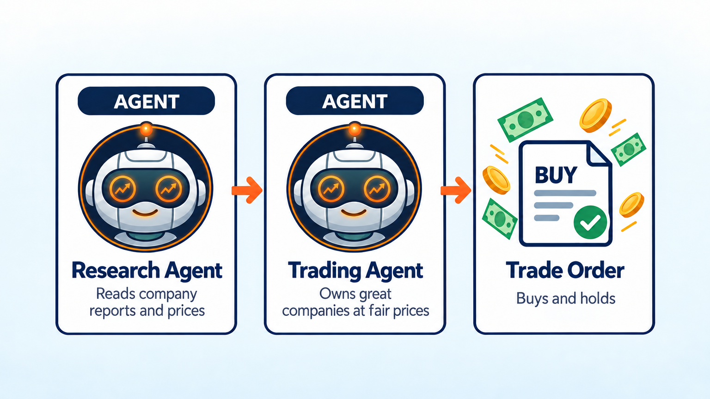
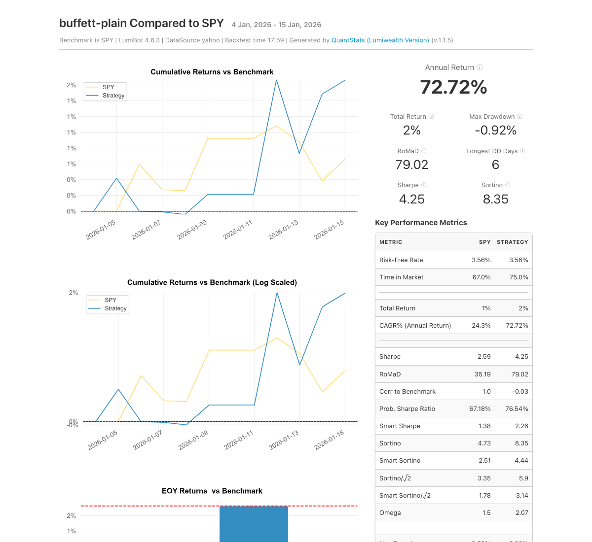

Warren Buffett AI Stock Picker
==============================

.. meta::
   :description: An AI stock picker that thinks like Warren Buffett. It reads company filings, hunts for great companies at fair prices, and holds them. Free Python code for LumiBot.

This bot picks stocks the way Warren Buffett describes in his Berkshire Hathaway letters: buy wonderful businesses at fair prices and hold them for a long time. Why copy that? From 1965 through 2025, Berkshire's stock grew 19.7% a year, versus 10.5% for the S&P 500 (`Berkshire 2025 letter <https://www.berkshirehathaway.com/letters/2025ltr.pdf>`__).

How it works
------------

1. **Research agent** reads each company's latest financial reports and checks its price today. It picks the 3 to 5 companies with the best mix of steady profits, a lasting edge over rivals, and a fair price.
2. **Skeptic agent**, like Buffett's partner Charlie Munger, attacks each pick: a price that is too high, a shrinking edge, too much debt, or numbers that do not add up. It keeps only the picks that survive.
3. **Trading agent** owns the survivors, split about evenly. It holds for the long run and only sells when the skeptic drops a stock because the business got worse or the price got far too high.

Change ``universe`` to pick from different companies.

Run it on BotSpot
-----------------

Run this bot on `BotSpot <https://botspot.trade/marketplace?utm_source=documentation&utm_medium=docs&utm_campaign=lumibot_ai_examples&utm_content=agents_example_warren_buffett_ai_stock_picker>`_ without installing anything. BotSpot runs LumiBot in the cloud, backtests it, and connects it to your broker.

Backtest tear sheet
-------------------

GPT-6 Luna, January 5 to 16, 2026, Yahoo daily prices and company reports, $100,000 start. After the skeptic's review the bot bought AXP, GOOGL, KO, and PG and held them, ending at $101,660 (+1.7%) while SPY rose 1%. Cash never went below $5,145.

`Open the full tear sheet <tearsheets/warren-buffett-ai-stock-picker.html>`__. A short backtest shows the bot works as written. It is not a promise of future returns.

The code
--------

The whole bot is one short file. The prompts are plain English, and they are the strategy.

.. literalinclude:: ../lumibot/example_strategies/ai_trading_team_warren_buffett_value.py
   :language: python

Run it yourself
---------------

.. code-block:: bash

   pip install lumibot
   python -m lumibot.example_strategies.ai_trading_team_warren_buffett_value

Put these in your ``.env`` file: ``OPENAI_API_KEY``, and your broker keys (for example ``ALPACA_API_KEY``, ``ALPACA_API_SECRET``, and ``ALPACA_IS_PAPER=true`` for paper trading). With ``IS_BACKTESTING=false`` the bot trades. With ``IS_BACKTESTING=true`` it backtests instead; set ``BACKTESTING_START`` and ``BACKTESTING_END`` to pick the dates, and start with a week or two, because every AI call costs a little.

Good to know
------------

* Inspired by Warren Buffett's public shareholder letters. Not affiliated with or endorsed by Warren Buffett or Berkshire Hathaway.

See :doc:`agents_examples` for more AI trading bots and :doc:`strategy_run_modes` for backtest and live runs.
