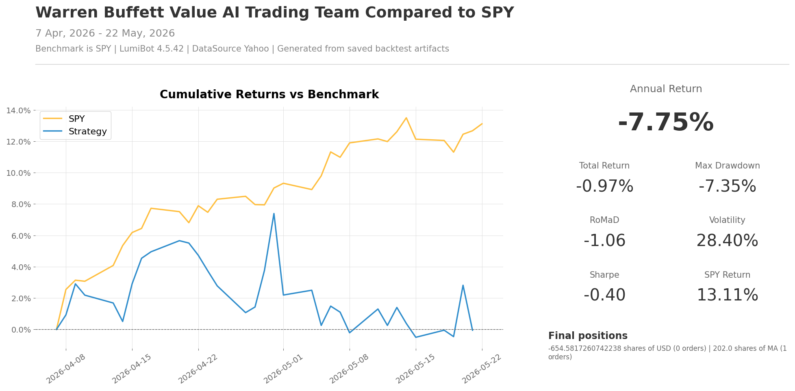

Warren Buffett Value AI Trading Team
====================================

.. image:: ../docs/assets/ai-trading-team-workflows/warren-buffett-value.png
   :alt: AI trading team workflow for Warren Buffett value style investing
   :width: 100%

This strategy is inspired by Warren Buffett's public investing style: understand
the business first, read the filings, care about durability, avoid overpaying,
and only act when the idea is strong enough to own. The point is not to clone
Buffett. The point is to show how AI agents can divide a value-investing process
into research, skepticism, and final portfolio action.

The first agent behaves like an annual-report reader. It looks for business
quality, cash generation, balance-sheet strength, and durability. The second
agent plays valuation skeptic and asks whether the price still leaves a margin
of safety. The portfolio manager only trades if the business-quality case and
valuation discipline both survive.

`See this strategy running live on BotSpot <https://botspot.trade/marketplace/strategy/bdd324e9-8026-4115-b26e-30cccf6e00e8>`__

How the team works
------------------

* ``annual_report_reader`` studies business quality, cash flow, filings, and durability.
* ``valuation_skeptic`` challenges valuation and asks for a margin of safety.
* ``portfolio_manager`` buys the best long-term compounder and is the only agent allowed to trade.

Backtest snapshot
-----------------

Run it with a broker
--------------------

The file defaults to broker-connected execution. With Alpaca, it runs in paper
mode unless you set ``ALPACA_IS_PAPER=false``.

.. code-block:: bash

   export GEMINI_API_KEY='your-key-here'
   export ALPACA_API_KEY='your-alpaca-key'
   export ALPACA_API_SECRET='your-alpaca-secret'
   export ALPACA_IS_PAPER=true
   python lumibot/example_strategies/ai_trading_team_warren_buffett_value.py

Backtest it
-----------

Use the same strategy class and change ``IS_BACKTESTING = False`` to ``IS_BACKTESTING = True`` in the runner:

.. code-block:: bash

   export GEMINI_API_KEY='your-key-here'
   python lumibot/example_strategies/ai_trading_team_warren_buffett_value.py

Example code
------------

.. literalinclude:: ../lumibot/example_strategies/ai_trading_team_warren_buffett_value.py
   :language: python
