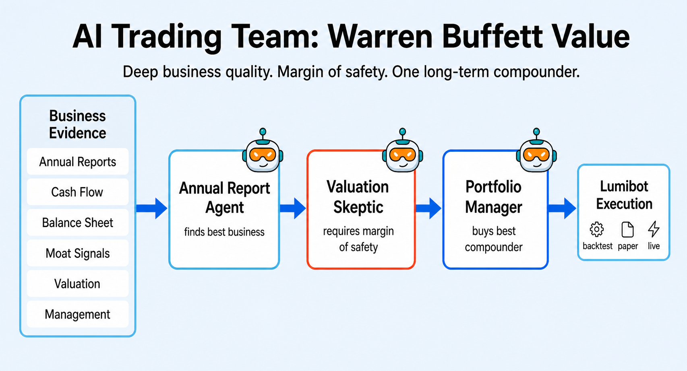

Warren Buffett Value Trading Team
=================================

This example is a long-term business-quality flow. It asks one agent to find the
best business, one agent to require valuation discipline, and one final
portfolio manager to trade only if the idea survives.

Agent flow
----------

* ``annual_report_reader`` looks for business quality, cash flow, balance-sheet strength, and durability.
* ``valuation_skeptic`` challenges valuation and requires a margin of safety.
* ``portfolio_manager`` buys the best long-term compounder with trading permission.

Example code
------------

.. literalinclude:: ../lumibot/example_strategies/ai_trading_team_warren_buffett_value.py
   :language: python
