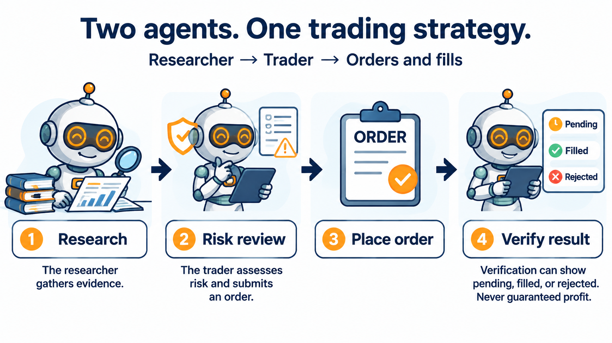

AI Trading Examples: Stocks, Macro Teams, and Options
=====================================================

Choose a strategy by the job you want to learn and the data you can supply.

**Start with two agents:** :doc:`agents_quickstart` creates a researcher and a
trader inside a standard Strategy. The trader reviews risk and observes orders.

Start with :doc:`agents_quickstart` for a complete two-agent stock backtest.
All examples below make model calls and require a supported provider account;
the Gemini examples use ``GEMINI_API_KEY``. Model usage may incur charges.

Stocks
------

.. list-table:: Stock workflows
   :header-rows: 1
   :widths: 25 30 25 20

   * - Example
     - What it does
     - Data and cadence
     - Evidence
   * - :doc:`Large-cap bull/bear team <agents_example_bull_bear_large_cap_stocks>`
     - Researcher, bull, and bear inform one trading agent.
     - Yahoo daily backtest; daily decisions. Alpaca keys only for the broker runner.
     - Saved source and historical screenshot; follow the tutorial's current validation status.
   * - :doc:`Opening range breakout <agents_example_ai_opening_range_breakout>`
     - Inspect completed opening bars and trade a confirmed breakout.
     - ThetaData via Data Downloader; minute evidence, hourly decisions.
     - Earlier mechanics run completed; later bounded run did not finish its full window.
   * - :doc:`VWAP <agents_example_ai_vwap>`
     - Explore VWAP reclaim and mean reversion.
     - Intraday bars and indicator tools; inspect the example's cadence.
     - See the page's recorded mechanics evidence; not a returns claim.
   * - :doc:`Value research team <agents_example_warren_buffett_value>`
     - Research business quality and challenge valuation.
     - Daily stock prices; SEC identity/setup for filing tools.
     - Source example; no new full run performed by this documentation update.
   * - :doc:`Concentrated stock team <agents_example_bill_ackman_concentrated>`
     - Debate one high-conviction large-cap position.
     - Yahoo daily backtest; Alpaca keys for broker execution.
     - Source example; no new full run performed by this documentation update.

ETF and macro teams
-------------------

.. list-table:: Team workflows
   :header-rows: 1
   :widths: 25 30 25 20

   * - Example
     - What it does
     - Data and cadence
     - Evidence
   * - :doc:`Sector pods <agents_example_citadel_sector_pods>`
     - Sector specialists present ideas to a portfolio manager.
     - Daily ETF prices. Hosted Data-On variants also require macro/news credentials.
     - Regular and leveraged marketplace revisions verified; not a performance endorsement.
   * - :doc:`Macro idea meritocracy <agents_example_ray_dalio_idea_meritocracy>`
     - Growth, inflation, and liquidity agents debate allocation.
     - Daily ETF prices; :doc:`FRED/ALFRED <macro_data>` and news for Data-On variants.
     - Regular and leveraged marketplace revisions verified; source differs from the original single-ETF example.
   * - :doc:`Leveraged ETF bull/bear team <agents_example_bull_bear_leveraged_etf>`
     - Debate leveraged long and inverse ETFs.
     - Daily prices; advanced instrument and concentration risk.
     - Source example; inspect the page's evidence before running it.

Hosted Data-On examples
~~~~~~~~~~~~~~~~~~~~~~~

* Sector pods: `regular ETFs <https://botspot.trade/marketplace/strategy/4fb6cf2f-272c-4a73-96e7-edd7383b1a33?utm_source=documentation&utm_medium=example_index&utm_campaign=lumibot_ai_examples&utm_content=citadel_regular>`__ or `leveraged ETFs <https://botspot.trade/marketplace/strategy/da83818b-f994-4163-8ef3-99ea346325b4?utm_source=documentation&utm_medium=example_index&utm_campaign=lumibot_ai_examples&utm_content=citadel_leveraged>`__.
* Macro team: `regular ETFs <https://botspot.trade/marketplace/strategy/b00c5f9c-beea-46fe-bdba-fc65c1315d5f?utm_source=documentation&utm_medium=example_index&utm_campaign=lumibot_ai_examples&utm_content=dalio_regular>`__ or `leveraged ETFs <https://botspot.trade/marketplace/strategy/362a50a1-d501-4b08-8d42-c7701a363731?utm_source=documentation&utm_medium=example_index&utm_campaign=lumibot_ai_examples&utm_content=dalio_leveraged>`__.

The four listings have no strategy subscription fee; BotSpot plans, model usage,
data, and broker requirements still apply. The Data-On versions add evidence and
allocation behavior beyond the original source examples. Inspect the saved code.

Options strategies
------------------

.. list-table:: Options workflows
   :header-rows: 1
   :widths: 25 30 25 20

   * - Example
     - What it does
     - Prerequisites
     - Evidence
   * - :doc:`Iron condor <agents_example_ai_iron_condor>`
     - Select and inspect four contracts, submit a multi-leg package, and manage it.
     - Historical option chains/quotes, supported options data, Gemini account.
     - Recorded mechanics evidence includes unavailable-chain/no-order cases.
   * - :doc:`Credit spread <agents_example_ai_credit_spread>`
     - Explore a vertical credit spread with shared option tools.
     - Option-chain and contract-price access; inspect the configured dates/cadence.
     - See the example's recorded evidence and limitations.
   * - :doc:`SPX zero-DTE bear-call team <agents_example_ai_spx_zero_dte_bear_call_team>`
     - Researcher gathers evidence; trading agent refreshes it and decides.
     - SPX option data and supported index-option execution; advanced example.
     - Inspect exact test conditions; no expected-return claim.

Before running a strategy
-------------------------

The original team files default to a broker runner. The stock tutorial supplies
a separate complete backtest runner so learning does not require editing that
mode flag or supplying broker keys. Other examples may use an explicit backtest
runner; read each page before executing its module.

A successful historical run verifies software behavior for that source, data,
and window. It does not establish investment performance. An LLM may know future
facts despite historical market-tool timestamps. These examples are inspired by
public ideas, without affiliation or endorsement from named people or firms.

.. toctree::
   :hidden:

   agents_example_bull_bear_large_cap_stocks
   agents_example_ai_opening_range_breakout
   agents_example_ai_vwap
   agents_example_warren_buffett_value
   agents_example_bill_ackman_concentrated
   agents_example_citadel_sector_pods
   agents_example_ray_dalio_idea_meritocracy
   agents_example_bull_bear_leveraged_etf
   agents_example_ai_iron_condor
   agents_example_ai_credit_spread
   agents_example_ai_spx_zero_dte_bear_call_team
