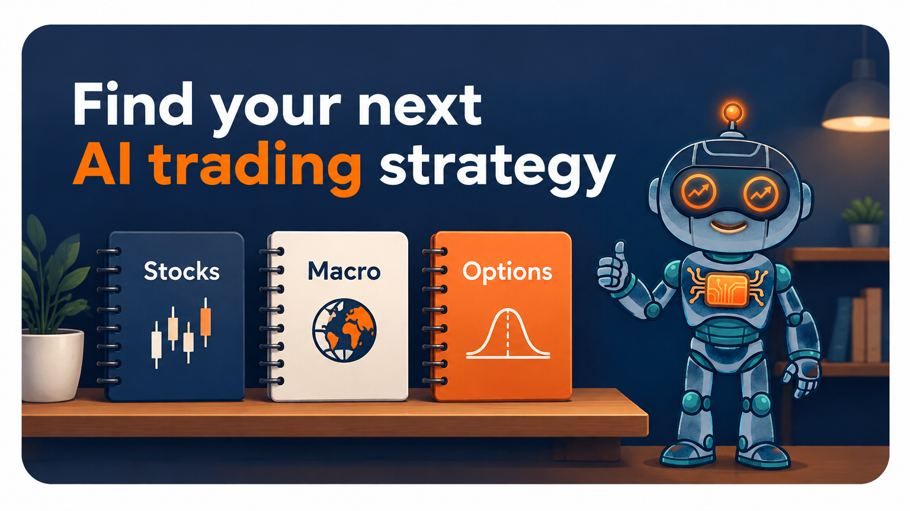

AI Trading Examples
===================

Start with a complete strategy, run a historical backtest, and inspect what the
agents decided. Model calls require a provider key. Each example states its
data requirements and whether the displayed result is a recorded run.

.. container:: lumibot-entry-grid lumibot-start-routes

   .. container:: lumibot-entry-card

      **First AI backtest**

      SPY trend research, risk review, and a trading agent. A small starting point.

      :doc:`Run the SPY example → <agents_quickstart>`

   .. container:: lumibot-entry-card

      **Agents that debate**

      Researcher, bull, bear, and trader working with familiar large-cap stocks.

      :doc:`See the stock team → <agents_example_bull_bear_large_cap_stocks>`

   .. container:: lumibot-entry-card

      **Options strategies**

      Explore an iron condor with its contracts, data setup, and recorded evidence.

      :doc:`Explore the iron condor → <agents_example_ai_iron_condor>`

Compare the workflows below. A fresh model run may produce different decisions
and returns; saved traces show what happened in a particular run.

Stocks
------

.. list-table:: Stock workflows
   :header-rows: 1
   :widths: 25 30 25 20

   * - Example
     - What it does
     - Data and cadence
     - Evidence
   * - :doc:`Large-cap bull/bear team <agents_example_bull_bear_large_cap_stocks>`
     - Researcher, bull, and bear inform one trading agent for names such as Apple, Microsoft, and Nvidia.
     - Yahoo daily prices. The January 2026 price proof bought 1 AAPL.
     - Real QuantStats tear sheet from that Yahoo run.
   * - :doc:`Opening range breakout <agents_example_ai_opening_range_breakout>`
     - Inspect completed opening bars and trade a confirmed breakout.
     - Alpaca minute bars. The January 5, 2026 proof bought and sold 1 SPY.
     - Real QuantStats tear sheet from that Alpaca minute run.
   * - :doc:`VWAP <agents_example_ai_vwap>`
     - Explore VWAP reclaim and mean reversion.
     - Alpaca minute bars. The January 5, 2026 proof bought 1 SPY at 686.54 and sold it at 687.29.
     - Real QuantStats tear sheet from that Alpaca minute run.
   * - :doc:`Value research team <agents_example_warren_buffett_value>`
     - Research business quality and challenge valuation.
     - Yahoo daily prices, then a real EDGAR read through get_filings and get_filing_section.
     - January 2026 source proof logged an Apple 10-K read, then held.
   * - :doc:`Concentrated stock team <agents_example_bill_ackman_concentrated>`
     - Debate one high-conviction large-cap position.
     - Yahoo daily prices, then a real SEC company atom fetch for Pershing Square.
     - January 2026 source proof logged that fetch, then held.

ETF and macro teams
-------------------

.. list-table:: Team workflows
   :header-rows: 1
   :widths: 25 30 25 20

   * - Example
     - What it does
     - Data and cadence
     - Evidence
   * - :doc:`Sector pods <agents_example_citadel_sector_pods>`
     - Sector specialists present ideas to a portfolio manager.
     - Daily ETF prices; inspect the published revision for additional data requirements.
     - Source example and public strategy listing; not a performance endorsement.
   * - :doc:`Macro idea meritocracy <agents_example_ray_dalio_idea_meritocracy>`
     - Growth, inflation, and liquidity agents debate allocation.
     - Daily ETF prices; :doc:`FRED/ALFRED <macro_data>` is available for macro extensions.
     - Source example and public strategy listing; inspect the published revision.
   * - :doc:`Leveraged ETF bull/bear team <agents_example_bull_bear_leveraged_etf>`
     - Debate leveraged long and inverse ETFs such as TQQQ against SQQQ and UPRO against SPXU.
     - Yahoo daily prices. The January 2026 price proof bought 1 TQQQ.
     - Real QuantStats tear sheet from that Yahoo run.

Public strategy listings
~~~~~~~~~~~~~~~~~~~~~~~~

* `Citadel-style sector pods, regular ETFs <https://botspot.trade/marketplace/strategy/4fb6cf2f-272c-4a73-96e7-edd7383b1a33?utm_source=documentation&utm_medium=example_index&utm_campaign=lumibot_ai_examples&utm_content=citadel_regular>`__.
* `Citadel-style sector pods, leveraged ETFs <https://botspot.trade/marketplace/strategy/da83818b-f994-4163-8ef3-99ea346325b4?utm_source=documentation&utm_medium=example_index&utm_campaign=lumibot_ai_examples&utm_content=citadel_leveraged>`__.
* `Ray Dalio idea meritocracy, regular ETFs <https://botspot.trade/marketplace/strategy/b00c5f9c-beea-46fe-bdba-fc65c1315d5f?utm_source=documentation&utm_medium=example_index&utm_campaign=lumibot_ai_examples&utm_content=ray_regular>`__.
* `Ray Dalio idea meritocracy, leveraged ETFs <https://botspot.trade/marketplace/strategy/362a50a1-d501-4b08-8d42-c7701a363731?utm_source=documentation&utm_medium=example_index&utm_campaign=lumibot_ai_examples&utm_content=ray_leveraged>`__.

These approved free public listings were verified through a read-only
production audit on September 20, 2026. Inspect their
published revisions and available observations; listing availability does not
establish deployment health or performance. BotSpot plans, model usage, data,
and broker requirements may apply.

Options strategies
------------------

.. list-table:: Options workflows
   :header-rows: 1
   :widths: 25 30 25 20

   * - Example
     - What it does
     - Prerequisites
     - Evidence
   * - :doc:`Iron condor <agents_example_ai_iron_condor>`
     - Open one four-leg package and close it after prices can move.
     - Alpaca option history. The January 2026 proof used one orders_submit_multileg to open and one to close.
     - Real QuantStats tear sheet. One contract did not wreck the account.
   * - :doc:`Credit spread <agents_example_ai_credit_spread>`
     - Open one vertical credit spread and close it after prices can move.
     - Alpaca option history. The January 2026 proof used one orders_submit_multileg to open and one to close.
     - Real QuantStats tear sheet. One contract did not wreck the account.
   * - :doc:`SPX zero-DTE bear-call team <agents_example_ai_spx_zero_dte_bear_call_team>`
     - Open and close one SPXW bear call on the same expiration day.
     - Alpaca SPXW minute history. January 5, 2026 used the 6900 and 6910 calls.
     - Real QuantStats tear sheet. Open and close both filled. Ending value about $99,925.

Public disclosures and browser automation
-----------------------------------------

.. list-table:: Disclosure and browser workflows
   :header-rows: 1
   :widths: 25 30 25 20

   * - Example
     - What it does
     - Availability boundary
     - Evidence
   * - :doc:`Congress disclosures <agents_example_congress_disclosures>`
     - Read the House Clerk yearly index and PTR PDF, then trade the stock or the listed option after the filing is public.
     - ``ReportDate`` or source publication time, never the earlier transaction date. Amounts are ranges. A report can be up to 45 days late. An option row without strike and expiration is skipped.
     - Does not ship sample trades. Official House and Senate filings are public. Point-in-time tests use invented clock rows, not a member portfolio.
   * - :doc:`SEC Form 4 insider filings <agents_example_sec_insider_filings>`
     - Read the live SEC Form 4 Atom feed and act only on rows already public at the backtest clock.
     - https://www.sec.gov/cgi-bin/browse-edgar?action=getcurrent&type=4&output=atom
     - Does not ship sample trades. A January 2026 clock hid all 40 current feed rows as future.
   * - :doc:`Authenticated browser research <agents_example_browser_research_showcase>`
     - Log in to an authorized JavaScript application, research, trade, and optionally publish a truthful receipt.
     - The observed page state and screenshot receipt at strategy time.
     - Local real-browser acceptance test plus a 100-cycle session restart soak.

Before running a strategy
-------------------------

The original team files default to a broker runner. The stock tutorial supplies
a separate complete backtest runner so learning does not require editing that
mode flag or supplying broker keys. Other examples may use an explicit backtest
runner; read each page before executing its module.

A successful historical run verifies software behavior for that source, data,
and window. It does not establish investment performance. An LLM may know future
facts despite historical market-tool timestamps. These examples are inspired by
public ideas, without affiliation or endorsement from named people or firms.

.. toctree::
   :hidden:

   agents_example_bull_bear_large_cap_stocks
   agents_example_ai_opening_range_breakout
   agents_example_ai_vwap
   agents_example_warren_buffett_value
   agents_example_bill_ackman_concentrated
   agents_example_citadel_sector_pods
   agents_example_ray_dalio_idea_meritocracy
   agents_example_bull_bear_leveraged_etf
   agents_example_ai_iron_condor
   agents_example_ai_credit_spread
   agents_example_ai_spx_zero_dte_bear_call_team
   agents_example_congress_disclosures
   agents_example_sec_insider_filings
   agents_example_browser_research_showcase

Build your own AI trading bot
-----------------------------

Want help turning your idea into a strategy? Learn with Rob in the free challenge.

