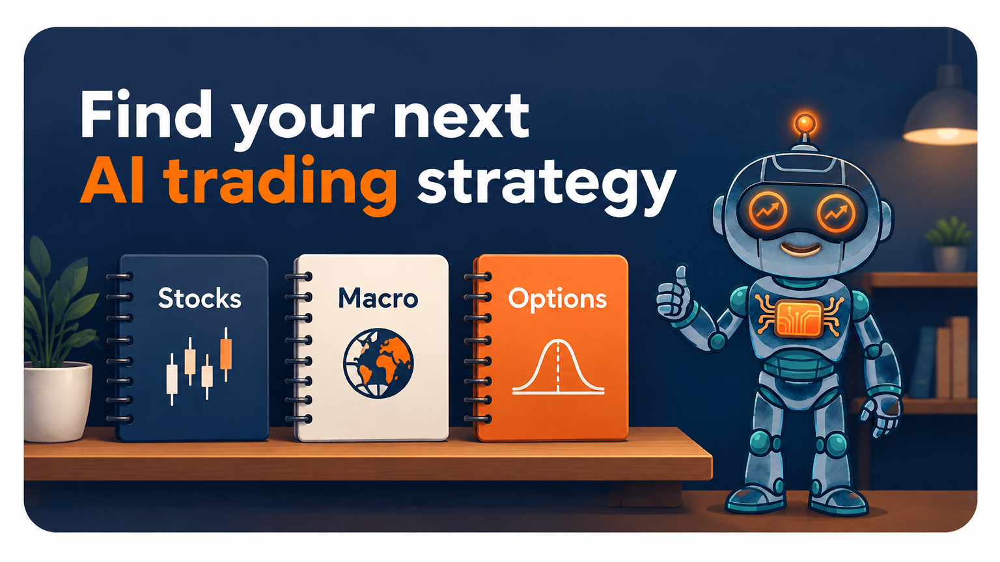

AI Trading Bot Examples
=======================

.. meta::
   :description: Free AI trading bot examples in Python: copy Nancy Pelosi's trades, follow insider buying, trade 0DTE options, and more. Each bot is two AI agents.

Pick a bot, read how it works, and run it. Each bot is a few sentences of plain
English. The agents fit the strategy: one agent for simple rules, a researcher
and a trader for most bots, and a debate or a team where that is the point.
Every page shows the full code and a real backtest tear sheet.

Every file ends the same way: with ``IS_BACKTESTING=true`` in your ``.env`` file
it backtests, otherwise it trades with your broker. See :doc:`strategy_run_modes`.

Copy famous investors and insiders
----------------------------------

* :doc:`agents_example_nancy_pelosi_trading_bot`: owns the same stocks as Nancy Pelosi, rebuilt from her reports on the House website.
* :doc:`agents_example_nancy_pelosi_copy_trading_bot`: copies her whole portfolio, call options included, sized to your account.
* :doc:`agents_example_insider_trading_bot`: buys more of the stocks that CEOs and directors are buying with their own money.
* :doc:`agents_example_warren_buffett_ai_stock_picker`: owns great companies at fair prices, the way Warren Buffett describes it.
* :doc:`agents_example_bill_ackman_portfolio_ai_trading_bot`: holds a few high-conviction stocks, the way Bill Ackman invests.

Read the web with a real browser
--------------------------------

* :doc:`agents_example_fear_and_greed_index_trading_bot`: opens CNN's Fear & Greed Index in a browser and buys SPY on fear, sells on greed.

AI agents that debate
---------------------

* :doc:`agents_example_bull_vs_bear_ai_stock_trading_bot`: a bull agent and a bear agent argue about the biggest US stocks before the trade.
* :doc:`agents_example_tqqq_strategy_ai_trading_bot`: the same debate for leveraged ETFs like TQQQ and SQQQ.

Options
-------

* :doc:`agents_example_iron_condor_ai_trading_bot`: sells a one-day SPY iron condor at 3:45 PM and closes early if SPY runs toward a strike.
* :doc:`agents_example_put_credit_spread_ai_trading_bot`: sells a SPY put credit spread about a month out and manages the exit.
* :doc:`agents_example_0dte_options_ai_trading_bot`: sells a same-day SPY call spread and watches it every 15 minutes.

Day trading
-----------

* :doc:`agents_example_vwap_strategy_ai_trading_bot`: buys SPY when it bounces back above VWAP.
* :doc:`agents_example_opening_range_breakout_ai_trading_bot`: buys the stock that breaks out above its first 15 minutes.

Hedge fund style AI teams
-------------------------

* :doc:`agents_example_citadel_sector_pods`: five sector agents pitch ideas to a risk manager and a portfolio manager.
* :doc:`agents_example_ray_dalio_idea_meritocracy`: growth, inflation, and debt agents argue before a trader builds a macro ETF basket.

A backtest shows the code works for that data and those dates. It is not a
promise of future returns. These examples are inspired by public ideas and are
not affiliated with or endorsed by the people or firms they are named after.

.. toctree::
   :hidden:

   agents_example_nancy_pelosi_trading_bot
   agents_example_nancy_pelosi_copy_trading_bot
   agents_example_insider_trading_bot
   agents_example_warren_buffett_ai_stock_picker
   agents_example_bill_ackman_portfolio_ai_trading_bot
   agents_example_fear_and_greed_index_trading_bot
   agents_example_bull_vs_bear_ai_stock_trading_bot
   agents_example_tqqq_strategy_ai_trading_bot
   agents_example_iron_condor_ai_trading_bot
   agents_example_put_credit_spread_ai_trading_bot
   agents_example_0dte_options_ai_trading_bot
   agents_example_vwap_strategy_ai_trading_bot
   agents_example_opening_range_breakout_ai_trading_bot
   agents_example_citadel_sector_pods
   agents_example_ray_dalio_idea_meritocracy

Build your own AI trading bot
-----------------------------

Want help turning your idea into a strategy? Learn with Rob in the free challenge.

