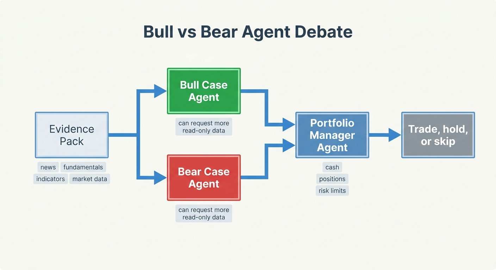

AI Investment Committee
=======================

LumiBot's AI investment committee pattern runs multiple agents inside normal
strategy lifecycle code. There is no LangGraph dependency and no separate
workflow engine. Each agent is a plain LumiBot agent created with
``self.agents.create(...)`` and called from ``on_trading_iteration()``.

.. image:: ../docs/assets/readme/lumibot_investment_committee_architecture.png
   :alt: Lumibot AI investment committee architecture

Recommended Flow
----------------

The reference committee uses four roles:

1. **Evidence Researcher** -- read-only. Gathers market data, indicators,
   Alpaca news, SEC fundamentals, SEC filings, FRED macro data, account state,
   and anything else available through read-only tools.
2. **Bull Researcher** -- read-only. Builds the strongest long-only thesis.
3. **Bear Researcher** -- read-only. Attacks the thesis and identifies reasons
   to avoid, delay, reduce, or monitor the trade.
4. **Portfolio Manager** -- trading enabled. Reviews the evidence, current
   positions, cash, open orders, and risk limits before submitting orders.

Different Models Per Agent
--------------------------

.. image:: ../docs/assets/ai_committee/docs_model_per_agent.png
   :alt: Different model per Lumibot agent

Every agent can use a different model:

.. code-block:: python

   self.agents.create(
       name="evidence_researcher",
       model="openai/gpt-5.4-mini",
       allow_trading=False,
       system_prompt=research_prompt,
   )

   self.agents.create(
       name="portfolio_manager",
       model="openai/gpt-5.5",
       allow_trading=True,
       system_prompt=trader_prompt,
   )

Use a smaller model for evidence gathering when cost matters, and a stronger
model for bull/bear reasoning and final trade decisions.

Safety Pattern
--------------

Use ``allow_trading=False`` for every agent that should not mutate broker state.
Those agents can still inspect positions, account state, open orders, market
data, indicators, SEC fundamentals, filings, FRED macro data, memory, and
notifications. They cannot submit, cancel, or modify orders.

The flagship example lives at
``lumibot/example_strategies/ai_investment_committee.py``.

Evidence, Debate, And Portfolio Decisions
-----------------------------------------

The committee does not require LangGraph or any external workflow runtime. The
strategy calls each agent from normal Python code, passes the prior agent's
summary into the next agent, and keeps order submission restricted to the final
portfolio manager.

The evidence researcher should gather market data, technical indicators, recent
news, SEC fundamentals, FRED macro context, and relevant SEC filing excerpts.
The bull and bear researchers can use the same read-only tools to dig deeper
before the portfolio manager checks positions, cash, open orders, and risk
limits.

Backtest Artifacts
------------------

Committee runs leave normal LumiBot backtest artifacts plus agent traces,
memory JSONL files, SEC cache files, and run summaries. This makes it possible
to answer why a trade was placed after the backtest completes.

.. image:: ../docs/assets/ai_committee/docs_backtest_artifacts.png
   :alt: Lumibot AI committee backtest artifact traceability
