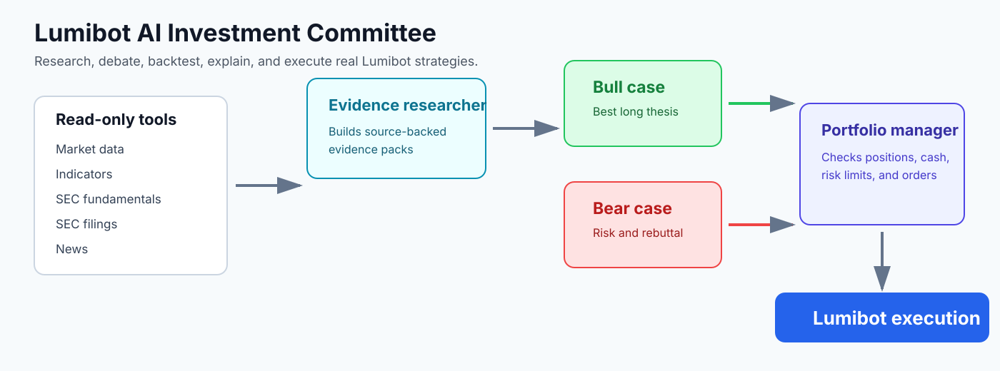

AI Investment Committee
=======================

LumiBot's AI investment committee pattern runs multiple agents inside normal
strategy lifecycle code. There is no LangGraph dependency and no separate
workflow engine. Each agent is a plain LumiBot agent created with
``self.agents.create(...)`` and called from ``on_trading_iteration()``.

Recommended Flow
----------------

The reference committee uses four roles:

1. **Evidence Researcher** -- read-only. Gathers market data, indicators,
   Alpaca news, SEC fundamentals, SEC filings, account state, and anything
   else available through read-only tools.
2. **Bull Researcher** -- read-only. Builds the strongest long-only thesis.
3. **Bear Researcher** -- read-only. Attacks the thesis and identifies reasons
   to avoid, delay, reduce, or monitor the trade.
4. **Portfolio Manager** -- trading enabled. Reviews the evidence, current
   positions, cash, open orders, and risk limits before submitting orders.

Different Models Per Agent
--------------------------

Every agent can use a different model:

.. code-block:: python

   self.agents.create(
       name="evidence_researcher",
       model="openai/gpt-5.5-mini",
       allow_trading=False,
       system_prompt=research_prompt,
   )

   self.agents.create(
       name="portfolio_manager",
       model="openai/gpt-5.5",
       allow_trading=True,
       system_prompt=trader_prompt,
   )

Use a smaller model for evidence gathering when cost matters, and a stronger
model for bull/bear reasoning and final trade decisions.

Safety Pattern
--------------

Use ``allow_trading=False`` for every agent that should not mutate broker state.
Those agents can still inspect positions, account state, open orders, market
data, indicators, SEC fundamentals, filings, memory, and notifications. They
cannot submit, cancel, or modify orders.

The flagship example lives at
``lumibot/example_strategies/ai_investment_committee.py``.
