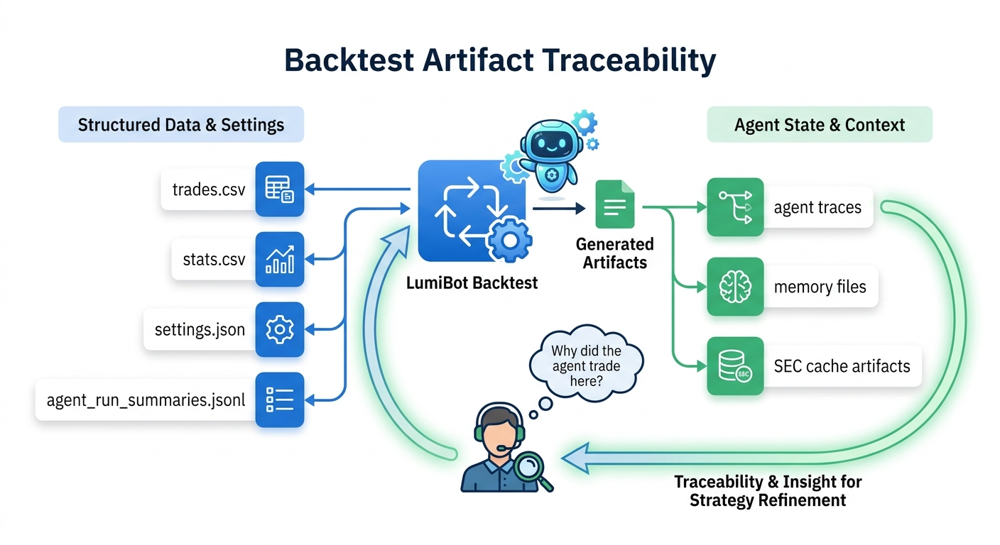

AI Investment Committee Example
===============================

This page describes one concrete agent-flow example: a four-agent investment
committee. It is not the only way to build with LumiBot agents. Start with
:doc:`agents_flows` if you want the broader design space: single-agent flows,
specialist desks, multi-model committees, iterated debates, and hybrid
deterministic-plus-agent strategies.

The investment committee pattern is useful when you want a strategy to:

- gather evidence from multiple built-in research tools
- create separate bull and bear analyses
- let one final portfolio manager weigh the evidence
- keep all research roles read-only
- submit orders only from the final trading-enabled step

.. image:: ../docs/assets/readme/lumibot_investment_committee_architecture.png
   :alt: Lumibot AI investment committee architecture

Reference Implementation
------------------------

The full runnable example lives at
``lumibot/example_strategies/ai_investment_committee.py``.

It runs inside normal LumiBot lifecycle code. There is no LangGraph dependency
and no external debate service. The strategy creates agents in ``initialize()``
and calls them from ``on_trading_iteration()``.

The four roles in this example are:

1. **Evidence researcher** -- read-only. Builds the evidence pack from market
   data, indicators, news, SEC fundamentals, SEC filings, FRED macro data,
   account state, and any other read-only tools it needs.
2. **Bull researcher** -- read-only. Builds the strongest long-only thesis.
3. **Bear researcher** -- read-only. Attacks the thesis and identifies reasons
   to avoid, delay, reduce, or monitor the trade.
4. **Portfolio manager** -- trading enabled. Reviews evidence, cash, positions,
   open orders, and risk limits before submitting orders.

Creating The Agents
-------------------

Every role can use a different model. The example uses a cheaper model for
evidence gathering and stronger models for bull, bear, and final portfolio
reasoning, but those choices are configuration, not a framework requirement.

.. code-block:: python

   self.agents.create(
       name="evidence_researcher",
       model=os.environ.get("COMMITTEE_RESEARCH_MODEL", "openai/gpt-5.4-mini"),
       allow_trading=False,
       system_prompt=self._evidence_researcher_prompt(),
   )
   self.agents.create(
       name="bull_researcher",
       model=os.environ.get("COMMITTEE_BULL_MODEL", "openai/gpt-5.5"),
       allow_trading=False,
       system_prompt=self._bull_researcher_prompt(),
   )
   self.agents.create(
       name="bear_researcher",
       model=os.environ.get("COMMITTEE_BEAR_MODEL", "openai/gpt-5.5"),
       allow_trading=False,
       system_prompt=self._bear_researcher_prompt(),
   )
   self.agents.create(
       name="portfolio_manager",
       model=os.environ.get("COMMITTEE_TRADER_MODEL", "openai/gpt-5.5"),
       allow_trading=True,
       system_prompt=self._portfolio_manager_prompt(),
   )

Running The Flow
----------------

The flow is just Python. The strategy passes one agent's output into the next
agent's context.

.. code-block:: python

   evidence = self.agents["evidence_researcher"].run(
       task_prompt="Build the evidence pack for today's committee.",
       context=context,
   )

   bull = self.agents["bull_researcher"].run(
       task_prompt="Build the strongest long-only investment case.",
       context={**context, "evidence_pack": evidence.summary or evidence.text},
   )

   bear = self.agents["bear_researcher"].run(
       task_prompt="Attack the long case and identify reasons to avoid, delay, reduce, or monitor the trade.",
       context={
           **context,
           "evidence_pack": evidence.summary or evidence.text,
           "bull_case": bull.summary or bull.text,
       },
   )

   decision = self.agents["portfolio_manager"].run(
       task_prompt="Make the final long-only portfolio decision.",
       context={
           **context,
           "evidence_pack": evidence.summary or evidence.text,
           "bull_case": bull.summary or bull.text,
           "bear_case": bear.summary or bear.text,
       },
   )

What The Evidence Researcher Should Gather
------------------------------------------

In this example, the research prompt tells the evidence researcher to gather:

- market context and visible historical prices
- technical indicators such as RSI, MACD, moving averages, volatility, ATR, and
  trend context
- recent news when Alpaca credentials are available
- SEC income statement, balance sheet, cash flow, and company facts
- SEC filings and targeted filing searches for risks, margins, debt,
  liquidity, customer concentration, accounting changes, buybacks, dilution,
  and management commentary
- FRED macro context for rates, inflation, labor, growth, liquidity, credit
  spreads, and market-risk series

The bull and bear researchers can also call read-only tools if they need to dig
deeper.

Trading Safety
--------------

The important safety rule is ``allow_trading=False`` for all research roles.
Those agents can inspect evidence but cannot submit, cancel, or modify orders.

Only the portfolio manager has ``allow_trading=True`` in this example. It is
prompted to check cash, positions, open orders, and risk limits before trading.

How To Modify This Pattern
--------------------------

You can make this committee smaller, larger, deterministic, or multi-model:

- Remove bull and bear and use only a researcher plus trader.
- Add a neutral agent.
- Add separate news, filing, macro, technical, or sector specialists.
- Run OpenAI, Gemini, Claude, and Grok agents independently and compare their
  cases.
- Iterate bull and bear rebuttals multiple times before the final decision.
- Let agents only write research, then place orders with deterministic Python.
- Add a hard Python risk gate after the portfolio manager's recommendation.

The reference committee is a flagship example because it is easy to understand
and demonstrates research, debate, permissions, memory, notifications, and real
orders in one workflow. It is not a limit on what LumiBot can express.

Backtest Artifacts
------------------

Committee runs leave normal LumiBot backtest artifacts plus agent traces,
memory JSONL files, SEC/FRED cache files, and run summaries. This makes it
possible to answer why a trade was placed after the backtest completes.

