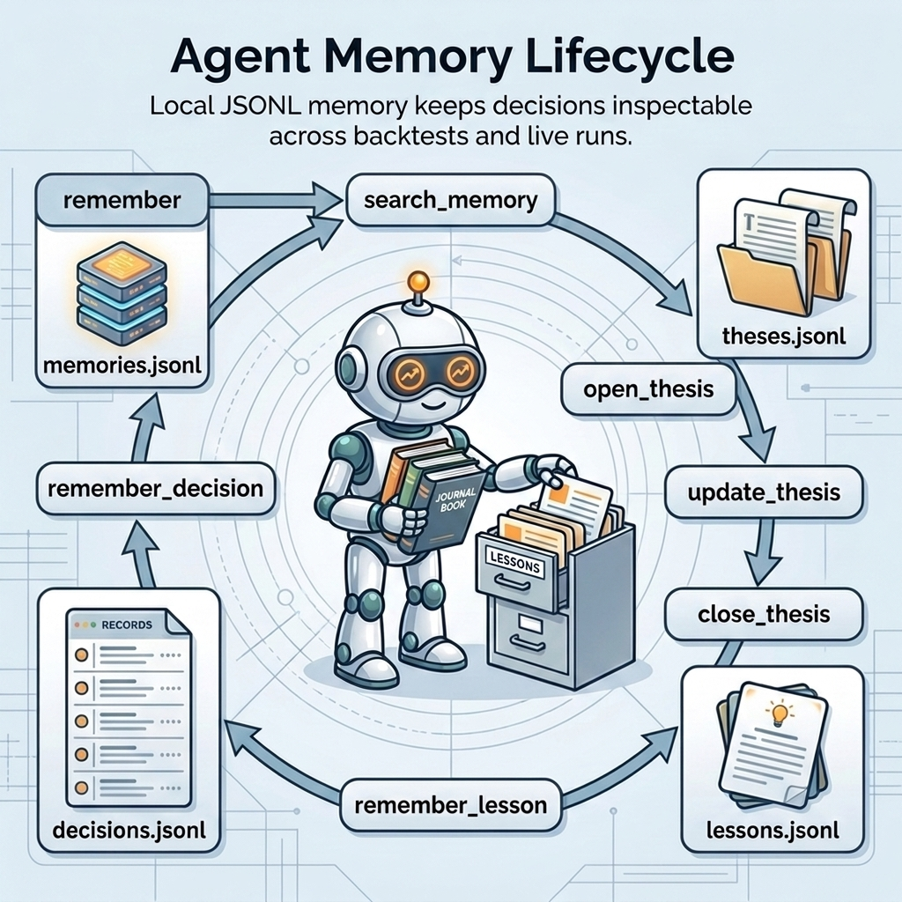

Agent Memory
============

Lumibot includes native local memory for agentic strategies. Memory lets an
agent record why it made a decision, search prior lessons, keep an open thesis,
and leave files that a human can inspect after a backtest or live run.

Memory is intentionally simple in version 1: local JSONL files, strategy-time
timestamps, keyword search, and explicit tools the agent can call. It is not an
external MCP server, not a vector database requirement, and not hidden state in
an LLM provider.

Why Memory Exists
-----------------

Trading agents need more than a one-shot prompt. Useful memory answers
questions such as:

* Why did the agent buy, hold, reduce, or skip?
* What evidence mattered at the time?
* Which thesis is still open?
* What lesson did the agent learn after a trade closed or a thesis failed?
* Did the same risk appear in a prior backtest iteration?

This makes AI strategies easier to audit. It also gives future agent calls a
small, searchable context instead of forcing every run to rediscover the same
facts.

Backtest And Live Parity
------------------------

Memory is available in both backtests and live trading. In a backtest, entries
use the simulated strategy datetime when Lumibot can provide it. In live
trading, entries use real current time.

That matters because Lumibot's core design goal is parity: the same strategy
code should behave the same way whether it is replaying history or connected to
a broker. Memory should be part of that same strategy lifecycle, not a
live-only side channel.

Storage
-------

By default, memory is stored under:

.. code-block:: text

   .lumibot/memory/<strategy_name>/

Override the root directory with:

.. code-block:: bash

   export LUMIBOT_MEMORY_DIR=/path/to/lumibot-memory

Lumibot writes JSONL files:

* ``memories.jsonl`` -- general memories and lessons
* ``decisions.jsonl`` -- trading decisions and rationale
* ``lessons.jsonl`` -- compact lessons, usually after an outcome is known
* ``theses.jsonl`` -- opened, updated, and closed theses

These files are append-only and human-readable. They are designed to be easy to
ship as artifacts, review in a pull request, or inspect after a backtest.

Agent Tools
-----------

Agents get these memory tools by default:

``remember``
   Store a general note with optional tags and metadata.

``search_memory``
   Search local memory files by keyword. Results are ranked by simple keyword
   match and timestamp.

``remember_decision``
   Record a trading decision with optional symbol, action, evidence, and tags.

``remember_lesson``
   Record a compact lesson with optional symbol and outcome metadata. Lessons
   are written to both ``lessons.jsonl`` and ``memories.jsonl`` so they are easy
   to find later.

``open_thesis``
   Open an investment thesis, usually before or at trade entry.

``update_thesis``
   Add an update to an existing thesis.

``close_thesis``
   Close a thesis with optional outcome metadata.

Common Patterns
---------------

**Decision journal**
   Ask the final decision agent to call ``remember_decision`` whenever it buys,
   sells, reduces, or explicitly skips a high-conviction setup. Keep the entry
   compact: action, symbol, main evidence, risk, and expected invalidation.

**Thesis tracking**
   Use ``open_thesis`` when the agent enters a position, ``update_thesis`` when
   evidence changes, and ``close_thesis`` when the position exits or the thesis
   is invalidated.

**Lessons after outcomes**
   On trade close, or after a fixed horizon, summarize what happened with
   ``remember_lesson``. Good lessons are short and reusable: what signal worked,
   what failed, and what should be checked next time.

**Search before acting**
   Before a final trade decision, ask the agent to call ``search_memory`` for
   the symbol, sector, or setup type. This helps the agent avoid repeating a
   mistake from an earlier iteration.

Example Prompt
--------------

.. code-block:: python

   self.agents.create(
       name="portfolio_manager",
       model="openai/gpt-5.5",
       allow_trading=True,
       system_prompt=(
           "Review the evidence and risk limits before trading. "
           "Before any trade, search memory for the symbol and setup. "
           "After the decision, record a compact decision memory with the "
           "symbol, action, main evidence, and invalidation condition."
       ),
   )

What Memory Is Not
------------------

Memory is not a risk-management substitute. Hard constraints such as maximum
position size, no-shorting rules, cash reserves, drawdown stops, and symbol
allowlists should still live in Python code or broker/account configuration.

Memory is also not a guarantee that an LLM will improve over time. It is a
structured, inspectable context source. The strategy still controls when memory
is searched, what tools are available, and whether orders can be submitted.

Traceability
------------

Memory complements Lumibot's normal backtest artifacts. Agent traces show the
prompt, tool calls, tool results, and summaries. Memory files show what the
agent chose to preserve for future iterations.

.. image:: ../docs/assets/ai_committee/docs_backtest_artifacts.png
   :alt: Lumibot backtest artifacts and agent memory

Review memory after a run when you want to answer:

* Why did the agent trade?
* Which evidence did it preserve?
* What thesis was open at the time?
* What lesson did it write after the outcome?
* Did the agent search prior memories before acting?
