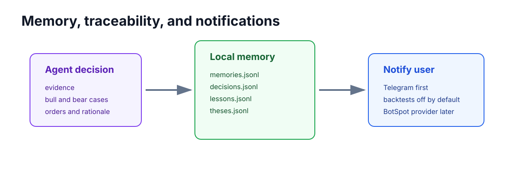

Agent Memory
============

LumiBot includes a native local memory store for agentic strategies. Memory is
available in backtesting and live trading so behavior stays as similar as
possible across modes.

Storage
-------

By default, memory is stored under ``.lumibot/memory/<strategy_name>/`` in JSONL
files:

- ``memories.jsonl``
- ``decisions.jsonl``
- ``lessons.jsonl``
- ``theses.jsonl``

Override the root with ``LUMIBOT_MEMORY_DIR``.

Agent Tools
-----------

Agents can call:

- ``remember``
- ``search_memory``
- ``remember_decision``
- ``remember_lesson``
- ``open_thesis``
- ``update_thesis``
- ``close_thesis``

The investment committee example uses these tools to record decisions, thesis
updates, and compact lessons.
