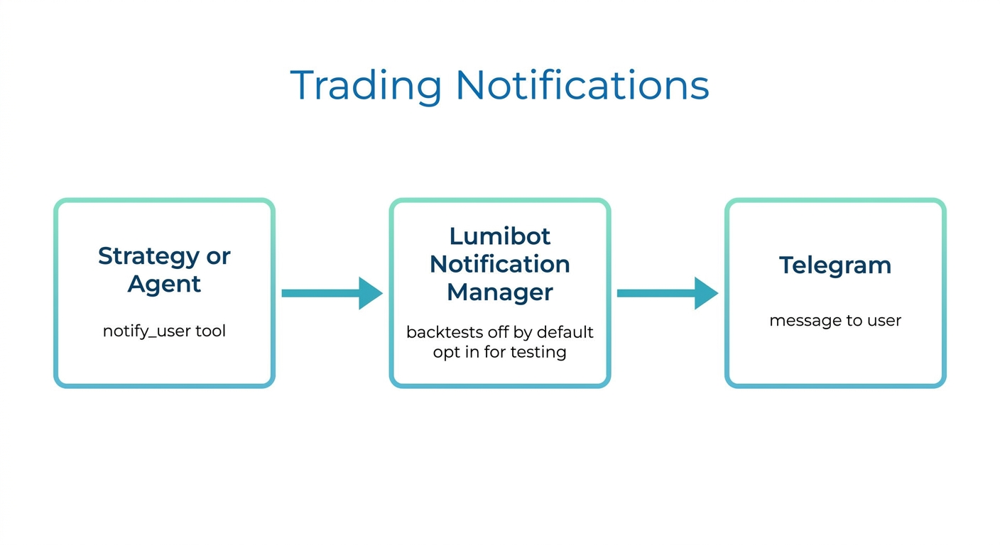

Agent Notifications
===================

LumiBot strategies can send notifications through ``self.notify(...)`` or
``self.notifications.notify(...)``. Telegram is the first native notification
provider.

Configure Telegram:

.. code-block:: python

   self.notifications.configure_telegram(
       bot_token=os.environ["TELEGRAM_BOT_TOKEN"],
       chat_id=os.environ["TELEGRAM_CHAT_ID"],
   )

Send a notification:

.. code-block:: python

   self.notify("Trade decision", "Bought AAPL after AI trading team review.")

Backtest Defaults
-----------------

Notifications are disabled by default in backtests to avoid noisy historical
runs. Enable them explicitly when testing notification behavior.

Agent Tool
----------

Agents can use ``notify_user``. In backtests, the tool returns a skipped result
unless notifications are enabled.
